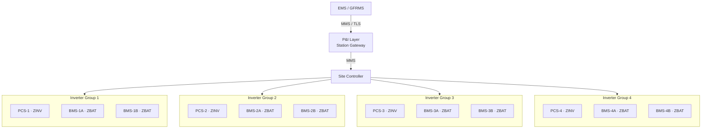
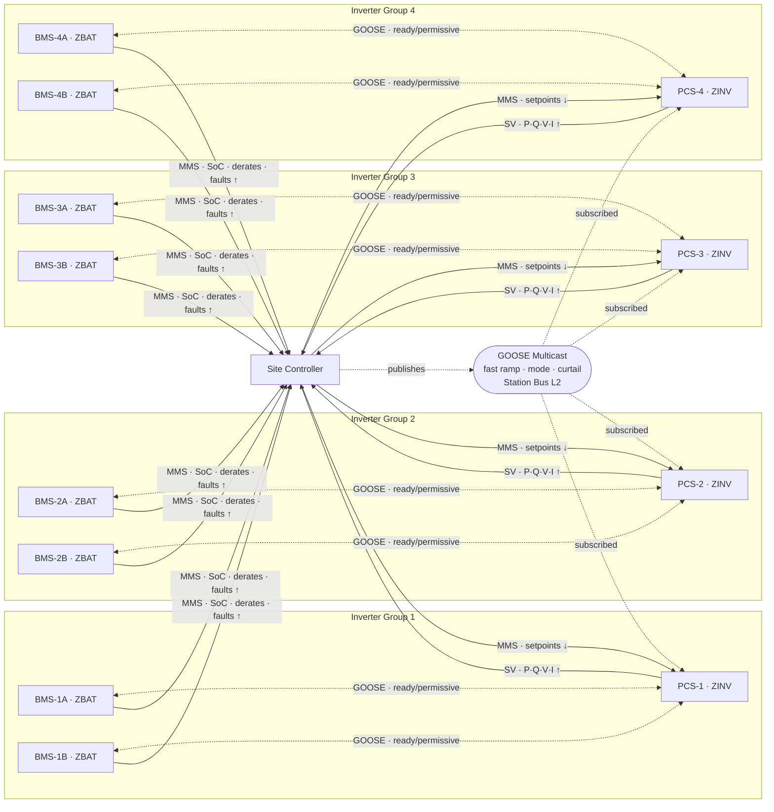

<!-- markdownlint-disable MD036 -->
# IEC 61850 for Large-Scale ESS — Process Control and Electrical Protection

## Overview

IEC 61850 was designed from the ground up for **power system engineering** — not adapted from IT networking like DNP3 was. For large-scale ESS, it serves two distinct engineering domains that must be kept architecturally separate:

| Domain | Purpose | Timescale | Primary IEC 61850 Service |
| --- | --- | --- | --- |
| **Process Control** | Charge/discharge management, voltage/frequency regulation, grid services | MMS: tens to hundreds of ms (supervisory); GOOSE: < 4 ms (speed-critical coordination) | MMS + GOOSE + Sampled Values (Station Bus; Process Bus applies to electrical protection — see Part 2) |
| **Electrical Protection** | Fault detection, trip signaling, fault isolation, anti-islanding | < 4 ms — autonomous | GOOSE + Sampled Values (Process Bus) |

*Table - 01: IEC 61850 Engineering Domains — Process Control and Electrical Protection*

These two domains share the same underlying communication standard but operate on **separate network layers**, respond at fundamentally different timescales, and must not be architecturally coupled. Protection functions must operate correctly even when the supervisory control layer is unavailable or faulted.

| IEC 61850 Design Principle | Which Domain It Serves |
| --- | --- |
| Peer-to-peer GOOSE messaging | Both — Electrical Protection (autonomous trips); Process Control (speed-critical operational coordination where MMS latency is too high) |
| Sampled Values (SV) | Both — direct input to protection IEDs; also high-fidelity measurement for process control |
| MMS over TCP/IP | Process Control — supervisory setpoints, state reporting, and configuration |
| Object-oriented data model (61850-7-420) | Both — structured logical nodes for protection functions and for operational control |
| Self-describing devices (SCL files) | Both — configuration management across a multi-vendor fleet |

*Table - 02: IEC 61850 Design Principles and the Domains They Serve*

### Key Electrical Quantities — Point of Common Coupling (PCC)

The **PCC** is the electrical connection point where the ESS connects to the utility grid — typically the high-voltage terminals of the main step-up transformer or the grid interconnection breaker. It is the metering and control boundary where interconnection agreement obligations are measured and contracted grid services are verified. The `MMXU` logical node in IEC 61850-7-420 publishes these five fundamental measurements from the PCC:

| Symbol | Quantity | What It Tells You |
| --- | --- | --- |
| **V** | Voltage | Is the grid voltage within acceptable range? Is the ESS holding voltage support targets? |
| **I** | Current | How much current is flowing in or out of the ESS at the grid connection? |
| **P** | Real power (watts / MW) | Active power — the MW the ESS is injecting into or absorbing from the grid; what the EMS dispatches against |
| **Q** | Reactive power (vars / MVAR) | Used for voltage regulation and power factor correction; the ESS can supply or absorb Q independently of P |
| **Hz** | Frequency | Grid frequency at the interconnection point; primary input signal for frequency response services (AGC, FFR, synthetic inertia) |

*Table - 03: Key Electrical Quantities at the Point of Common Coupling (PCC)*

---

## Part 1: Process Control

### Scope — Process Control

Process control covers the operational management of the battery system — the functions that direct what the ESS is doing operationally. Most process control functions are **setpoint-driven and managed through the supervisory hierarchy** via MMS, tolerant of the latency inherent in TCP/IP communication. However, at scale — where state changes across hundreds of PCS units must be coordinated simultaneously or where grid service response times are contractually binding — MMS latency becomes a constraint. For these speed-critical operational functions, **GOOSE is also used in the process control domain**, not for autonomous protection actions, but for low-latency coordinated command delivery.

The key distinction:

- **MMS** handles normal supervisory operations: setpoints, configuration, telemetry, reporting
- **GOOSE** handles speed-critical operational coordination: simultaneous ramp commands, mode transitions, fast-response grid services
- **Electrical Protection** (Part 2) uses GOOSE exclusively for autonomous safety actions that must operate without the site controller

Battery process control functions in scope here:

- Charge and discharge control (MW setpoints, charge/discharge current limits)
- State of Charge (SoC) management and operational envelope enforcement
- Volt/VAR support and reactive power dispatch
- Frequency response — AGC following, frequency regulation, synthetic inertia mode
- Grid service modes — peak shaving, energy arbitrage, spinning reserve
- Thermal derating — reducing available output based on reported temperature limits
- Capacity reporting — available P/Q capability from each subsystem up to the site controller
- Speed-critical operational coordination — simultaneous ramp, mode transition, fast curtailment across all PCS units

Process control also **receives protection event data** from the electrical protection layer — breaker status, overcurrent trips, overvoltage events, and other fault conditions that affect operational state. These are reported upward via MMS after the protection function has acted. The process control layer uses this data for situational awareness, post-fault response, and operator alarming — it does not initiate the protection action itself.

### MMS over TCP/IP — The Supervisory and Setpoint Layer

Manufacturing Message Specification (MMS) is the supervisory backbone for battery process control. This is where operational intent flows from the EMS down through the control hierarchy to individual PCS units:

- EMS/GFRMS sends MW/MVAR setpoints to the P&I (Presentation & Integration) Layer, which translates them to per-PCS setpoints via MMS write operations
- The site controller reads operational constraints from each subsystem — BMS maximum charge/discharge current, PCS available P/Q capability, thermal derates
- Protection event data (breaker trips, fault indicators, overcurrent events) is reported upward via MMS BRCB/URCB reporting after the protection function has acted
- Configuration changes are applied via MMS write with appropriate authority controls
- Historical event data and disturbance recordings are retrieved from IEDs

MMS runs over TCP/IP on the **Station Bus** — the managed, VLAN-segmented Ethernet backbone connecting the site controller, P&I Layer gateway, IEDs, and engineering workstation. Latency on the order of tens to hundreds of milliseconds is acceptable for setpoint delivery and event reporting.

### GOOSE — Speed-Critical Process Control Coordination

At the scale of a large ESS — hundreds of PCS units, contractual grid service response obligations, and state dependencies across strings and containers — MMS round-trip latency becomes a real constraint. GOOSE is used in the process control domain for functions where simultaneous delivery across all subscribers is required and MMS cannot meet the timing budget:

| Process Control Function | Why GOOSE, Not MMS |
| --- | --- |
| **Synthetic inertia / fast frequency response** | Must react to ROCOF (rate of change of frequency) within tens of ms — MMS round-trip across a loaded Station Bus cannot reliably deliver this |
| **Under-frequency fast ramp** | Grid emergency power injection coordinated with protection-class speed — the response is a controlled operational command, not a protection trip |
| **Simultaneous ramp across all PCS** | At 200+ units, sequential MMS write operations introduce skew; a single GOOSE multicast reaches every ZINV node simultaneously |
| **Fast curtailment** | Emergency or grid operator curtailment commands requiring simultaneous de-energization of output across the fleet |
| **Grid-connected → island mode transition** | Mode transitions require all inverters to switch references simultaneously — sequential MMS creates dangerous transients at scale |
| **PCS enable/ready handshaking** | Ready and permissive state signals between PCS units and the site controller where polling latency introduces unnecessary delay |

*Table - 04: Process Control Functions Using GOOSE Instead of MMS*

The critical distinction from electrical protection: **process control GOOSE signals are authorized and initiated by the site controller or P&I Layer** — they are fast operational commands, not autonomous safety responses. The site controller remains in the authority chain; GOOSE is used only as the delivery mechanism to achieve the required response time. This is architecturally different from Part 2, where GOOSE bypasses the site controller entirely.

### Sampled Values (SV) — The Measurement Input to Process Control

Beyond feeding protection IEDs, SV also provides the site controller with high-fidelity operational measurements:

- Computing aggregate real and reactive power (P/Q) across all PCS stacks with microsecond-resolution timestamps
- Synchrophasor-quality frequency and phase measurements — when frequency response is the contracted product, measurement speed and quality directly determine service performance
- Power quality monitoring at the Point of Common Coupling

For a 500 MWh system with 200+ PCS units, SV data volume is substantial. The Station LAN must use separate VLAN trunks for GOOSE/SV Layer 2 multicast versus MMS/supervisory Layer 3 routed traffic.

### Process Control Logical Nodes (IEC 61850-7-420)

Battery operational control functions map to these standard logical nodes:

| Logical Node | Process Control Function |
| --- | --- |
| `ZBAT` | Battery unit — SoC, SoH, temperature, voltage, current reporting; charge/discharge limits; fault status reported upward |
| `ZBTC` | Battery charger control — charge/discharge current setpoints, charge mode selection |
| `ZINV` | Inverter/PCS — real power setpoint (P), reactive power setpoint (Q), operating mode, available capability |
| `ZRCT` | Rectifier control |
| `MMXU` | Electrical measurements at the PCC — V, I, P, Q, Hz |
| `XCBR` / `XSWI` | Breaker and switch state — reported to process control for situational awareness after protection action |
| `GGIO` | Generic I/O — auxiliary systems, HVAC/cooling status in the operational context |

*Table - 05: Process Control Logical Nodes (IEC 61850-7-420)*

**Logical device hierarchy for a large ESS site (process control view):**

```text
Logical Device: ESS_SITE
├── ZBAT[1..n]         ← one per container / battery string
│   ├── SoC, SoH, Temp, Voltage, Current
│   ├── Charge/discharge limits, thermal derates (reported upward via MMS)
│   └── Fault indicators, protection trip status (reported upward via MMS)
├── ZINV[1..n]         ← one per PCS unit
│   ├── P_setpoint, Q_setpoint, Mode  (MMS for normal setpoints; GOOSE for simultaneous fast ramp/mode transitions)
│   └── Available P/Q capability      (read upward via MMS)
├── ZBTC[1..n]         ← one per charger control zone
│   └── Charge mode, current limit setpoints
├── MMXU[1]            ← Point of Common Coupling measurement (SV → site controller)
└── XSWI / XCBR        ← Breaker/switch state reported upward after protection events
```

This gives a **self-describing, self-documenting** system — the SCL (Substation Configuration Language) files define exactly what data is available from every device, enabling automated engineering tools and fleet-level configuration validation.

### Setpoint Flow for Battery Operation

```text
         EMS / GFRMS
              │  MW/MVAR dispatch instruction
              │  (IEC 61850 MMS or IEEE 2030.5 above plant floor)
              ▼
       P&I Layer / Station Gateway
              │  Normal setpoints: MMS write to ZINV (tens–hundreds of ms)
              │  Fast operational commands: GOOSE multicast to all ZINV simultaneously (< 4 ms)
              │  Constrained by BMS-reported limits (read from ZBAT/ZBTC via MMS)
              ▼
       Site Controller
              │  Distributes normal setpoints to each PCS via MMS
              │  Issues speed-critical commands (ramp, curtail, mode change) via GOOSE
              │  Applies SoC balancing logic across strings
              │  Receives protection event reports (breaker trips, faults) via MMS
              ▼
   PCS-1/ZINV    PCS-2/ZINV  ...  PCS-n/ZINV
   (MMS setpoints or GOOSE fast commands — same logical node, different transport)
                       │
              BMS-1/ZBAT + ZBTC  ← reports SoC, temp, derates, and fault status upward via MMS
```

Charge and discharge decisions flow **top-down** from the EMS through the P&I Layer. Normal setpoints travel via MMS. Speed-critical operational commands — simultaneous ramp, fast curtailment, mode transitions — travel via GOOSE, authorized by the site controller or P&I Layer, to reach all PCS units simultaneously without MMS round-trip latency. The BMS contributes **bottom-up** by reporting operational constraints and fault status via MMS. When the BMS initiates a protective action (fault, overcurrent, thermal event), the protection trip itself travels via **GOOSE on the Process Bus as an autonomous protection function** (Part 2) — the resulting state is subsequently reported to the site controller via MMS for situational awareness and post-fault response.

### Protocol Map — 4-Inverter / 8-BMS Example

The two diagrams below cover a system of 4 PCS units with 2 BMS per inverter. The first shows the control hierarchy and authority chain; the second shows the signal flows (MMS, GOOSE, and SV) between nodes.

**Diagram A — Control Hierarchy and Authority Chain**



*Figure - 01: Control Hierarchy — Authority Chain from EMS to Inverter Groups*

**Diagram B — Signal Flows (MMS, GOOSE, and Sampled Values)**



*Figure - 02: Signal Flows — MMS, GOOSE, and Sampled Values across 4 Inverter Groups*

**What the diagrams show:**

- **MMS (solid lines, Station Bus):** Setpoints flow down from SC to each PCS individually. All 8 BMS report SoC, derates, and fault status up to the SC independently — at 200+ BMS in a full fleet, the polling overhead of this pattern is a tangible design concern.
- **GOOSE multicast (dashed, from SC):** A single publish from the SC reaches all 4 ZINV nodes simultaneously. As the fleet scales from 4 to 40 to 400 inverters, the multicast remains one message — the MMS alternative scales linearly with unit count.
- **GOOSE peer-to-peer (dashed, BMS ↔ PCS):** Ready and permissive state handshaking between each BMS and its paired PCS — low-latency, no server in the path.
- **SV streams (solid lines, PCS → SC):** Continuous high-fidelity measurement from each PCS to the site controller for aggregate P/Q computation and frequency response.

### Process Control — Combined Architecture

The table and text block below summarize the full Part 1 architecture without a diagram: how the three IEC 61850 services divide responsibility in the process control domain, which network layer carries each, and how authority flows.

**Network layers in the process control domain:**

| Layer | Network | Protocols | Traffic |
| --- | --- | --- | --- |
| **Station Bus** | Managed Ethernet, TCP/IP (L3), VLAN-segmented | MMS over TCP/IP; GOOSE/SV multicast over L2 trunks | Supervisory setpoints (MMS); speed-critical operational commands (GOOSE multicast); SV streams from PCS |
| **Process Bus** *(see Part 2)* | Separate L2 segment per protection zone | GOOSE; Sampled Values | Electrical protection trips; BMS-to-PCS permissive handshakes; raw analog SV to protection IEDs |

*Table - 06: Network Layers in the Process Control Domain*

**Authority chain for process control commands:**

```text
EMS / GFRMS
  │  Dispatch instruction (MW / MVAR)
  │  MMS over TLS  ←  northbound interface
  ▼
P&I Layer / Station Gateway
  │  Translates fleet dispatch to per-unit setpoints
  │  Applies authority control, validates against BMS-reported limits
  │  Normal setpoints: MMS write to each ZINV (tens–hundreds ms)
  │  Speed-critical commands: GOOSE multicast to all ZINV simultaneously (< 4 ms)
  ▼
Site Controller
  │  Distributes per-unit setpoints to PCS via MMS
  │  Publishes simultaneous ramp / mode / curtail commands via GOOSE multicast
  │  Applies SoC balancing across strings
  │  Receives protection events (breaker trips, fault flags) via MMS after-the-fact
  ▼
PCS units (ZINV) ←── BMS units (ZBAT) report SoC, derates, faults upward via MMS
```

**Which service carries which process control function:**

| Function | Service | Why |
| --- | --- | --- |
| Normal charge/discharge setpoints | MMS | Tolerant of 50–200 ms round-trip; acknowledged delivery; audit trail |
| Volt/VAR dispatch, reactive power setpoint | MMS | Same — supervisory cadence sufficient |
| BMS constraint reporting (SoC, derates, limits) | MMS | Upstream telemetry; polling or BRCB reporting acceptable |
| Protection event notification to site controller | MMS | Post-action reporting only — protection has already acted via GOOSE |
| Simultaneous ramp across 200+ PCS units | GOOSE multicast | MMS would require 200+ sequential write operations; multicast is one message |
| Synthetic inertia / fast frequency response | GOOSE multicast | Must react to ROCOF within tens of ms; MMS round-trip cannot meet this budget |
| Fast curtailment (grid operator command) | GOOSE multicast | Simultaneous de-energization across the fleet — one publish, all subscribers |
| Mode transition (grid-connected → island) | GOOSE multicast | Sequential MMS creates dangerous phase/voltage transients across unsynchronized inverters |
| BMS-to-PCS ready/permissive handshake | GOOSE peer-to-peer | Direct IED-to-IED, no server in the path |
| High-fidelity P/Q/Hz measurement for frequency response | Sampled Values | Synchrophasor-quality timestamps; MMS cannot achieve required measurement cadence |
| Aggregate P/Q across PCS fleet | Sampled Values | Microsecond-resolution timestamps needed for accurate fleet-level computation |

*Table - 07: IEC 61850 Service Assignments for Process Control Functions*

**The architectural rule that separates process control from electrical protection:** Every function in the table above is either initiated by or flows through the site controller or P&I Layer. The authority chain is always present. When speed demands GOOSE delivery, the authorizing node (SC or P&I Layer) still publishes the command — GOOSE is the transport, not the decision-maker. Part 2 describes where this rule is deliberately broken: electrical protection GOOSE signals are published autonomously by protection IEDs, bypassing the site controller entirely.

---

## Part 2: Electrical Protection

### Scope — Electrical Protection

Electrical protection covers all functions that detect fault conditions and initiate protective actions to prevent equipment damage, contain faults, and maintain system safety. These functions are **autonomous and time-critical** — they must operate correctly without any intervention from the site controller or EMS, and must continue to operate if the supervisory network is degraded or unavailable.

Battery system protection functions in scope here:

- Overcurrent protection (string, rack, and container level)
- Overvoltage and undervoltage protection
- DC bus fault isolation
- Anti-islanding detection and coordinated trip with the utility relay
- Thermal runaway containment — fault isolation between containers
- Ground fault detection
- PCS-to-BMS ready/fault/trip state handshaking

### GOOSE — The Protection and Fast Coordination Bus

GOOSE (Generic Object-Oriented Substation Event) is the mechanism that makes autonomous battery protection possible. It delivers multicast messages in **under 4 ms** on the Process Bus LAN — no server polling, no TCP acknowledgment, no round-trip latency. The signal arrives simultaneously at every IED subscribed to that multicast group.

| Protection Function | GOOSE Action |
| --- | --- |
| String BMS detects overcurrent or cell fault | BMS publishes GOOSE trip → every PCS on that DC bus ramps to zero within one scan cycle |
| Utility relay trips (anti-islanding) | Relay publishes GOOSE → site controller and all ESS subsystems receive simultaneously → coordinated shutdown without polling delay |
| Thermal runaway in Container A | Container A BMS publishes isolation GOOSE → adjacent containers isolate immediately, no site controller mediation |
| PCS fault state | PCS publishes fault GOOSE → BMS and protection IEDs receive simultaneously |

*Table - 08: Electrical Protection Functions and Their GOOSE Actions*

The critical property: **GOOSE bypasses the site controller for all protection functions.** The site controller supervises and monitors but is never in the protection signal path. This is the architecture the BESS IT/Control System Playbook describes: *"Safety protection functions operate independently of external communications."* IEC 61850 GOOSE is the technical mechanism that implements that requirement. After the protection action completes, the resulting state is reported to the process control layer via MMS (see Part 1).

### Sampled Values (SV) — The Measurement Input to Protection

SV streams raw analog measurements (voltage, current) at up to **4,000 samples/second** from Merging Units directly to protection IEDs. In the protection domain, SV provides:

- Real-time current measurement for overcurrent relay logic
- Voltage measurement for overvoltage and undervoltage protection
- High-speed fault detection before a fault propagates to adjacent equipment

SV in the protection role feeds **protection IEDs directly** — the data never passes through the site controller on the way to the protection relay logic. The same independence principle applies: protection measurement must not route through supervisory infrastructure.

### Protection Logical Nodes (IEC 61850-7-420)

Battery system protection functions map to these standard logical nodes:

| Logical Node | Protection Function |
| --- | --- |
| `PTOC` | Overcurrent protection — per PCS unit, per string, per DC bus segment |
| `PTOV` | Overvoltage protection |
| `PTUV` | Undervoltage protection |
| `PDIF` | Differential protection — main ESS transformer |
| `XCBR` | Circuit breaker control — trip commands from protection IEDs |
| `XSWI` | Disconnect and isolation switch control |
| `ZBAT` | Battery unit fault indicators and protection status (also reported to process control via MMS — see Part 1) |

*Table - 09: Electrical Protection Logical Nodes (IEC 61850-7-420)*

> **Note on `ZBAT`:** The Battery Unit logical node carries both protection status (fault flags, trip indicators) and operational state (SoC, temperature). The protection attributes drive GOOSE-based protection actions. The same attributes are also reported upward to the site controller via MMS so that process control has visibility into fault state and breaker position after the protection function has acted.

### The Process Bus — Network Architecture for Protection

Protection traffic runs on the **Process Bus** — a physically or logically separate Ethernet network from the supervisory Station Bus. This separation is non-negotiable: GOOSE multicast at the process level must never compete for bandwidth with MMS polling traffic.

- Layer 2 multicast — GOOSE and SV are not TCP/IP routed
- Segmented by protection zone — each container cluster's GOOSE stays on its own L2 segment
- IGMP snooping to prevent flooding to uninterested ports
- Engineered to meet the < 4 ms protection response requirement end-to-end

At scale, the Process Bus is **not a flat broadcast domain.** A 500 MWh system with 200+ PCS units publishing SV at 4,000 samples/second on one flat segment would saturate the network before any supervisory traffic is added. Each container cluster or DC bus protection zone gets its own L2 segment. Cross-zone protection coordination (e.g., a thermal runaway event in Container A that affects shared DC infrastructure) uses **GOOSE over IP (IEC 61850-8-2)** or is addressed through zone boundary engineering.

### Vendor Reality Gap

Many commercial BESS today implement **Modbus TCP or CANbus** at the BMS/PCS layer and bolt a 61850 gateway on top. That gateway introduces latency — GOOSE protection response is only as fast as the underlying bus. Native IEC 61850-9-2 Sampled Values from BMS/PCS hardware is still rare. In practice, most deployments achieve 61850 at the Station Bus (supervisory) level, with legacy protocols handling protection signaling below — which limits achievable protection response time and is the primary gap requiring engineering attention in procurement.

---

## Combined Architecture

```text
                    EMS / GFRMS
                         │
                    MMS over TLS   ← Process Control (supervisory)
                         │
              ┌──────────▼──────────┐
              │    P&I Layer /      │
              │   Station Gateway   │  ← 61850 MMS server (northbound)
              │   (IEC 61850 core)  │    Protocol translation + authority control
              └──────────┬──────────┘
                         │
              ═══════════╪════════════  STATION BUS — Process Control (MMS, TCP/IP L3)
              │           │           │
        ┌─────▼──┐  ┌─────▼──┐  ┌─────▼──┐
        │ PCS-1  │  │ PCS-2  │  │ PCS-n  │   ← ZINV / ZBTC logical nodes
        │(ZINV)  │  │(ZINV)  │  │(ZINV)  │    MMS setpoints (process control)
        └─────┬──┘  └─────┬──┘  └─────┬──┘    SV streams (operational measurement)
              │           │           │
        ══════╪═══════════╪═══════════╪══  PROCESS BUS — Electrical Protection (GOOSE + SV, L2)
              │           │           │
        ┌─────▼──┐  ┌─────▼──┐  ┌─────▼──┐
        │ BMS-1  │  │ BMS-2  │  │ BMS-n  │   ← ZBAT logical nodes
        │ (ZBAT) │  │ (ZBAT) │  │ (ZBAT) │    GOOSE trips (electrical protection)
        └────────┘  └────────┘  └────────┘    SV measurements (to protection IEDs)
```

**Key architectural rule:** A BMS fault or protection trip travels **exclusively via GOOSE on the Process Bus**. It does not travel through the MMS/Station Bus path. The site controller may observe the result afterward via MMS reporting, but it is never in the protection signal path. Process control commands (setpoints, mode changes) travel exclusively via **MMS on the Station Bus** and do not influence protection relay logic directly.

---

## Where This Breaks Down — The Hard Problems

### 1. Vendor Profile Fragmentation

61850-7-420 defines the model but not the implementation. Tesla's `ZBAT` and LG's `ZBAT` will have different data attributes, different reporting configurations, and different behavior on loss of communications. The P&I Layer must normalize across all of them. This affects both domains — inconsistent protection status reporting from `ZBAT` creates gaps in the electrical protection picture; inconsistent operational constraints from `ZBTC` create gaps in process control capability.

### 2. The Process Bus Isn't Universal Yet

Many BESS vendors implement Modbus TCP or CANbus at the BMS/PCS layer with a 61850 gateway on top. The gateway introduces latency that undermines the < 4 ms GOOSE protection timing guarantee. The MMS/process control layer is more mature in commercial products; the GOOSE/SV electrical protection layer is where vendor native support is still catching up. This is the primary gap requiring attention in future procurement specifications.

### 3. Cybersecurity

IEC 62351 defines TLS for MMS and authentication for GOOSE. **TLS for MMS is practical and should be required** on all Station Bus communications. GOOSE authentication carries timing overhead that can violate the < 4 ms protection requirement — the practical answer for the Process Bus is **network segmentation** rather than per-message authentication. The cyber posture for protection signaling is enforced architecturally (zone isolation, access control, separate physical infrastructure) rather than in-protocol. This is a known and unresolved tension in the standards: GOOSE timing constraints are fundamentally incompatible with cryptographic overhead at the required response speed.

### 4. Configuration Management at Scale

A 500 MWh ESS may have 500+ IEDs, each with an SCL (Substation Configuration Language) file defining its data model and configuration. These files must be version-controlled and treated as first-class engineering artifacts. For RESS specifically, this means tracking **configuration state** alongside maintenance state — when a BESS unit relocates between sites, its IED configuration state (protection settings, setpoint limits, logical node mappings) must be validated against the new site's engineering requirements.

---

## Implications for SCE Generation's Large-Scale ESS

The BESS IT/Control System Playbook's *"DCS-oriented or RTU-based implementations"* language for GFRMS-connected assets points directly at an IEC 61850 Station Bus architecture. The full picture, with domain separation made explicit:

| Service | Domain | Role |
| --- | --- | --- |
| **GOOSE** | Electrical Protection | Sub-4 ms fault isolation — fire-and-forget, no server in the loop |
| **Sampled Values** | Both | Protection relay input AND synchrophasor-quality measurement for process control |
| **MMS** | Process Control | Supervisory setpoints and telemetry — P&I Layer northbound and southbound interface |
| **61850-7-420 (ZBAT/ZINV/ZBTC)** | Process Control | Operational data model — charge/discharge control, SoC, capability reporting |
| **61850-7-420 (PTOC/PTOV/XCBR/XSWI)** | Electrical Protection | Protection data model — fault detection, trip commands, isolation switch control |

*Table - 10: IEC 61850 Service Roles for SCE Large-Scale ESS*

### Procurement Decision

**Option A — Gateway Adapter Layer (Pragmatic)**
Procure vendor 61850 gateways as an adapter layer on top of existing Modbus/CANbus. Faster to deploy, broader vendor eligibility. MMS/process control functions are largely unaffected by the gateway; **GOOSE/electrical protection functions are the ones degraded** — the gateway inheritance latency limits true sub-4 ms protection response.

**Option B — Native 61850 Process Bus (Long-Term Correct)**
Require native IEC 61850-9-2 Sampled Values and GOOSE from BMS/PCS vendors in future procurement. Achieves true sub-4 ms electrical protection response and eliminates the adapter layer, but narrows the vendor field significantly today.

For RESS — given the relocatable, multi-vendor nature of the fleet — **Option A is more realistic for current deployments**, with Option B as a procurement requirement for next-generation BESS contracts. The P&I Layer is the correct architectural home for managing that transition without stranding existing assets.

---

## Relationship to DNP3 and IEEE 2030.5

| Protocol | Domain | Role in ESS | Direction |
| --- | --- | --- | --- |
| **DNP3** | Process Control (legacy) | Upstream path (Site Controller → EMS/SCADA); embedded in existing RTUs | Maintenance mode; cannot meet modern cyber baselines without SAv4/5 (stalled) |
| **IEC 61850 MMS** | Process Control | Station Bus supervisory and P&I Layer northbound interface | Primary target for new large-scale ESS builds |
| **IEC 61850 GOOSE/SV** | Electrical Protection | Process Bus fault isolation and protection measurement | Required for sub-4 ms protection; currently limited by vendor native support |
| **IEEE 2030.5** | Above plant floor | DERMS dispatch aggregation (DER endpoint, not plant floor control) | Relevant at EMS/DERMS boundary only — not a process control or protection protocol |

*Table - 11: Protocol Comparison — DNP3, IEC 61850, and IEEE 2030.5*

IEEE 2030.5 operates **above the plant floor** — it is the dispatch aggregation protocol for DERMS/VPP coordination. It does not replace or compete with 61850 on the plant floor; they serve different tiers of the architecture. The distinction between dispatching the ESS from outside versus controlling battery operation from within mirrors the protection/process control separation applied one tier higher in the stack.

---

## Network Architecture — Broadcast Domain Design

The combined architecture diagram above is a **logical conceptual view**. At physical scale, the Station Bus and Process Bus are engineered switched networks, not flat broadcast domains.

### Why a Flat Bus Fails at Scale

GOOSE and Sampled Values use **Layer 2 multicast** — they are not routed and flood to every port on the segment. A 500 MWh ESS with 200 PCS units all publishing SV at 4,000 samples/second on one flat Ethernet segment would:

- Saturate the network with multicast traffic before any supervisory MMS traffic is added
- Allow a single misconfigured IED to storm the entire plant
- Make fault isolation impossible — a failing PCS could disrupt protection GOOSE signaling for every other PCS on the same segment

### What a Real Large-Scale ESS Network Looks Like

```text
                     P&I Layer / Station Gateway
                                │
                ════════════════╪════════════════  STATION BUS (L3 backbone — Process Control)
                │                                │
       ┌────────▼────────┐             ┌────────▼────────┐
       │   ZONE A        │             │   ZONE B        │
       │  VLAN 10        │             │  VLAN 20        │
       │  (Container 1)  │             │  (Container 2)  │
       ├─────────────────┤             ├─────────────────┤
       │ PCS-1  PCS-2    │             │ PCS-3  PCS-4    │
       │ BMS-1  BMS-2    │             │ BMS-3  BMS-4    │
       └────────┬────────┘             └────────┬────────┘
                │                                │
          Process Bus                      Process Bus
          Zone A (L2)                      Zone B (L2)
          GOOSE + SV                       GOOSE + SV
          [Electrical Protection]          [Electrical Protection]
```

| Mechanism | Function |
| --- | --- |
| **VLANs** | Each container cluster is its own L2 segment — GOOSE multicast stays within its protection zone |
| **IGMP snooping** | Switches track multicast group subscribers — no flooding to ports without interested receivers |
| **L3 routing** | MMS supervisory traffic (process control) crosses zone boundaries through the routed Station Bus backbone |
| **Separate switch fabrics** | Many large ESS designs run Station Bus and Process Bus on entirely separate physical switching infrastructure |
| **GOOSE over IP (IEC 61850-8-2)** | Cross-zone protection coordination where required, at the cost of some latency |

*Table - 12: Network Segmentation Mechanisms for Large-Scale ESS*

### Design Rules

- **GOOSE and SV must be contained** within the protection zone they serve. A BMS in Container A should never receive GOOSE trip signals from Container B's protection scheme unless they share a DC bus segment.
- **MMS is routed (L3)** — supervisory traffic crosses zone boundaries through the routing layer; it does not flood.
- **Zone boundaries map to electrical fault isolation boundaries** — the network topology must mirror the DC bus topology.

A properly engineered large ESS has **many broadcast domains** — typically one per container cluster or DC bus protection zone. The number is an engineering decision driven by the DC bus topology, fault isolation requirements, and the physical container groupings of the specific deployment.
