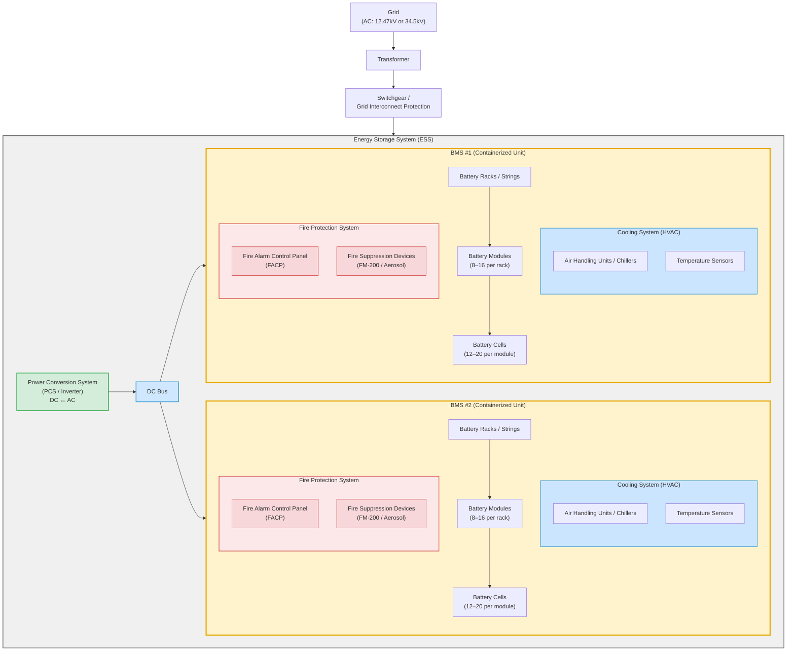

# Battery Component Hierarchy

## Reference System: 1MW / 4MWh BESS

- **1MW** — peak power output (rate of energy flow)
- **4MWh** — total stored energy capacity
- **4-hour duration** — at full rated power, system runs 4 hours before depletion

---

## Physical Hierarchy

```text
Grid (AC, e.g. 12.47kV or 34.5kV)
  └── Transformer
        └── Switchgear / Grid Interconnect Protection
              └── Energy Storage System (ESS)
                    └── Power Conversion System (PCS) / Inverter  ← DC↔AC
                          └── DC Bus
                                ├── Battery Management System (BMS) #1  ← containerized battery unit (1..N per DC Bus)
                                │     ├── Battery Racks / Strings (multiple per Battery)
                                │     │     └── Battery Modules (e.g. 8–16 per rack)
                                │     │           └── Battery Cells (e.g. 12–20 per module)
                                │     ├── Cooling System (HVAC)
                                │     │     ├── Air Handling Units / Chillers
                                │     │     └── Temperature Sensors
                                │     └── Fire Protection System
                                │           ├── Fire Alarm Control Panel (FACP)
                                │           └── Fire Suppression Devices (e.g. FM-200, Aerosol Suppressants)
                                └── Battery Management System (BMS) #2  ← second containerized battery unit on the same DC Bus
                                      ├── Battery Racks / Strings (multiple per Battery)
                                      │     └── Battery Modules (e.g. 8–16 per rack)
                                      │           └── Battery Cells (e.g. 12–20 per module)
                                      ├── Cooling System (HVAC)
                                      │     ├── Air Handling Units / Chillers
                                      │     └── Temperature Sensors
                                      └── Fire Protection System
                                            ├── Fire Alarm Control Panel (FACP)
                                            └── Fire Suppression Devices (e.g. FM-200, Aerosol Suppressants)
```

> **Note on the "Battery" layer:** This is a placeholder representing a containerized battery unit (e.g., a single ISO container). A 1MW/4MWh system may have 1–2 Battery nodes on the DC Bus. This layer maps to the Master BMS boundary and enables modular scaling — adding capacity means adding Battery nodes without changing the rack/module model below.
>
> **Note on the "Energy Storage System" layer:** The ESS is the top-level boundary for everything inside the fenceline that is not the utility grid interface. It groups the power electronics (PCS) and the stored energy (Battery) subsystems managed together. Environmental control (Cooling) and life-safety systems (Fire Protection) are scoped to each containerized battery unit (BMS), since each container has its own HVAC and fire suppression.

---

## Mermaid Diagram



*Figure - 01: ESS Physical Component Hierarchy — from Grid to Battery Cell, including Cooling and Fire Protection subsystems*

---

## Key Subsystems

| Subsystem | Layer | Role |
| --- | --- | --- |
| **Battery Cells** | Cell | Electrochemical energy storage. Typically LFP (Lithium Iron Phosphate) at utility scale for safety and cycle life |
| **Battery Modules** | Module | Cells wired in series/parallel to target voltage/capacity. Include local fusing and cell-level monitoring |
| **Battery Racks / Strings** | Rack | Groups of modules; primary structural and electrical unit. Each rack has its own BMS |
| **Battery** | Container | Containerized unit (e.g. ISO 20' or 40'). Master BMS aggregates all rack data. Isolatable as a unit from the DC Bus |
| **DC Bus** | DC Distribution | Common DC rail connecting one or more Battery containers to the PCS |
| **PCS / Inverter** | Power Conversion | Converts DC battery voltage to AC grid voltage; handles real/reactive power control |
| **Energy Storage System** | ESS Boundary | Top-level grouping for all equipment inside the fenceline: PCS and Battery containers |
| **Cooling System (HVAC)** | Environmental (per BMS / container) | Air handling units, chillers, and temperature sensors maintaining cell temperature in optimal range (~15–35°C for LFP); scoped to each containerized battery unit |
| **Fire Alarm Control Panel** | Fire Protection (per BMS / container) | Monitors smoke/heat detectors within the container; triggers alarms and suppression system activation |
| **Fire Suppression Devices** | Fire Protection (per BMS / container) | FM-200 or aerosol suppressants deployed per container to extinguish thermal events |
| **Switchgear / Protection** | Grid Interface | Protection relays guard against faults; disconnect point from utility |
| **Transformer** | Grid Interface | Steps voltage up to interconnect with the MV utility feeder |

---

## Supporting Systems

| System | Role |
| --- | --- |
| **BMS (Battery Management System)** | Monitors cell voltage, temperature, SoC, SoH, SoP; enforces charge/discharge limits; manages balancing and fault isolation |
| **EMS (Energy Management System)** | High-level dispatch: optimization, charge scheduling, grid services (frequency response, peak shaving) |
| **Cooling System (HVAC)** | Air handling units and chillers maintaining cell temperature in optimal range (~15–35°C for LFP); includes temperature sensors feeding the BMS |
| **Fire Alarm Control Panel (FACP)** | Central panel monitoring smoke/heat detectors across the ESS; triggers alarms and initiates suppression |
| **Fire Suppression Devices** | FM-200 or aerosol suppressants deployed per container; required for safety compliance (UL 9540, NFPA 855) |
| **SCADA / Comms** | DNP3 or Modbus for field devices; IEC 61850 or MQTT for EMS/SCADA integration |

---

## Control Layers

```text
EMS  (dispatch, optimization, grid services)
  ↓ setpoints
PCS Controller  (power control loop, grid synchronization)
  ↓ operating limits
Master BMS  (per Battery / container)
  ↓ rack limits
Rack BMS  →  Module BMS  →  Cell Monitoring
```

---

## Rough Scale (1MW / 4MWh, LFP)

| Item | Approximate Count |
| --- | --- |
| Cells | 5,000 – 12,000 |
| Modules | 200 – 500 |
| Racks | 10 – 20 |
| Battery containers | 1 – 2 |
| DC Bus voltage | 600 – 1,500V DC |
| AC output | 480V or 600V → stepped up to MV |
