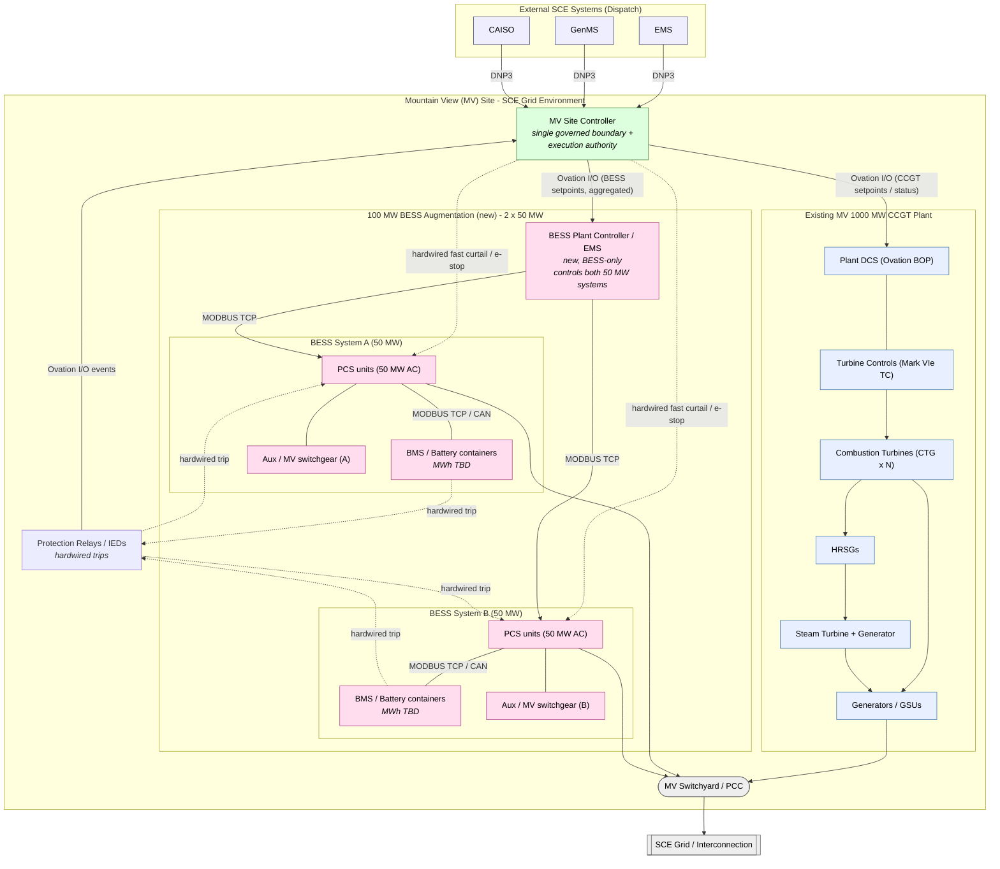
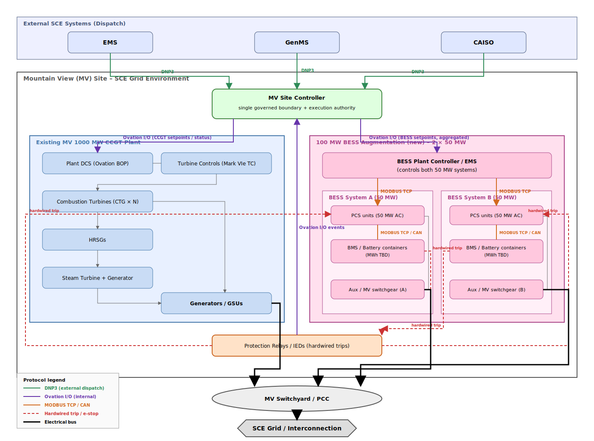

# Mountain View 100 MW BESS Augmentation — Planning Brief

> **Status:** Draft / planning. This document frames the planned 100 MW battery
> augmentation at the Mountain View (MV) site against the existing MV-BESS
> IT/Control System architecture. Site-specific values marked **TBD** must be
> confirmed by the project team (electrical, civil, market, and operations).

## 1. Purpose

This document explains, at an IT and control-system level, the 100 MW battery
energy storage augmentation planned for the Mountain View site. It is intended
to:

- Establish a shared description of the augmentation for IT/OT, control,
  cybersecurity, asset management, and vendor stakeholders.
- Anchor the augmentation to the existing
  [BESS IT & Control System Architecture Vision Document](../docs-MiscRef/BESS_IT-Control%20System%20Architecture%20Vision%20Document.md).
- Identify the IT/control decisions and dependencies that must be resolved
  before procurement and detailed design.

It is **not** an electrical, protection, interconnection, or market-strategy
specification. Those artifacts remain project-specific and are produced
separately, as noted in the Architecture Vision Document.

## 2. Scope of the Augmentation

| Item | Value |
|---|---|
| Site | Mountain View (MV) |
| Existing host plant | **1000 MW Combined Cycle Gas Turbine (CCGT)** generating station |
| Augmentation nameplate (AC, PCS-side) | **100 MW** BESS, delivered as **two 50 MW BESS systems (System A + System B)** under a **single BESS Plant Controller** |
| Energy capacity (MWh) | **TBD** (duration to be confirmed — e.g., 2 hr / 4 hr) |
| Point of Common Coupling (PCC) | **TBD** (shared with existing CCGT switchyard / new bay) |
| Interconnection voltage | **TBD** kV (medium-voltage collection, HV step-up) |
| Commercial Operation Date (COD) | **TBD** |
| Ownership | SCE-owned BESS asset |
| Role(s) | **TBD** — Reliability / Market (see §4) |

The augmentation is treated as an **SCE-owned BESS asset**. Per the
Architecture Vision Document, SCE-owned assets require deeper operational
visibility, greater control, and more direct integration than third-party
resources connected to the SCE grid.

> **Out of scope:** The MV BESS augmentation is a transmission-class
> generation/market resource co-located with the existing 1000 MW CCGT.
> It is **not** integrated with ADMS or DERMS, and it does not participate
> in distribution-side use cases. All dispatch reaches the MV Site
> Controller through generation-side paths (EMS, GenMS, CAISO).

## 3. Relationship to the Existing Mountain View Site

Mountain View is an **existing 1000 MW Combined Cycle Gas Turbine (CCGT)
generating station**. The 100 MW battery is an **augmentation** added at the
same site — it does not replace any portion of the CCGT and does not share
the CCGT's turbine or BOP control systems. Instead, it is integrated as a
new, logically distinct BESS plant that coexists with the CCGT behind a
common site control and dispatch boundary.

The augmentation must therefore be integrated into:

- A site-level dispatch and authority chain that already controls the CCGT,
  extended to add the new BESS plant alongside it.
- The MV Site Controller, which is the single, governed interface between
  SCE-owned generation at MV (CCGT + new BESS) and external SCE systems
  (EMS, GenMS, CAISO).
- The site's existing networking, cybersecurity, and physical-plant
  infrastructure (substation, switchyard, fiber, OT network zones).
- New BESS-specific monitoring, alarming, and asset-management tooling
  described in
  [docs-BESSCore](../docs-BESSCore/Battery%20Component%20Hierarchy.MD) and
  [Asset Performance Management for ESS](../docs-AssetManagement/Asset%20Performance%20Management%20for%20ESS.MD),
  introduced specifically for the BESS plant.

Key boundary principles:

- The BESS augmentation has **its own** PCS, BMS, and plant controller — it
  is not folded into the CCGT DCS.
- The CCGT's turbine controls and BOP DCS continue to manage the CCGT and
  are **not** modified to control batteries.
- The MV Site Controller is the integration point where CCGT and BESS
  dispatch, telemetry, and coordination come together for SCE.

Open question (**TBD**): how dispatch coordination between the CCGT and the
BESS is handled at MV — independent dispatch of each asset, coordinated
site-level dispatch through a common Site Controller, or a hybrid model.
This decision drives Site Controller scope and the point-map design at the
SCE/site boundary (see §6).

## 4. Functional Role (Two-Layer Control)

Per the Architecture Vision Document, the augmentation must support the
two-layer control concept:

- **Dispatch** — *what* the grid or market requests. External systems
  (EMS, GenMS, CAISO) express operational intent to the MV Site
  Controller.
- **Operate** — *how* the BESS control system safely and deterministically
  executes those requests within its technical limits.

Confirmed expectations for the augmentation:

- All external communications terminate at the MV Site Controller; no
  external system communicates directly with vendor controllers, PCS units,
  or BMS.
- The Site Controller retains execution authority and enforces safety limits,
  equipment constraints, and asset protection, regardless of dispatch source.
- Vendor-supplied networking and control components are treated as SCE grid
  assets and must meet SCE monitoring, management, and cybersecurity
  expectations.

Intended services (**TBD — to be confirmed by Operations and Market**):

- Energy arbitrage / time-shifting
- Resource adequacy and capacity
- Frequency response / ancillary services

## 5. Reference Architecture Alignment

The augmentation will conform to the vendor-neutral functional model and
reference architecture in the Architecture Vision Document. Key elements:

- **MV Site Controller** — single governed boundary to external SCE systems
  and local authority for execution, setpoint coordination, and safety
  enforcement across the BESS plant.
- **BESS plant controller / EMS** — vendor-supplied, operating beneath the
  Site Controller and inside the SCE-controlled environment.
- **PCS, BMS, transformers, MV switchgear, auxiliaries** — integrated into
  the site hierarchy defined in
  [docs-BESSCore/Battery Component Hierarchy](../docs-BESSCore/Battery%20Component%20Hierarchy.MD).
- **Communications infrastructure** — SCE-provided and SCE-controlled paths
  for all external communications; vendor LANs remain part of the logical
  SCE grid environment.

### 5.1 High-level architecture (MV site with 100 MW augmentation)

**Reading the diagram:**

- **Blue** nodes are the existing **1000 MW CCGT** plant (Mark VIe TC turbine
  controls, Ovation BOP DCS, CTGs, HRSGs, STG, generators).
- **Pink** nodes are **new** with the 100 MW BESS augmentation, delivered as
  **two 50 MW BESS systems (A and B)** — each with its own PCS, BMS, and
  MV switchgear — controlled by a **single BESS Plant Controller**.
- The BESS Plant Controller presents the augmentation to the MV Site
  Controller as one **aggregated 100 MW resource** over Ovation I/O, and
  handles the split / coordination across Systems A and B internally over
  MODBUS TCP.
- Solid arrows show the assumed protocol on each link — **DNP3** between
  SCE control-center systems (EMS, GenMS, CAISO) and the MV Site
  Controller, **Ovation I/O** between the Site Controller and the CCGT DCS
  / BESS Plant Controller (and for protection events back to the Site
  Controller), and **MODBUS TCP** internal to the BESS plant (Plant
  Controller ↔ PCS, PCS ↔ BMS).
- Dotted arrows are **hardwired** trip / fast-curtail signals used for
  protection and emergency stop — these bypass the Site Controller and the
  Plant Controller and are subsequently reported up as **Ovation I/O
  events** for situational awareness.
- Systems A and B share the MV switchyard/PCC alongside the CCGT, while the
  MV Site Controller is the single dispatch boundary and
  execution-coordination point for the MV site.

### 5.2 High-level architecture (draw.io view)

The same architecture is also maintained as a draw.io / diagrams.net source
file so it can be edited with a richer shape library, manual layout (CCGT
on the left, BESS on the right), and color-coded protocol edges. The SVG
export is embedded below for inline reading; the editable source lives next
to it.

- Source (editable): [img-Architecture/MV-100MW-Augmentation.drawio](../img-Architecture/MV-100MW-Augmentation.drawio)
- SVG export: [img-Architecture/MV-100MW-Augmentation.svg](../img-Architecture/MV-100MW-Augmentation.svg)

Edge colors in the draw.io view encode the protocol:

- **Green** — DNP3 (external SCE dispatch from EMS, GenMS, and CAISO to the MV Site Controller)
- **Purple** — Ovation I/O (MV Site Controller ↔ CCGT DCS, BESS Plant Controller, protection events)
- **Orange** — MODBUS TCP / CAN inside the BESS plant
- **Red dashed** — hardwired trip / e-stop (protection, fast curtail)
- **Heavy black** — electrical bus to switchyard / grid

The Mermaid diagram in §5.1 remains the canonical, text-reviewable version
in this document. The draw.io view is the recommended source for
stakeholder decks, BRD attachments, and higher-fidelity exports.

## 6. Protocol & Integration Strategy

The augmentation uses the conventional utility/BESS protocol stack already
familiar to SCE operations and to vendor equipment in this class. Assumed
baseline (to be confirmed against final vendor selections):

- **External SCE systems ↔ MV Site Controller:** **DNP3 over TCP/IP** for
  EMS, GenMS, and CAISO. The Site Controller is the single termination
  point for all external integration — no external system reaches into the
  CCGT DCS or the BESS plant controller directly.
- **Site Controller ↔ CCGT DCS (Ovation BOP):** **Ovation I/O** over the
  Ovation network for the coordination signals defined in §7 (switchyard
  status, AGC coordination, station service, plant-mode awareness). The
  CCGT DCS internals continue to use their existing proprietary buses.
- **Site Controller ↔ BESS Plant Controller:** **Ovation I/O** for
  setpoints, status, alarms, and measurements. **OPC UA** may be used in
  parallel for engineering / historian data where Ovation I/O is not a fit.
- **BESS Plant Controller ↔ PCS / BMS / aux:** **MODBUS TCP** is the
  predominant in-plant protocol for PCS and BMS vendors in this class.
  Vendor-specific buses (e.g., **CAN** inside battery racks) terminate at
  the BMS controller and are exposed northbound via MODBUS TCP.
- **Protection and fast-trip signals:** **hardwired** between protection
  relays / IEDs, BMS, and PCS — fully independent of the Site Controller
  and supervisory network. Post-action state is reported upward as Ovation
  I/O events for situational awareness and post-event analysis.
- **Time synchronization:** **NTP** for supervisory devices, **PTP (IEEE
  1588)** or **IRIG-B** for protection IEDs requiring tighter accuracy.

Additional guidance:

- Where a vendor component is **MODBUS-only** northbound (some PCS / EMS
  combinations), the limitations and mitigations documented in
  [MODBUS Challenges](../docs-MiscRef/MODBUS%20Challenges.MD) apply, and the
  device must sit behind the BESS plant controller (acting as an
  Ovation I/O gateway northbound) under the Site Controller — MODBUS is
  **not** exposed across the SCE OT boundary.
- **Vendor tiering** — PCS, BMS, plant-controller, and integrator selections
  must be evaluated against
  [Vendor Tiers v1.0](../docs-MiscRef/Vendor%20Tiers%20v1.0.md).

**Point-mapping implication:** because the augmentation is a new, logically
distinct BESS plant, it introduces a dedicated Ovation I/O point map at the
Site Controller for BESS status, setpoints, alarms, and measurements. The
CCGT continues to expose its existing Ovation point map; the two are
aggregated at the MV Site Controller rather than merged into a single
device model.

## 7. Existing CCGT Control Platforms and BESS Coexistence

Mountain View's existing 1000 MW CCGT uses the MV-Baseline control platforms
documented in [docs-MVOverallControls](./):

- [MV-Baseline — Mark VIe TC](MV-Baseline-Mark%20VIe%20TC.md)
  — GE Mark VIe turbine controls for the combustion and steam turbines.
- [MV-Baseline — Ovation BOP](MV-Baseline-Ovation-BOP.md)
  — Emerson Ovation DCS for balance-of-plant.

These platforms remain in place to operate the CCGT and are **not** repurposed
to control batteries. The BESS augmentation introduces its own dedicated
plant controller / EMS, PCS controllers, and BMS, designed to BESS
requirements (sub-second setpoint response, BESS alarm philosophy, APM data
model) using the conventional protocol stack in §6.

The BESS plant controller must:

- Sit beneath the MV Site Controller authority chain alongside the CCGT
  controls — not beneath the CCGT DCS.
- Expose required points to the MV Site Controller via **Ovation I/O**
  (preferred), with OPC UA as an allowed alternate for engineering /
  historian data and MODBUS TCP allowed only as a documented exception
  behind a gateway.
- Honor BMS- and relay-originated protective actions delivered via
  **hardwired** trip signals without Site Controller mediation, while
  reporting resulting state via Ovation I/O events for situational
  awareness.

**Decisions (TBD):**

- The integration boundary between the CCGT DCS (Ovation BOP) and the BESS
  plant controller at the MV Site Controller — specifically, which shared
  signals (switchyard status, AGC coordination, station service, plant-mode
  awareness) cross that boundary.
- Whether any shared site services (e.g., plant-wide HMI, historian,
  cybersecurity zone gateways) are reused for the BESS or stood up
  independently for the BESS plant.

## 8. Component Hierarchy and Alarming

MV has no pre-existing BESS component hierarchy (the existing plant is a
CCGT). The augmentation establishes the MV BESS hierarchy and alarming for
the first time, following the SCE-fleet BESS reference material:

- [Battery Component Hierarchy](../docs-BESSCore/Battery%20Component%20Hierarchy.MD)
- [Battery Component Hierarchy — Alarm Philosophy](../docs-BESSCore/Battery%20Component%20Hierarchy%20-%20Alarm%20Philosophy.MD)
- [Battery Component Hierarchy — Alarm Philosophy (Detail)](../docs-BESSCore/Battery%20Component%20Hierarchy%20-%20Alarm%20Philosophy%20-%20Detail.MD)

PCS, BMS, container, and auxiliary instances introduced by the augmentation
must be modeled into this hierarchy and inherit the established alarm
severities, suppression rules, and roll-up behavior. CCGT alarms continue
to roll up through the Ovation BOP DCS; the two alarm streams are presented
to operators in a coordinated MV site view rather than merged at the device
level.

## 9. Asset Performance Management

The augmentation's telemetry and event data must flow into the existing APM
approach described in
[Asset Performance Management for ESS](../docs-AssetManagement/Asset%20Performance%20Management%20for%20ESS.MD),
including:

- Capacity / state-of-health tracking per battery unit.
- Cycle counting and warranty-relevant data capture.
- Availability, dispatch performance, and exception reporting.
- Lifecycle support and post-deployment supportability expectations from
  the Architecture Vision Document.

## 10. Cybersecurity and Networking

The augmentation must comply with the cybersecurity and networking posture
established by the Architecture Vision Document:

- All external communications to the augmentation use SCE-provided and
  SCE-controlled communication paths and terminate at the MV Site Controller.
- Vendor-deployed local networks remain part of the logical SCE grid
  environment and must meet SCE minimum monitoring, management, and
  cybersecurity expectations.
- The BESS plant network is **VLAN-segmented** from the CCGT OT network and
  from the SCE WAN, with firewalled boundaries between (a) external SCE
  systems and the Site Controller, (b) the Site Controller and the BESS
  plant controller / CCGT DCS, and (c) the plant controller and the
  PCS/BMS MODBUS TCP segment.
- User interfaces are split per the Architecture Vision Document into
  operational/business access, maintenance access, and system-to-system
  interfaces, each with appropriate governance.

## 11. Verification, Acceptance, and Support

The augmentation must adopt the core operational and maintenance use cases,
verification and acceptance expectations, and post-deployment support and
lifecycle framework defined in the Architecture Vision Document. At a
minimum, the project should produce:

- A site-specific BRD that tailors the IT-related business requirements to
  this augmentation.
- A factory and site acceptance test plan covering dispatch/operate
  separation, Site Controller behavior, protection independence, alarm
  roll-up, APM data flow, and cybersecurity controls.
- A defined support model and lifecycle plan consistent with the SCE fleet
  approach.

## 12. Open Items / TBD Summary

The following items must be confirmed before procurement and detailed design:

- [ ] Energy capacity (MWh) and duration.
- [ ] PCC / switchyard tie-in location and interconnection voltage at MV.
- [ ] Commercial Operation Date.
- [ ] Dispatch coordination model between the existing CCGT and the new BESS
      at the MV Site Controller (independent / coordinated / hybrid).
- [ ] Integration boundary between the CCGT DCS (Ovation BOP) and the new
      BESS plant controller — signals that must cross (switchyard status,
      AGC, station service, plant-mode awareness, etc.).
- [ ] Confirmed BESS service stack (Reliability / Market roles).
- [ ] Vendor selections (BESS plant controller, PCS, BMS, integrator)
      against [Vendor Tiers v1.0](../docs-MiscRef/Vendor%20Tiers%20v1.0.md).
- [ ] Confirmation that Ovation I/O is the agreed protocol baseline between
      the Site Controller and the BESS plant controller; document and
      justify any required MODBUS exceptions across the SCE OT boundary.
- [ ] Site network design extension (VLANs, firewall zones, Site
      Controller sizing) to add the BESS plant alongside the existing CCGT
      OT environment.
- [ ] Shared-services decision: which MV site services (HMI, historian,
      cybersecurity gateways) are reused for the BESS vs. stood up
      independently.

## 13. References

- [README](../README.md)
- [BESS IT & Control System Architecture Vision Document](../docs-MiscRef/BESS_IT-Control%20System%20Architecture%20Vision%20Document.md)
- [MODBUS Challenges](../docs-MiscRef/MODBUS%20Challenges.MD)
- [Vendor Tiers v1.0](../docs-MiscRef/Vendor%20Tiers%20v1.0.md)
- [Battery Component Hierarchy](../docs-BESSCore/Battery%20Component%20Hierarchy.MD)
- [Battery Component Hierarchy — Alarm Philosophy](../docs-BESSCore/Battery%20Component%20Hierarchy%20-%20Alarm%20Philosophy.MD)
- [Battery Component Hierarchy — Alarm Philosophy (Detail)](../docs-BESSCore/Battery%20Component%20Hierarchy%20-%20Alarm%20Philosophy%20-%20Detail.MD)
- [Asset Performance Management for ESS](../docs-AssetManagement/Asset%20Performance%20Management%20for%20ESS.MD)
- [MV-Baseline — Mark VIe TC](MV-Baseline-Mark%20VIe%20TC.md)
- [MV-Baseline — Ovation BOP](MV-Baseline-Ovation-BOP.md)
