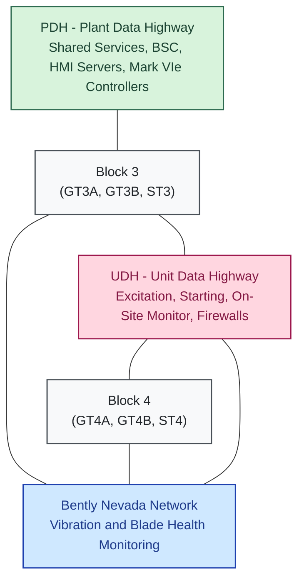

# Mountainview Generation Station — GE Mark VIe Turbine Control Baseline

Source diagram: [MVGS_Baseline Architecture_GE_V1.png](../img-Architecture/MVGS_Baseline%20Architecture_GE_V1.png)

Owner: IT Enterprise Architecture
Classification: INTERNAL
Version: V1 (5/8/2026) — B. Smith

## 1. Purpose

This document describes the **baseline GE Mark VIe Turbine Control (TC)
system** at Southern California Edison's **Mountainview Generation Station
(MVGS)**. It captures the as-built network segmentation, the major server
and HMI roles, the Mark VIe controllers and associated GE excitation /
starting equipment, the Bently Nevada vibration and blade-health
monitoring chain, and the external interfaces that surround the GE DCS
today. It is intended as a reference for IT/OT architects, controls
engineers, cybersecurity, and integration teams working on MVGS
modifications (including the upcoming BESS integration).

The GE Mark VIe DCS is responsible for the **combustion turbine,
generator, and steam-turbine controls** for both power blocks at MVGS —
units **GT3A, GT3B, ST3, GT4A, GT4B, and ST4**. The Balance of Plant
(BoP) scope (HRSG duct burners, gas compressor, water treatment, and
plant-wide operator infrastructure) is provided by a separate
**Emerson Ovation DCS**, which interfaces to the GE environment through
the Ovation Field LAN Router on the PDH.

## 2. Architecture at a Glance

The GE deployment is organized as a layered, segmented architecture with
three plant data buses inside the Control Building:

1. **External networks** — `GRID2` and the **Grid Data Center (GDC)**
   network terminate outside the plant control envelope; GE itself
   reaches the site via the public Internet for Remote Monitoring &
   Diagnostics (RM&D).
2. **Perimeter** — an `MVGS FW` firewall (with `INTERNAL` and `EXTERNAL`
   interfaces) and the `XONA` secure remote access gateway mediate all
   traffic between `GRID2` / GDC and the GE DCS.
3. **PDH — Plant Data Highway** (green) — top-level plant bus that
   carries NTP, the BSC server pair, EWS, Historian, Control Room HMI
   servers (CRM*SVR), the Unit Server/HMIs, and the Mark VIe controllers.
4. **UDH — Unit Data Highway** (pink) — unit-level bus that carries
   excitation, starting, vibration, and ancillary monitoring devices into
   each unit, segmented from the PDH by a `Fortinet FW` and a
   `Cisco ASA FW`.
5. **Bently Nevada Network** (blue) — dedicated machinery-protection
   segment that connects every unit's Bently Nevada 3500 vibration
   monitor and Blade Health Monitor.
6. **ADH/MDH** (purple) — Auxiliary / Maintenance Data Highway at the
   bottom of the Control Building, with the `Auto Transfer Switch (APC)`
   and the **ADH/PDH Bridging Lock Box** (installed but not utilized).
7. **Unit zones** — GT3A, GT3B, ST3 (Block 3) and GT4A, GT4B, ST4
   (Block 4). Block 4 mirrors Block 3.

### 2.1 Plant-Only View (Blocks 3 & 4)

The diagram below is a pared-down, plant-only view of the GE DCS — all
external and perimeter elements (`GRID2`, GDC, Internet, GE RM&D,
`MVGS FW`, `XONA`, `BSC1CLT`, `Ovation Field LAN Router`) and the
ADH/MDH are intentionally omitted. Color coding matches the source
diagram's palette: **green** = PDH, **pink** = UDH, **blue** = Bently
Nevada Network, **amber** = firewalls.

```mermaid
flowchart TB
    %% ---- Level 1: PDH (Plant Data Highway) ----
    subgraph PDH["PDH - Plant Data Highway"]
        direction LR
        SHARED["Shared Services<br/>NTP / EWS / Historian<br/>BSC PRI / SEC"]
        CRM3["CRM1-3SVR<br/>(Unit 3 Desk)"]
        CRM4["CRM4-6SVR<br/>(Unit 4 Desk)"]
    end

    %% ---- Level 2: Block 3 ----
    subgraph BLK3["Block 3"]
        direction LR
        subgraph GT3A["GT3A"]
            direction TB
            GT3A_HMI["Unit Server/HMI<br/>+ Mark VIe Controller"]
            GT3A_EXC["EX2100e Exciter<br/>+ LX2100e LCI"]
            GT3A_BN["BN 3500 Vib Mon<br/>+ Blade Health Mon"]
        end
        subgraph GT3B["GT3B"]
            direction TB
            GT3B_HMI["Unit Server/HMI<br/>+ Mark VIe Controller"]
            GT3B_EXC["EX2100e Exciter<br/>+ ePDA / GHM"]
            GT3B_BN["BN 3500 Vib Mon<br/>+ Blade Health Mon"]
        end
        subgraph ST3["ST3"]
            direction TB
            ST3_HMI["Unit Server/HMI<br/>+ Mark VIe Controller"]
            ST3_EXC["EX2100e Exciter<br/>&nbsp;"]
            ST3_BN["BN 3500 Vib Mon<br/>&nbsp;"]
        end
    end

    %% ---- Level 3: UDH (Unit Data Highway) ----
    subgraph UDH["UDH - Unit Data Highway"]
        direction LR
        FORTI["Fortinet FW"]
        OSM["uOSM / PSDM<br/>+ Eth/Serial Converter<br/>Serial MODBUS to DCS"]
        BNS1["Bently Nevada System 1<br/>(+ System 1 Laser Printer)"]
        ASA["Cisco ASA FW"]
    end

    %% ---- Level 4: Block 4 ----
    subgraph BLK4["Block 4"]
        direction LR
        subgraph GT4A["GT4A"]
            direction TB
            GT4A_HMI["Unit Server/HMI<br/>+ Mark VIe Controller"]
            GT4A_EXC["EX2100e Exciter<br/>+ LX2100e LCI"]
            GT4A_BN["BN 3500 Vib Mon<br/>+ Blade Health Mon"]
        end
        subgraph GT4B["GT4B"]
            direction TB
            GT4B_HMI["Unit Server/HMI<br/>+ Mark VIe Controller"]
            GT4B_EXC["EX2100e Exciter<br/>+ ePDA / GHM"]
            GT4B_BN["BN 3500 Vib Mon<br/>+ Blade Health Mon"]
        end
        subgraph ST4["ST4"]
            direction TB
            ST4_HMI["Unit Server/HMI<br/>+ Mark VIe Controller"]
            ST4_EXC["EX2100e Exciter<br/>&nbsp;"]
            ST4_BN["BN 3500 Vib Mon<br/>&nbsp;"]
        end
    end

    %% ---- Bus / firewall connections ----
    SHARED --- CRM3
    SHARED --- CRM4

    SHARED --- FORTI
    FORTI --- OSM
    SHARED --- ASA

    %% PDH to unit HMI/controllers
    CRM3 --- GT3A_HMI
    CRM3 --- GT3B_HMI
    CRM3 --- ST3_HMI
    CRM4 --- GT4A_HMI
    CRM4 --- GT4B_HMI
    CRM4 --- ST4_HMI

    %% UDH (post-ASA) to unit excitation/starting
    ASA --- GT3A_EXC
    ASA --- GT3B_EXC
    ASA --- ST3_EXC
    ASA --- GT4A_EXC
    ASA --- GT4B_EXC
    ASA --- ST4_EXC

    %% Bently Nevada Network to System 1 on UDH
    GT3A_BN --- BNS1
    GT3B_BN --- BNS1
    ST3_BN --- BNS1
    GT4A_BN --- BNS1
    GT4B_BN --- BNS1
    ST4_BN --- BNS1

    %% ---- Node class definitions ----
    classDef pdh fill:#d8f3dc,stroke:#2d6a4f,stroke-width:1px,color:#1b4332
    classDef udh fill:#ffd6e0,stroke:#9d174d,stroke-width:1px,color:#831843
    classDef bn  fill:#cfe8ff,stroke:#1e40af,stroke-width:1px,color:#1e3a8a
    classDef fw  fill:#fff3bf,stroke:#b45309,stroke-width:1.5px,color:#7c2d12

    %% ---- Node class assignments ----
    class SHARED,CRM3,CRM4,GT3A_HMI,GT3B_HMI,ST3_HMI,GT4A_HMI,GT4B_HMI,ST4_HMI pdh
    class OSM,BNS1,GT3A_EXC,GT3B_EXC,ST3_EXC,GT4A_EXC,GT4B_EXC,ST4_EXC udh
    class GT3A_BN,GT3B_BN,ST3_BN,GT4A_BN,GT4B_BN,ST4_BN bn
    class FORTI,ASA fw

    %% ---- Subgraph styling ----
    style PDH  fill:#ebfbee,stroke:#2d6a4f,stroke-width:1.5px,color:#1b4332
    style UDH  fill:#fff0f3,stroke:#9d174d,stroke-width:1.5px,color:#831843
    style BLK3 fill:#f8f9fa,stroke:#495057,stroke-width:1.5px,color:#212529
    style BLK4 fill:#f8f9fa,stroke:#495057,stroke-width:1.5px,color:#212529
    style GT3A fill:#ffffff,stroke:#adb5bd,stroke-dasharray:4 3,color:#212529
    style GT3B fill:#ffffff,stroke:#adb5bd,stroke-dasharray:4 3,color:#212529
    style ST3  fill:#ffffff,stroke:#adb5bd,stroke-dasharray:4 3,color:#212529
    style GT4A fill:#ffffff,stroke:#adb5bd,stroke-dasharray:4 3,color:#212529
    style GT4B fill:#ffffff,stroke:#adb5bd,stroke-dasharray:4 3,color:#212529
    style ST4  fill:#ffffff,stroke:#adb5bd,stroke-dasharray:4 3,color:#212529
```

### 2.2 Conceptual Abstraction

The diagram below is a high-level abstraction of §2.1 — the six units
and per-unit equipment are collapsed into a single representative
**Block** node, and the three plant buses are shown as flat colored
bars. Useful for executive briefings or when introducing the layered
architecture without the unit-level detail.

## 3. External Interfaces and Perimeter

| Zone / Device | Role |
|---|---|
| `GRID2` | External SCE grid-side network, brought to the MVGS firewall. |
| Grid Data Center (`GDC Networks`) | SCE GDC, double-firewalled, providing the controlled path from `GRID2` toward the Internet and back. |
| Internet | Public Internet path used exclusively for GE RM&D. |
| `GE Remote Monitoring & Diagnostics` | GE-hosted RM&D service that reaches MVGS through the GDC perimeter. *Vendor-owned, outside SCE control envelope.* |
| `MVGS FW` | Edge firewall enforcing the boundary between `GRID2` and the GE DCS; presents `INTERNAL` and `EXTERNAL` interfaces. |
| `XONA` | Secure remote access gateway behind `MVGS FW` for SCE/vendor remote sessions into the GE DCS. |
| `BSC1CLT` | BSC Thin Client used to access the BSC servers from outside the PDH. |
| `Ovation Field LAN Router` | Dashed/yellow on the diagram — **not part of the GE scope**; shown to indicate the interface between the Ovation BoP environment and the PDH. |

All north-bound integration of the GE DCS to SCE corporate, grid, or GE
vendor services traverses the `MVGS FW` (toward SCE) or the GDC firewall
pair (toward GE RM&D via the Internet). The PDH, UDH, Bently Nevada
Network, and ADH/MDH are all considered inside the plant control
envelope.

## 4. PDH — Plant Data Highway

The PDH is the top-level plant bus inside the Control Building. It
connects shared plant services, the BSC server pair, the operator
control-room HMI servers, and every Unit Server/HMI and Mark VIe
controller across both blocks.

### 4.1 Shared Services on the PDH

| Device | Role |
|---|---|
| NTP Server | Time source for the GE DCS. |
| BSC (Primary) | Backup / Site Controller — primary. |
| BSC (Secondary) | Backup / Site Controller — secondary. |
| EWS | Engineering Workstation for the GE DCS. |
| Historian | GE DCS process historian. |

### 4.2 Control Room HMI Servers

| Server Group | Desk |
|---|---|
| CRM1SVR, CRM2SVR, CRM3SVR | Unit 3 Desk |
| CRM4SVR, CRM5SVR, CRM6SVR | Unit 4 Desk |

### 4.3 Unit Server / HMI and Mark VIe Controllers

Each combustion turbine and each steam turbine has its own
**Unit Server/HMI** and **Mark VIe Controller** pair connected to the
PDH.

| Unit | Devices on PDH |
|---|---|
| GT3A | Unit Server/HMI; Mark VIe Controller |
| GT3B | Unit Server/HMI; Mark VIe Controller |
| ST3  | Unit Server/HMI; Mark VIe Controller |
| GT4A | Unit Server/HMI; Mark VIe Controller |
| GT4B | Unit Server/HMI; Mark VIe Controller |
| ST4  | Unit Server/HMI; Mark VIe Controller |

> The diagram explicitly notes: *"GT4A, GT4B, and ST4 Same as GT3A, GT3B,
> and ST3 Above"* — Block 4 is a structural mirror of Block 3.

## 5. UDH — Unit Data Highway

The UDH sits below the PDH and carries the unit-level excitation,
starting, ancillary monitoring, and on-site monitor traffic. The UDH is
separated from the PDH by **two firewalls**:

- **Fortinet FW** — segments the on-site monitor / serial MODBUS branch
  from the rest of the UDH.
- **Cisco ASA FW** — segments the unit excitation / starting / Bently
  Nevada branch from the rest of the UDH.

### 5.1 On-Site Monitor and Serial MODBUS Branch

| Device | Role |
|---|---|
| Fortinet FW | Firewall between this branch and the broader UDH. |
| uOSM / PSDM (On Site Monitor) | GE On-Site Monitor / Plant Service Data Manager. |
| Ethernet / Serial Converter | Protocol conversion between the on-site monitor and the DCS serial port. |
| Serial MODBUS to DCS Port | Serial MODBUS link into the DCS. |

### 5.2 Shared UDH Services

| Device | Role |
|---|---|
| System 1 Laser Printer | Printer for the Bently Nevada System 1 environment. |
| Bently Nevada System 1 | Bently Nevada System 1 server for machinery condition monitoring. |
| Cisco ASA FW | Firewall between the unit excitation / starting branch and the UDH. |

### 5.3 Per-Unit Excitation, Starting, and Ancillary Equipment

Each unit zone (downstream of the `Cisco ASA FW`) carries the GE
excitation control and unit-specific ancillary devices. The full set as
drawn for Block 3:

| Unit | Devices on UDH |
|---|---|
| GT3A | Exciter Control (GE EX2100e); Static Starter / LCI (GE LX2100e) |
| GT3B | Exciter Control (GE EX2100e); ePDA (Block); GHM (Block) |
| ST3  | Exciter Control (GE EX2100e) |

Block 4 (GT4A, GT4B, ST4) replicates the Block 3 layout.

## 6. Bently Nevada Network

A dedicated **Bently Nevada Network** sits below the UDH and connects
each unit's machinery-protection devices. Per unit, the network carries:

| Unit | Devices on Bently Nevada Network |
|---|---|
| GT3A | Vibration Monitor (Bently Nevada 3500); Blade Health Monitor |
| GT3B | Vibration Monitor (Bently Nevada 3500); Blade Health Monitor |
| ST3  | Vibration Monitor (Bently Nevada 3500) |
| GT4A | Vibration Monitor (Bently Nevada 3500); Blade Health Monitor |
| GT4B | Vibration Monitor (Bently Nevada 3500); Blade Health Monitor |
| ST4  | Vibration Monitor (Bently Nevada 3500) |

The Bently Nevada Network feeds the `Bently Nevada System 1` server on
the UDH for condition-monitoring data aggregation.

## 7. ADH/MDH

The ADH/MDH (Auxiliary / Maintenance Data Highway) is the bottom bus in
the Control Building.

| Device | Role |
|---|---|
| Auto Transfer Switch (APC) | APC ATS for control-building power transfer. |
| ADH/PDH Bridging Lock Box | **Installed but not utilized** — red on the diagram. Reserved bridge between ADH and PDH; intentionally not in service. |

## 8. Unit Zones

The right-hand side of the diagram is organized into six unit zones,
grouped into two power blocks:

- **Block 3:** `GT3A`, `GT3B`, `ST3`
- **Block 4:** `GT4A`, `GT4B`, `ST4`

Each combustion turbine unit (`GT*`) carries a Unit Server/HMI and a Mark
VIe Controller on the PDH; an Exciter Control on the UDH (plus a Static
Starter / LCI on the lead GT of each block, and ePDA/GHM blocks on the
second GT of each block); and a Bently Nevada 3500 Vibration Monitor and
Blade Health Monitor on the Bently Nevada Network. Each steam turbine
unit (`ST*`) carries the same PDH stack, an Exciter Control on the UDH,
and a Bently Nevada 3500 Vibration Monitor.

## 9. Conventions and Notes

- **Mark VIe Controller** is the GE turbine controller; each unit has its
  own controller paired with a Unit Server/HMI on the PDH.
- **EX2100e** is the GE digital excitation platform; **LX2100e** is the
  GE LCI / static-starter platform.
- **uOSM / PSDM** is GE's On-Site Monitor / Plant Service Data Manager,
  used by GE RM&D for remote data collection.
- The **ADH/PDH Bridging Lock Box** is **installed but not utilized** —
  it is shown red on the diagram to highlight that the ADH and PDH are
  intentionally not bridged in the current baseline.
- The **Ovation Field LAN Router** is shown with a dashed yellow outline
  to indicate that it is **not part of the GE DCS scope** — it is the
  Ovation BoP environment's gateway onto the PDH.
- The **GE Remote Monitoring & Diagnostics** node is GE-owned and reaches
  MVGS over the public Internet via the GDC perimeter; it is shown
  outside the SCE control envelope.
- Block 4 (`GT4A`, `GT4B`, `ST4`) is structurally identical to Block 3
  (`GT3A`, `GT3B`, `ST3`) and the diagram collapses Block 4's detail with
  the note *"GT4A, GT4B, and ST4 Same as GT3A, GT3B, and ST3 Above."*
