# Mountainview Generation Station — Ovation DCS Baseline (Balance of Plant)

Source diagram: [MVGS_Baseline Architecture_Ovation_V1.png](../img-Architecture/MVGS_Baseline%20Architecture_Ovation_V1.png)

Owner: IT Enterprise Architecture
Classification: INTERNAL
Version: V1 (5/8/2026) — H. Mendel / B. Smith

## 1. Purpose

This document describes the **baseline Emerson Ovation Distributed Control
System (DCS)** that provides **Balance of Plant (BoP)** monitoring and
control at Southern California Edison's **Mountainview Generation Station
(MVGS)**. It captures the as-built network segmentation, the major server
and workstation roles, the field controllers, and the external interfaces
that surround the Ovation system today. It is intended as a reference for
IT/OT architects, controls engineers, cybersecurity, and integration teams
working on MVGS modifications (including the upcoming BESS integration).

The Ovation DCS is responsible for the BoP scope at MVGS — Heat Recovery
Steam Generators (HRSG) duct burners, the gas compressor train, water
treatment, and the supporting plant-wide control, historian, and operator
infrastructure. The combustion turbine / generator controls themselves are
provided by a separate **GE DCS (PDH)** that interfaces into the Ovation
environment through a dedicated PDH link.

## 2. Architecture at a Glance

The Ovation deployment is organized as a layered, segmented architecture:

1. **External networks** — `GRID2`, the **SCE EMS Network** (carrying
   `SCE EMS`), the **SCE ECN** (carrying the `SCE MV ECN Tunnel` for
   Dispatch / AGC, fed by `CAISO ECN`), and the **SCE ECN for GenMS**
   (carrying `GenMS`) all terminate outside the plant control envelope.
   These four external networks are mutually independent.
2. **Perimeter** — an `MVGS FW` firewall and a `DMZ` mediate all traffic
   between `GRID2` and the plant.
3. **Field acquisition** — serial/Ethernet gateways (MOXA) and the GE PDH
   link bring RTU, weather, and turbine data onto a `MOXA LAN`.
4. **Field LAN Router with ACL** — a controlled junction between the field
   acquisition LAN and the Ovation `ELC LAN`.
5. **ELC LAN** — Ovation External Link Controllers (ELCs), deployed in
   PRI/SEC pairs, terminate DNP3 and MODBUS sessions and present the data
   into Ovation.
6. **ROOT network** — the Ovation plant bus that connects controllers,
   operator stations, engineering and historian servers, and the control
   building infrastructure.
7. **Plant-wide control segments** — HRSG, Gas Compressor, and Water
   Treatment areas, each with their own Ovation controllers and Remote I/O.
8. **PWCS LAN** — an isolated Plant-Wide Cyber Security suite for the
   Ovation environment.

### 2.1 Ovation Architecture Diagram

The diagram below summarizes the Ovation BoP layers and how they connect
across the MVGS plant. PRI/SEC controller pairs are collapsed into a
single node for readability; refer to the detailed sections below for the
full `primary / partner` numbering.

```mermaid
%%{init: {'flowchart': {'nodeSpacing': 40, 'rankSpacing': 50, 'padding': 8, 'htmlLabels': true, 'useMaxWidth': true, 'curve': 'basis', 'diagramPadding': 8}, 'themeVariables': {'fontSize': '9px'}}}%%
flowchart TB
    classDef ext fill:#e8eef7,stroke:#36507a,color:#15233b
    classDef caiso fill:#dfe7f5,stroke:#1f3d7a,color:#0e1f3b
    classDef ems fill:#f5e1d2,stroke:#8a3b12,color:#3b1a08,stroke-width:2px
    classDef ecn fill:#e8eef7,stroke:#36507a,color:#15233b,stroke-width:2px
    classDef genms fill:#e7e0f2,stroke:#4a2a7a,color:#1f1138,stroke-width:2px
    classDef perim fill:#fde9d9,stroke:#a35a17,color:#3b2410
    classDef field fill:#fff4c2,stroke:#8a6d12,color:#3b3208
    classDef elc fill:#e2f0d9,stroke:#3f6e2a,color:#1c3414
    classDef root fill:#d9e8f5,stroke:#1f4e79,color:#0e2236
    classDef sec fill:#f8d7da,stroke:#842029,color:#3b0a0e
    classDef legacy fill:#fff2a8,stroke:#b8860b,color:#3a2a00,stroke-dasharray: 5 4
    classDef spacer fill:none,stroke:none,color:transparent
    classDef rootSmall fill:#d9e8f5,stroke:#1f4e79,color:#0e2236,font-size:7px

    %% ============================================================
    %% Layer 1 - External Networks (full-width top band)
    %% ============================================================
    subgraph EXT[External Networks]
        direction LR
        GRID2[GRID2]:::ext
        subgraph EMSNET[SCE EMS Network]
            direction TB
            EMS_TOP( ):::spacer
            EMS_TOP2( ):::spacer
            SCEEMS[SCE EMS]:::ems
            EMS_BOT( ):::spacer
            EMS_TOP ~~~ EMS_TOP2 ~~~ SCEEMS ~~~ EMS_BOT
        end
        subgraph ECNNET[SCE ECN]
            direction TB
            ECN_TOP( ):::spacer
            CAISO[CAISO ECN]:::caiso
            SCEECN[SCE MV ECN Tunnel<br/>Dispatch / AGC]:::ecn
            ECN_BOT( ):::spacer
            CAISO <-->|Market awards| SCEECN
            ECN_TOP ~~~ CAISO
            SCEECN ~~~ ECN_BOT
        end
        subgraph GENMSNET[SCE ECN for GenMS]
            direction TB
            GEN_TOP( ):::spacer
            GEN_TOP2( ):::spacer
            GENMS[GenMS]:::genms
            GEN_BOT( ):::spacer
            GEN_TOP ~~~ GEN_TOP2 ~~~ GENMS ~~~ GEN_BOT
        end
    end

    %% ============================================================
    %% Layer 2 - Perimeter (centered under externals)
    %% ============================================================
    subgraph PERIM[Perimeter]
        direction LR
        FW[MVGS FW] <--> DMZ[DMZ] <--> EDS[EDS Workstation]
    end
    class FW,DMZ,EDS perim

    %% ============================================================
    %% Layer 3 - Field Acquisition (MOXA LAN + PDH)
    %% ============================================================
    subgraph FIELD[Field Acquisition - MOXA LAN and PDH]
        direction LR
        subgraph SRC[Serial Sources]
            direction LR
            TRIMARK[Trimark RIG]
            EMSRTU[EMS RTU]
            WX[Weather Station]
            OMNI[OMNI RTU]
            FOCUS[FOCUS RTU]
        end
        MOXA[MOXA Serial/Ethernet Gateways]
        PDH[GE DCS - PDH Link]
        SRC --- MOXA
    end
    class MOXA,EMSRTU,TRIMARK,WX,OMNI,FOCUS field
    class PDH legacy

    %% ============================================================
    %% Layer 4 - Field LAN Router (ACL)
    %% ============================================================
    FLR{{Field LAN Router - ACL}}:::perim

    %% ============================================================
    %% Layer 5 - ELC LAN (PRI/SEC pairs)
    %% ============================================================
    subgraph ELCLAN[ELC LAN - PRI/SEC Pairs]
        direction LR
        subgraph ELCPAIRS[Controller 1/51 ELCs]
            direction LR
            ELC_EMS[ELC EMS RTU<br/>DNP3 Server]
            ELC_RIG[ELC RIG<br/>DNP3 Client]
            ELC_WX[ELC Weather<br/>MODBUS Client]
            ELC_FOCUS[ELC FOCUS<br/>DNP3 Client]
        end
        CTRL01[Controller 01/51]
        ELCPAIRS <--> CTRL01
    end
    class ELC_RIG,ELC_WX,ELC_EMS,ELC_FOCUS,CTRL01 elc

    %% ============================================================
    %% Layer 6 - PWCS LAN (above ROOT) + Ovation ROOT (two balanced rows)
    %% ============================================================
    subgraph PWCS[PWCS LAN - Cyber Security]
        direction LR
        CSUI[Cyber Suite UI]
        CSVM[Cyber Suite VM Host]
        CSNAS[Cyber Suite NAS]
    end
    class CSUI,CSVM,CSNAS sec

    subgraph ROOT[Ovation ROOT Network]
        direction TB
        subgraph ROW1[Servers and Operators]
            direction LR
            subgraph CB[Control Building]
                direction TB
                GPS[GPS Clock]
                PRN[Printer]
                HIST160[Process Historian 160]
                ENG180[Engineering Stn 180]
                DC150[Domain Ctrl 150]
                DB200[Database 200]
                TS245[Term Services 245]
            end
            subgraph MCR[Main Control Room]
                direction TB
                OS3[Unit 3 Desk<br/>OS 210/211]
                OS4[Unit 4 Desk<br/>OS 220/221]
                OSC[Common Desk<br/>OS 230]
            end
            subgraph BCR[Backup Control Room]
                direction TB
                HIST161[Process Historian 161]
            end
        end
        subgraph ROW2[Plant Areas]
            direction LR
            subgraph HRSG[HRSG Duct Burners]
                direction TB
                H3A[HRSG 3A<br/>OS 212 - Ctrl 38/88]
                H3B[HRSG 3B<br/>OS 213 - Ctrl 39/89]
                H4A[HRSG 4A<br/>OS 222 - Ctrl 48/98]
                H4B[HRSG 4B<br/>OS 223 - Ctrl 49/99]
            end
            subgraph GCF[Gas Compressor - GCF MCC]
                direction TB
                GC[Controller 20/70]
                GCRIO[RIO 20-1 to 20-6]
                GC --- GCRIO
            end
            subgraph WT[Water Treatment]
                direction TB
                WTC[Controller 21/71]
                WTRIO[RIO 21-1 RO<br/>21-2 Pre-Treat<br/>21-3 Tank Farm<br/>21-4 Lime/Ash]
                WTOS[Lab OS 240]
                WTC --- WTRIO
                WTC --- WTOS
            end
        end
    end
    class GPS,PRN,HIST160,ENG180,DC150,DB200,TS245,OS3,OS4,OSC,HIST161,H3A,H3B,H4A,H4B,GC,GCRIO,WTC,WTRIO,WTOS rootSmall

    %% ============================================================
    %% Cross-layer connections
    %% ============================================================

    %% External network -> field device terminations (match Section 2.2)
    GRID2 <---->  FW
    SCEEMS <---->|EMS Telemetry| EMSRTU
    SCEECN <---->|Market awards| TRIMARK
    GENMS <---->|SCE Internal Dispatch| TRIMARK

    %% Field acquisition into Ovation core
    DMZ <-. controlled exchange .-> FLR
    MOXA <--> FLR
    PDH <--> FLR
    FLR <--> ELC_EMS
    FLR <--> ELC_RIG
    FLR <--> ELC_WX
    FLR <--> ELC_FOCUS
    CTRL01 <--> ROOT
    PWCS <--> ROOT

    %% Styles for invisible / outline-only containers
    style EXT fill:#f7f9fc,stroke:#36507a,stroke-width:1.5px
    style EMSNET fill:#fff4ec,stroke:#8a3b12,stroke-width:2px
    style ECNNET fill:#eef3fb,stroke:#36507a,stroke-width:2px
    style GENMSNET fill:#f3eef9,stroke:#4a2a7a,stroke-width:2px
    style SRC fill:none,stroke:#8a6d12,stroke-dasharray: 3 3
    style ROW1 fill:none,stroke:#1f4e79,stroke-dasharray: 3 3,font-size:7px
    style ROW2 fill:none,stroke:#1f4e79,stroke-dasharray: 3 3,font-size:7px

    %% Shrink Ovation ROOT Network area to ~50% of the rest
    style ROOT font-size:7px
    style CB font-size:7px
    style MCR font-size:7px
    style BCR font-size:7px
    style HRSG font-size:7px
    style GCF font-size:7px
    style WT font-size:7px
    style ELCPAIRS fill:#eff5e9,stroke:#3f6e2a,stroke-width:1.5px,stroke-dasharray: 3 3
```

### 2.2 CAISO Dispatch Path — ECN to Ovation Core

This view isolates the **CAISO dispatch signal path** as it traverses
MVGS. Non-dispatch traffic is intentionally omitted so the dispatch chain
is visible end-to-end.

**Three completely separate external SCE networks** reach MVGS, and each
terminates on exactly one field device:

- **SCE EMS Network** — carries `SCE EMS`, which terminates **only on
  the EMS RTU** (edge labeled `EMS Telemetry`).
- **SCE ECN** — carries the `SCE MV ECN Tunnel` (Dispatch / AGC), which
  terminates **only on the Trimark RIG** (edge labeled `Market awards`).
- **SCE ECN for GenMS** — carries `GenMS`, which also terminates **only
  on the Trimark RIG** (edge labeled `SCE Internal Dispatch`).

`CAISO ECN` sits above the three SCE networks and feeds the `SCE MV ECN
Tunnel` with `Market awards`.

From the two field devices (`EMS RTU` and `Trimark RIG`), both paths are
concentrated by the **MOXA Serial/Ethernet Gateways** on the **MOXA
LAN**, cross the **Field LAN Router (ACL)** onto the **ELC LAN**,
terminate on their respective ELC PRI/SEC pairs (`ELC EMS RTU — DNP3
Server` and `ELC RIG — DNP3 Client`), and are presented to Ovation
`ROOT` via `Controller 01/51` (Plant-wide common). `Controller 01/51`
then distributes to the **Main Control Room**, **Process Historian 160 /
161**, and the **Unit-area Controllers (HRSG / GCF / WT)**.

```mermaid
flowchart LR
    classDef caiso fill:#dfe7f5,stroke:#1f3d7a,color:#0e1f3b
    classDef ems fill:#f5e1d2,stroke:#8a3b12,color:#3b1a08,stroke-width:2px
    classDef ecn fill:#e8eef7,stroke:#36507a,color:#15233b,stroke-width:2px
    classDef genms fill:#e7e0f2,stroke:#4a2a7a,color:#1f1138,stroke-width:2px
    classDef field fill:#fff4c2,stroke:#8a6d12,color:#3b3208
    classDef router fill:#fde9d9,stroke:#a35a17,color:#3b2410
    classDef elc fill:#e2f0d9,stroke:#3f6e2a,color:#1c3414
    classDef root fill:#d9e8f5,stroke:#1f4e79,color:#0e2236

    CAISO[CAISO ECN]:::caiso

    %% Two completely separate external networks (stacked vertically)
    subgraph EXTCOL[ ]
        direction TB
        subgraph GENMSNET[SCE ECN for GenMS]
            direction TB
            GENMS[GenMS]
        end
        subgraph ECNNET[SCE ECN]
            direction TB
            SCEECN[SCE MV ECN Tunnel<br/>Dispatch / AGC]
        end
        subgraph EMSNET[SCE EMS Network]
            direction TB
            SCEEMS[SCE EMS]
        end
    end
    class SCEEMS ems
    class SCEECN ecn
    class GENMS genms

    %% Each external network terminates on exactly one MVGS device (stacked for balance)
    subgraph RTUCOL[ ]
        direction TB
        EMSRTU[EMS RTU]
        RIG[Trimark RIG]
    end
    class EMSRTU,RIG field

    subgraph MOXALAN[MOXA LAN]
        direction TB
        MOXA[MOXA Serial/Ethernet Gateways]
    end
    class MOXA field

    FLR{{Field LAN Router - ACL}}:::router

    subgraph ELCLAN[ELC LAN - PRI/SEC Pairs]
        direction TB
        ELC_EMS[ELC EMS RTU<br/>DNP3 Server]
        ELC_RIG[ELC RIG<br/>DNP3 Client]
        CTRL01[Controller 01/51<br/>Plant-wide common]
    end
    class ELC_EMS,ELC_RIG,CTRL01 elc

    subgraph ROOT[Ovation ROOT]
        direction TB
        MCR[Main Control Room<br/>Unit 3 / Unit 4 / Common Desks]
        HIST[Process Historian 160 / 161]
        UNITCTRL[Unit-area Controllers<br/>HRSG / GCF / WT]
    end
    class MCR,HIST,UNITCTRL root

    %% --- SCE EMS path: EMS -> EMS RTU only ---
    CAISO <-->|Market awards| SCEECN
    SCEEMS <-->|EMS Telemetry| EMSRTU
    EMSRTU <--> MOXA
    MOXA <--> FLR
    FLR <--> ELC_EMS
    ELC_EMS <--> CTRL01

    %% --- SCE ECN path: ECN -> Trimark RIG only ---
    SCEECN <-->|Market awards| RIG
    GENMS <-->|SCE Internal Dispatch| RIG
    RIG <--> MOXA
    MOXA <--> FLR
    FLR <--> ELC_RIG
    ELC_RIG <--> CTRL01

    %% --- Ovation ROOT distribution ---
    CTRL01 <--> MCR
    CTRL01 <--> UNITCTRL
    CTRL01 <--> HIST

    style EMSNET fill:#fff4ec,stroke:#8a3b12,stroke-width:2px
    style ECNNET fill:#eef3fb,stroke:#36507a,stroke-width:2px
    style GENMSNET fill:#f3eef9,stroke:#4a2a7a,stroke-width:2px
    style EXTCOL fill:none,stroke:none
    style RTUCOL fill:none,stroke:none
```

> **Notes:**
> - **SCE EMS Network**, **SCE ECN**, and **SCE ECN for GenMS** are
>   drawn as three independent top-level networks. There is **no edge
>   between them** — they do not share infrastructure or transit each
>   other.
> - **SCE EMS communicates only with the EMS RTU** (`EMS Telemetry`).
> - **SCE ECN (`SCE MV ECN Tunnel`) communicates only with the Trimark
>   RIG** (`Market awards`).
> - **SCE ECN for GenMS (`GenMS`) communicates only with the Trimark
>   RIG** (`SCE Internal Dispatch`).
> - **CAISO ECN** connects only to the `SCE MV ECN Tunnel` with `Market
>   awards`.
> - The CAISO dispatch chain via SCE EMS is: `SCE EMS → EMS RTU → MOXA
>   Serial/Ethernet Gateways → Field LAN Router (ACL) → ELC EMS RTU
>   (DNP3 Server) → Controller 01/51 → Ovation ROOT`.
> - The Trimark RIG chain (carrying both `SCE MV ECN Tunnel` and `GenMS`
>   inputs) is: `Trimark RIG → MOXA Serial/Ethernet Gateways → Field
>   LAN Router (ACL) → ELC RIG (DNP3 Client) → Controller 01/51 →
>   Ovation ROOT`.
> - Weather Station, OMNI RTU, FOCUS RTU, the GE PDH link, and PWCS LAN
>   are present in the full architecture (Section 2.1) but are excluded
>   here to keep the dispatch path clear.

## 3. External Interfaces and Perimeter

| Zone / Device | Role |
| --- | --- |
| `GRID2` | External SCE grid-side network, brought to the MVGS firewall. |
| `MVGS FW` | Edge firewall enforcing the boundary between `GRID2` and MVGS. |
| `DMZ` | Demilitarized zone for controlled data exchange between `GRID2` and the plant. |
| `EDS` | Edge / data services workstation reachable from the DMZ side. |
| `ECN` | SCE Enterprise Control Network, the source of RTU and weather feeds. |

All north-bound integration of the Ovation environment to SCE corporate or
grid systems traverses the `MVGS FW` and `DMZ`. The PWCS LAN, ROOT, ELC
LAN, MOXA LAN, and PDH networks are all considered inside the plant
control envelope.

## 4. Field Acquisition Layer (MOXA LAN and PDH)

The `MOXA LAN` aggregates serial devices that arrive from the `ECN` via
MOXA Serial/Ethernet gateways. The `PDH` segment carries the link to the
plant's combustion turbine controls.

| Source Device | Gateway / Link | Notes |
| --- | --- | --- |
| Trimark RIG | Serial/Ethernet (MOXA) | Remote Intelligent Gateway feed. |
| Weather Station | Serial/Ethernet (MOXA) | Plant meteorological data. |
| OMNI RTU | Serial/Ethernet (MOXA) | RTU feed from ECN. |
| EMS RTU | Serial/Ethernet (MOXA) | Energy Management System RTU. |
| FOCUS RTU | Serial/Ethernet (MOXA) | FOCUS dispatch / monitoring RTU. |
| GE DCS (PDH) | PDH link | Turbine/generator DCS — *not part of Ovation*; shown as the external/legacy yellow block on the diagram. |

The MOXA LAN and the PDH link both terminate at the **Field LAN Router**,
which enforces an **Access Control List (ACL)** before any traffic is
permitted onto the `ELC LAN`.

## 5. External Link Controllers (ELC LAN)

The ELC LAN hosts the Ovation External Link Controllers that translate
between field protocols and the Ovation ROOT network. All ELCs are
deployed as **PRI/SEC (primary / secondary) redundant pairs**.

| ELC Pair | Protocol Role | Upstream Source |
| --- | --- | --- |
| ELC — RIG (PRI/SEC) | DNP3 Client | Trimark RIG |
| ELC — Weather (PRI/SEC) | MODBUS Client | Weather Station |
| ELC — EMS RTU (PRI/SEC) | DNP3 Server | EMS RTU |
| ELC — FOCUS (PRI/SEC) | DNP3 Client | FOCUS RTU |
| ELC — GenMS (PRI/SEC) | DNP3 Server | Generation Management System |
| Controller (01/51) | Ovation controller | Plant-wide / common functions |

The `(01/51)` numbering convention (and the `xx/yy` numbering used
throughout the rest of the architecture) follows Ovation's standard
**primary controller / partner controller** pairing.

## 6. Ovation ROOT Network

The `ROOT` network is the Ovation plant data highway. Connected to ROOT
are the ELC pairs, every Ovation controller, every Operator Station, the
historian and engineering infrastructure, and the control-building
servers.

### 6.1 Control Building Infrastructure

| Device | ID | Role |
| --- | --- | --- |
| GPS Clock | — | Time source for the Ovation environment. |
| Printer | — | Plant printing services. |
| Process Historian | 160 | Primary Ovation historian. |
| Engineering Station | 180 | Ovation engineering / configuration. |
| Domain Controller | 150 | Ovation Windows domain controller. |
| Database Server | 200 | Ovation database services. |
| Terminal Services Server | 245 | Remote / terminal access services. |

### 6.2 Main Control Room

| Operator Station | ID | Desk |
| --- | --- | --- |
| Operator Station | 210 / 211 | Unit 3 Desk |
| Operator Station | 220 / 221 | Unit 4 Desk |
| Operator Station | 230 | Common / additional desk |

### 6.3 Backup Control Room

| Device | ID | Role |
| --- | --- | --- |
| Process Historian | 161 | Backup historian located in the Backup Control Room. |

## 7. HRSG Duct Burner Controls

Each of the four Heat Recovery Steam Generators has a dedicated Ovation
controller pair and a local Operator Station. All connect back to the
ROOT network.

| HRSG Area | Operator Station | Controller (PRI/SEC) | Function |
| --- | --- | --- | --- |
| HRSG 3A | 212 | 38 / 88 | Duct Burner 3A |
| HRSG 3B | 213 | 39 / 89 | Duct Burner 3B |
| HRSG 4A | 222 | 48 / 98 | Duct Burner 4A |
| HRSG 4B | 223 | 49 / 99 | Duct Burner 4B |

## 8. Gas Compressor (GCF MCC Building)

The Gas Compressor train is controlled by a single Ovation controller
pair with six Remote I/O (RIO) drops, one per compressor / suction skid.

| Device | ID | Function |
| --- | --- | --- |
| Controller | 20 / 70 | Gas Compressor master controller (PRI/SEC) |
| RIO 20-1 | — | Gas Compressor Skid 1 |
| RIO 20-2 | — | Gas Compressor Skid 2 |
| RIO 20-3 | — | Gas Compressor Skid 3 |
| RIO 20-4 | — | Gas Compressor Skid 4 |
| RIO 20-5 | — | Gas Compressor Skid 5 |
| RIO 20-6 | — | Gas Compressor Suction Skid |

## 9. Water Treatment

Water Treatment is split across the Water Treatment MCC Building (process
equipment and RIO) and the Water Treatment Lab (local HMI).

| Location | Device | ID | Function |
| --- | --- | --- | --- |
| Water Treatment MCC Building | Controller | 21 / 71 | Water Treatment master controller (PRI/SEC) |
| Water Treatment MCC Building | RIO 21-1 | — | Reverse Osmosis |
| Water Treatment MCC Building | RIO 21-2 | — | Pre-Treatment |
| Tank Farm | RIO 21-3 | — | Tank Farm |
| Lime/Ash Silo | RIO 21-4 | — | Lime / Ash Silo |
| Water Treatment Lab | Operator Station | 240 | Local Water Treatment HMI |

## 10. PWCS LAN — Plant-Wide Cyber Security Suite

The PWCS LAN is a dedicated segment off the Control Building that hosts
the cybersecurity tooling for the Ovation environment.

| Device | Role |
| --- | --- |
| Cybersecurity Suite User Interface | Operator / analyst console for the cyber suite. |
| Cybersecurity Suite VM Host | Virtualization host for the cyber suite workloads. |
| Cybersecurity Suite NAS | Storage for cyber suite data (logs, baselines, artifacts). |

## 11. Conventions and Notes

- **Controller numbering** follows Ovation's `primary / partner`
  convention (e.g., `38 / 88`, `20 / 70`, `21 / 71`, `01 / 51`).
- **ELC pairs** are denoted `(PRI/SEC)` and are deployed redundantly.
- The **GE DCS (PDH)** block is shown on the diagram with a dashed yellow
  outline to indicate that it is **not part of the Ovation BoP scope** —
  it is the combustion turbine / generator DCS that interfaces to Ovation
  via the PDH link.
- The **Field LAN Router (ACL)** is the single enforced choke point
  between the MOXA LAN / PDH and the Ovation ELC LAN.
- All operator interaction with the BoP occurs from Operator Stations on
  the ROOT network (Main Control Room, HRSG areas, and the Water
  Treatment Lab); the Backup Control Room currently hosts the secondary
  historian only.
