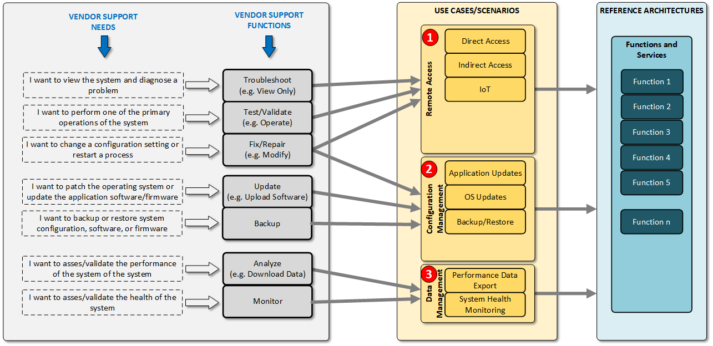
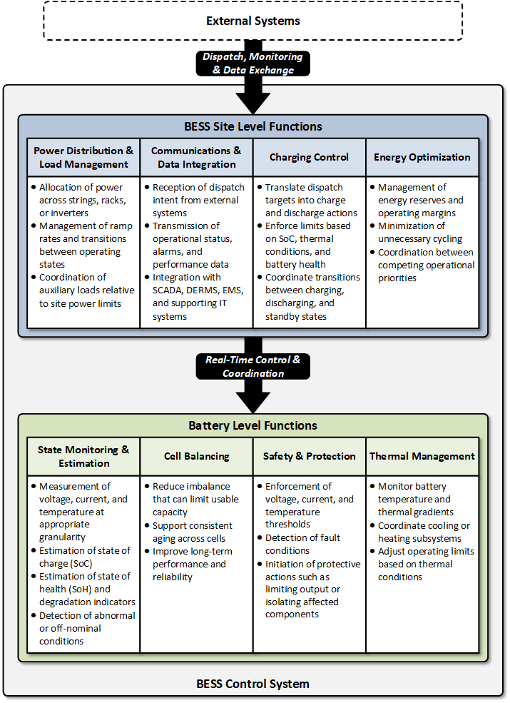
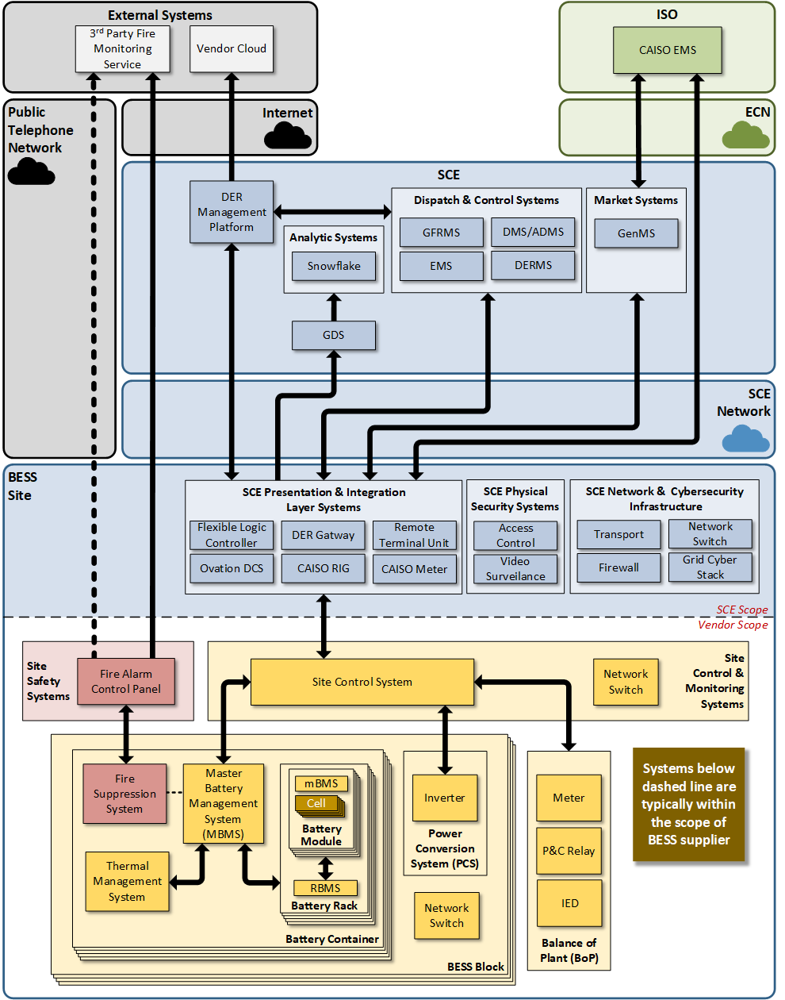
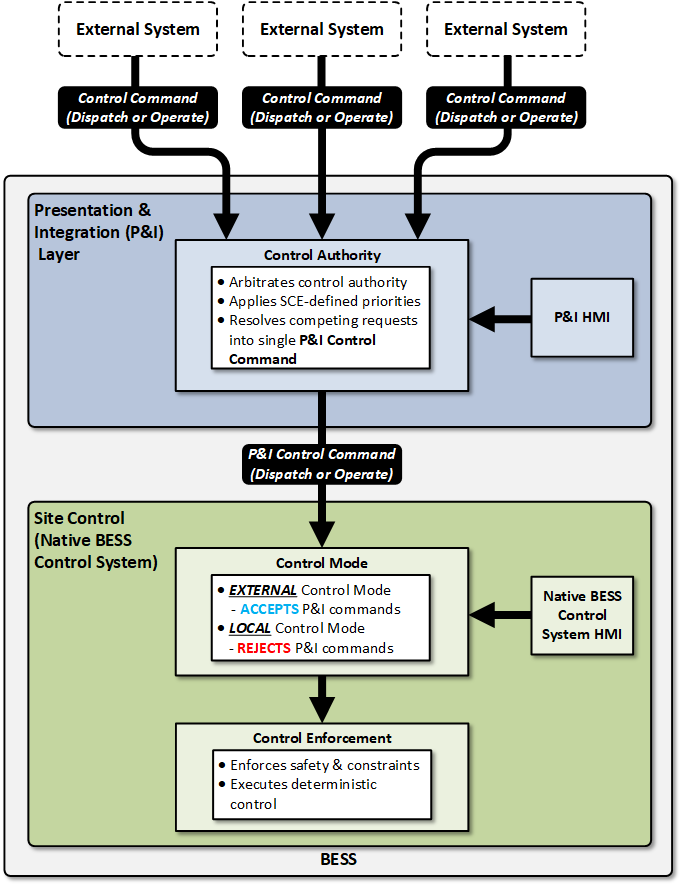
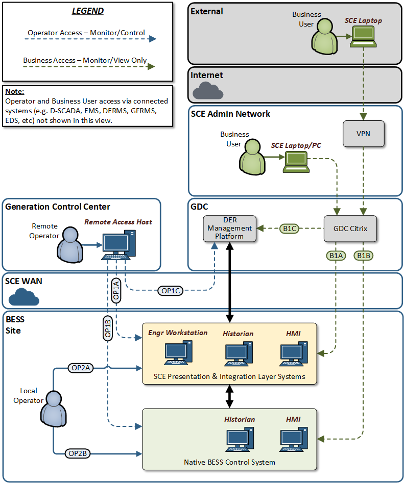
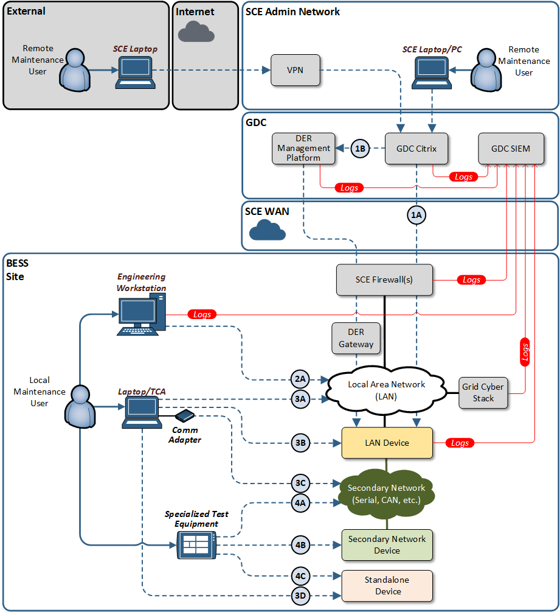

# BESS IT & Control System Architecture Vision Document

<!-- markdownlint-disable MD013 MD025 MD033 MD036 -->
<!--
  MD013 (line-length): Pandoc-converted reference doc uses one-paragraph-per-line style.
  MD025 (single-h1):   Document intentionally uses multiple top-level headings per source.
  MD033 (no-inline-html): Required for tables with merged-cell (rowspan/colspan) headers
                          in §6 requirements; GFM pipe-tables cannot express them.
  MD036 (no-emphasis-as-heading): Original document uses bold runs as sub-labels by design.
-->

Battery Energy Storage System (BESS)

IT & Control System Architecture Vision Document

***Version 1.0***

**\**

# Executive Summary

Southern California Edison’s (SCE) Battery Energy Storage System (BESS) Control System Architecture Vision Document establishes a shared, enterprise‑level framework for how SCE owned BESS control systems are designed, integrated, operated, and supported across the SCE grid. Unlike third‑party‑owned resources connected to the SCE grid that require basic monitoring and dispatch capabilities, SCE‑owned BESS assets require deeper operational visibility, greater control, and more direct integration to safely and reliably perform their intended functions. As SCE owned BESS deployments expand in scale, diversity, and operational importance, this architecture vision document provides a consistent reference that aligns stakeholders across Operations, Engineering, IT/OT, Cybersecurity, Asset Management, and Vendors around a common control philosophy and architectural model.

This document is intentionally an architecture vision document, not a detailed engineering specification. Its purpose is to articulate the target architectural state, guiding principles, and decision boundaries for BESS IT and control systems, enabling consistent architectural choices without prescribing vendor-specific implementations or project-level designs.

In this architecture vision document, dispatch refers to external requests that define what services the BESS should provide, while operate refers to how the BESS control system safely and deterministically executes those requests within its technical limits.

At the core of the architecture vision document is a two‑layer control concept that separates dispatch (what the grid or market requests) from operate (how the BESS safely and deterministically executes those requests). External systems such as Distributed Energy Management System (DERMS), Advanced Distribution Management System (ADMS), Generation Management System (GenMS), and market platforms express operational intent, while the BESS control system retains authority over execution, enforcing safety limits, equipment constraints, and asset protection. This separation is fundamental to safe, interoperable, and scalable BESS operation.

The architecture vision document defines a vendor‑neutral functional model and a corresponding reference architecture that describe the systems, subsystems, interfaces, and communications layers required to support BESS deployments serving Distribution, Reliability, and Market roles. Central to this architecture is the SCE Presentation & Integration (P&I) Layer, which acts as the single, governed interface between the BESS and external SCE systems. This approach reduces integration complexity, avoids vendor lock‑in, and ensures consistent behavior across the fleet.

Recognizing that BESS deployments operate within complex IT and operational environments, the architecture vision document explicitly addresses communications, networking, and cybersecurity infrastructure. It establishes that all external communications to the BESS must use SCE‑provided and SCE‑controlled communication paths, and that all networking—whether SCE‑provided or vendor‑supplied—remains part of the logical SCE grid environment. Even when vendors design, deploy, or maintain portions of the control system or local network, those components are treated as SCE grid assets and must meet minimum monitoring, management, and cybersecurity expectations.

The architecture vision document also provides clarity on user and system interfaces, distinguishing between:

- Operational and business user access (local and remote HMIs, control center access, business analytics),

- Maintenance user access (local and remote diagnostics, configuration, updates), and

- System‑to‑system interfaces (dispatch platforms, enterprise services, cybersecurity tooling).

This distinction helps stakeholders understand how people and systems interact with the BESS, the associated levels of observability, and the governance required to manage risk.

To support consistent execution, the architecture vision document defines core operational and maintenance use cases, outlines verification and acceptance expectations, and establishes a framework for post‑deployment support and lifecycle management. Together, these sections ensure that BESS assets are not only commissioned correctly, but remain safe, reliable, secure, and supportable throughout their operational life.

In summary, this architecture vision document serves as:

- A shared mental model for how BESS control systems fit into SCE’s grid, IT, and cybersecurity environments

- A set of architectural guardrails that guide project‑level design and vendor engagement

- A foundation for consistent decision‑making across the BESS lifecycle

- A durable reference that enables SCE to scale its BESS fleet while maintaining safety, interoperability, and operational integrity

By grounding BESS deployments in a common control philosophy and architecture, SCE can confidently integrate energy storage as a core grid asset—today and as the grid continues to evolve.

# How to Use This Architecture Vision Document

This Architecture Vision Document is intended to be used as a foundational reference for the information‑technology–related aspects of Battery Energy Storage System (BESS) control systems at Southern California Edison (SCE). Its primary focus is on the IT, control system integration, networking, cybersecurity, data, and lifecycle support considerations required to safely and reliably operate SCE‑owned BESS assets within SCE’s grid and enterprise environments.

While BESS deployments involve many disciplines—including electrical design, protection engineering, market operations, and physical construction—this Architecture Vision Document does not attempt to define every aspect of a BESS project. Instead, it establishes a common framework for how BESS control systems and their supporting IT infrastructure are designed, integrated, operated, and governed, ensuring consistency across a diverse fleet of deployments.

## Intended Audience

This Architecture Vision Document is primarily written for:

- IT / OT architects and engineers

- Control system and integration engineers

- Cybersecurity and network engineering teams

- Operations support teams (Distribution, Generation, and Market‑facing IT systems)

- Compliance, governance, and audit organizations

- Vendors and system integrators supporting BESS control systems

Other stakeholders—such as operations leadership, asset management, procurement, and program management—may use this document as a context‑setting and alignment reference, particularly the Executive Summary, Reference Model, Use Cases, and Architecture Principles. However, detailed electrical, protection, or market‑strategy design is intentionally outside the scope of this Architecture Vision Document.

## How This Architecture Vision Document Fits with Other BESS Documentation

This Architecture Vision Document complements, but does not replace:

- Electrical and protection engineering specifications

- Detailed control algorithms or vendor‑specific designs

- Grid interconnection studies

- Operational procedures and runbooks

- Market participation strategies or bidding logic

Those artifacts remain project‑specific and are developed separately. This Architecture Vision Document defines the IT and control‑system foundation upon which those designs and procedures rely.

## Using the Guidance Effectively

Project teams should use this Architecture Vision Document to:

- Align IT and control‑system expectations early in planning and procurement

- Guide architectural decisions and vendor engagement

- Select and tailor IT‑related business requirements for project‑specific BRDs

- Verify that proposed solutions integrate correctly with SCE systems

- Ensure that cybersecurity, access, and lifecycle considerations are addressed consistently

The Architecture Vision Document is meant to inform decisions, not prescribe a single implementation.

## Key Takeaway

This Architecture Vision Document defines how SCE approaches the IT and control‑system aspects of BESS deployments—providing guardrails, governance, and architectural consistency—while allowing project‑specific engineering, operational, and market designs to be developed separately.

# Contents

[Executive Summary](#executive-summary)

[How to Use This Architecture Vision Document](#how-to-use-this-architecture-vision-document)

[Intended Audience](#intended-audience)

[How This Architecture Vision Document Fits with Other BESS Documentation](#how-this-architecture-vision-document-fits-with-other-bess-documentation)

[Using the Guidance Effectively](#using-the-guidance-effectively)

[Key Takeaway](#key-takeaway)

[1 Purpose and Scope](#1-purpose-and-scope)

[1.1 Purpose](#11-purpose)

[1.2 Scope](#12-scope)

[1.3 Out of Scope](#13-out-of-scope)

[1.4 Applicability and Adaptability](#14-applicability-and-adaptability)

[2 Stakeholders and Roles](#2-stakeholders-and-roles)

[2.1 SCE Stakeholders](#21-sce-stakeholders)

[2.2 Vendors and 3^(rd) Parties](#22-vendors-and-3rd-parties)

[2.2.1 Vendor Support Clarification](#221-vendor-support-clarification)

[2.2.2 Vendor Access and Support Constraints](#222-vendor-access-and-support-constraints)

[3 BESS Control System Functional Model](#3-bess-control-system-functional-model)

[3.1 Role of the BESS Control System](#31-role-of-the-bess-control-system)

[3.1.1 Two Layer Control Concept: Dispatch vs Operate](#311-two-layer-control-concept-dispatch-vs-operate)

[3.1.2 Process Control](#312-process-control)

[3.2 Site Level Functions](#32-site-level-functions)

[3.2.1 Power Distribution & Load Management](#321-power-distribution--load-management)

[3.2.2 Communication & Data Integration](#322-communication--data-integration)

[3.2.3 Charging Control](#323-charging-control)

[3.2.4 Energy Optimization](#324-energy-optimization)

[3.3 Battery Level Functions](#33-battery-level-functions)

[3.3.1 State Monitoring & Estimation](#331-state-monitoring--estimation)

[3.3.2 Cell Balancing](#332-cell-balancing)

[3.3.3 Safety & Protection](#333-safety--protection)

[3.3.4 Thermal Management](#334-thermal-management)

[4 BESS Control System Reference Model](#4-bess-control-system-reference-model)

[4.1 Systems and Subsystems](#41-systems-and-subsystems)

[4.1.1 SCE Presentation & Integration Layer](#411-sce-presentation--integration-layer)

[4.1.2 Physical Security Systems](#412-physical-security-systems)

[4.1.3 Site Control Systems](#413-site-control-systems)

[4.1.4 Site Safety Systems](#414-site-safety-systems)

[4.1.5 Battery Management Systems (BMS)](#415-battery-management-systems-bms)

[4.1.6 Thermal Management Systems](#416-thermal-management-systems)

[4.1.7 Fire Suppression Systems](#417-fire-suppression-systems)

[4.1.8 Power Conversion Systems (PCS)](#418-power-conversion-systems-pcs)

[4.1.9 Site Auxiliary Systems / Balance of Plant (BoP)](#419-site-auxiliary-systems--balance-of-plant-bop)

[4.2 Control Authority](#42-control-authority)

[4.3 User Interfaces](#43-user-interfaces)

[4.3.1 Operator and Business User Access](#431-operator-and-business-user-access)

[4.3.2 Maintenance User Access](#432-maintenance-user-access)

[4.4 System Interfaces](#44-system-interfaces)

[4.4.1 System Interfaces Supporting Operational and Business Functions](#441-system-interfaces-supporting-operational-and-business-functions)

[4.4.2 Common Service and Cybersecurity Interfaces](#442-common-service-and-cybersecurity-interfaces)

[4.5 Communications, IT, and Cybersecurity Infrastructure](#45-communications-it-and-cybersecurity-infrastructure)

[4.5.1 Communications Infrastructure](#451-communications-infrastructure)

[4.5.2 IT and Networking Infrastructure](#452-it-and-networking-infrastructure)

[4.5.3 Cybersecurity Infrastructure](#453-cybersecurity-infrastructure)

[5 Core Use Cases](#5-core-use-cases)

[5.1 Operational and Business Use Cases](#51-operational-and-business-use-cases)

[5.1.1 Distribution-Driven Dispatch of BESS](#511-distribution-driven-dispatch-of-bess)

[5.1.2 Reliability-Driven Dispatch of BESS](#512-reliability-driven-dispatch-of-bess)

[5.1.3 Market-Driven Dispatch of BESS](#513-market-driven-dispatch-of-bess)

[5.1.4 Monitoring and Control of BESS Operation](#514-monitoring-and-control-of-bess-operation)

[5.1.5 Constraint Management](#515-constraint-management)

[5.1.6 Performance and Warranty Data Export](#516-performance-and-warranty-data-export)

[5.1.7 Disturbance/Event Data Retrieval](#517-disturbanceevent-data-retrieval)

[5.2 Maintenance and Support Use Cases](#52-maintenance-and-support-use-cases)

[5.2.1 Software Patching & Updates](#521-software-patching--updates)

[5.2.2 Remote User Access](#522-remote-user-access)

[5.2.3 Fault Diagnostics and Troubleshooting](#523-fault-diagnostics-and-troubleshooting)

[5.2.4 Configuration and Parameter Management](#524-configuration-and-parameter-management)

[5.2.5 Cybersecurity Monitoring and Incident Response](#525-cybersecurity-monitoring-and-incident-response)

[5.2.6 Backup, Restore, and Recovery](#526-backup-restore-and-recovery)

[6 IT Related Business Requirements](#6-it-related-business-requirements)

[6.1 Presentation & Integration Layer](#61-presentation--integration-layer)

[6.2 Site Control & Monitoring (Native BESS Control System)](#62-site-control--monitoring-native-bess-control-system)

[6.3 Back Office Integration](#63-back-office-integration)

[6.4 Networking and Communications Infrastructure](#64-networking-and-communications-infrastructure)

[6.5 Cybersecurity](#65-cybersecurity)

[6.6 Physical Security](#66-physical-security)

[6.7 Compliance and Governance](#67-compliance-and-governance)

[7 Architecture Principles](#7-architecture-principles)

[7.1 Independent Safety Functions](#71-independent-safety-functions)

[7.2 External Interface Through the Presentation & Integration Layer](#72-external-interface-through-the-presentation--integration-layer)

[7.3 Standards‑Oriented and Vendor‑Neutral Interfaces](#73-standardsoriented-and-vendorneutral-interfaces)

[7.4 Modular and Replaceable Subsystems](#74-modular-and-replaceable-subsystems)

[7.5 Scalability and Fleet-Wide Consistency](#75-scalability-and-fleet-wide-consistency)

[7.6 High Observability](#76-high-observability)

[7.7 Lifecycle-Ready Architecture](#77-lifecycle-ready-architecture)

[7.8 SCE-Controlled Communications Only](#78-sce-controlled-communications-only)

[7.9 Unified BESS Control System Cybersecurity, Monitoring, and Oversight](#79-unified-bess-control-system-cybersecurity-monitoring-and-oversight)

[7.10 Auditability and Traceability](#710-auditability-and-traceability)

[8 Verification and Acceptance](#8-verification-and-acceptance)

[8.1 Verification Approach](#81-verification-approach)

[8.1.1 Documentation and Pre‑Installation Verification](#811-documentation-and-preinstallation-verification)

[8.1.2 Site Acceptance and Functional Integration Testing](#812-site-acceptance-and-functional-integration-testing)

[8.1.3 Safety and Protection Verification](#813-safety-and-protection-verification)

[8.1.4 Operational Readiness Demonstration](#814-operational-readiness-demonstration)

[8.1.5 Integration and Interoperability Verification](#815-integration-and-interoperability-verification)

[8.1.6 Cybersecurity and Access Verification](#816-cybersecurity-and-access-verification)

[8.1.7 Documentation, Training, and Handover](#817-documentation-training-and-handover)

[8.1.8 Acceptance Determination](#818-acceptance-determination)

[9 Post-Deployment Support & Lifecycle Management](#9-post-deployment-support--lifecycle-management)

[9.1 Run‑State Operations & Monitoring](#91-runstate-operations--monitoring)

[9.2 Incident, Problem, and Change Management](#92-incident-problem-and-change-management)

[9.3 Patch, Upgrade, and Release Management](#93-patch-upgrade-and-release-management)

[9.4 Backup, Restore, and Disaster Recovery (DR)](#94-backup-restore-and-disaster-recovery-dr)

[9.5 Capacity, Obsolescence, and Lifecycle Planning](#95-capacity-obsolescence-and-lifecycle-planning)

[9.6 Warranty, Performance, and Vendor Support](#96-warranty-performance-and-vendor-support)

[9.7 Security Operations (Monitoring, Vulnerability, Evidence)](#97-security-operations-monitoring-vulnerability-evidence)

[9.8 Documentation](#98-documentation)

[9.9 Roles and Responsibilities](#99-roles-and-responsibilities)

[9.10 Applicability by Deployment Type](#910-applicability-by-deployment-type)

[10 Glossary & Definitions](#10-glossary--definitions)

Document Version History

<table style="width:100%;">
<colgroup>
<col style="width: 10%" />
<col style="width: 13%" />
<col style="width: 23%" />
<col style="width: 52%" />
</colgroup>
<thead>
<tr>
<th style="text-align: center;">Version Number</th>
<th style="text-align: center;">Date</th>
<th>Authored By</th>
<th>Description</th>
</tr>
</thead>
<tbody>
<tr>
<td style="text-align: center;">0.1</td>
<td style="text-align: center;"></td>
<td>B. Smith</td>
<td>Initial Draft</td>
</tr>
<tr>
<td style="text-align: center;">0.2</td>
<td style="text-align: center;">4/8/26</td>
<td>B. Smith</td>
<td>Changed title from Playbook to Architecture Vision Document to reflect technical architecture focus of this document.</td>
</tr>
<tr>
<td style="text-align: center;">1.0</td>
<td style="text-align: center;">5/14/26</td>
<td>B. Smith</td>
<td>First formal release of the Architecture Vision Document</td>
</tr>
</tbody>
</table>

Approvals

# 1 Purpose and Scope

## 1.1 Purpose

The purpose of this BESS Architecture Vision Document is to establish a consistent, vendor‑neutral framework for the design, integration, operation, support, and lifecycle management of Battery Energy Storage System (BESS) control systems and supporting IT infrastructure deployed by Southern California Edison (SCE). This document defines a common control philosophy, functional model, and architectural expectations to ensure that BESS assets, regardless of vendor, size, or deployment context, operate in a safe, reliable, interoperable, and supportable manner. The Architecture Vision Document is intended to:

- Promote consistent behavior and performance across a diverse BESS fleet

- Establish clear requirements governing the separation of BESS dispatch and BESS operation, including roles, responsibilities, and interfaces

- Reduce integration complexity and vendor lock‑in through interoperable control and data interfaces

- Support SCE operational, engineering, cybersecurity, and asset‑management needs over the full asset lifecycle

- Provide a durable reference that can be applied across multiple projects, vendors, and deployment models

This Architecture Vision Document does not prescribe grid operational strategies or market behavior. Rather, it defines the BESS control system and IT infrastructure foundation that allows those functions to be executed safely, consistently, and securely across a diverse BESS fleet.

## 1.2 Scope

This Architecture Vision Document applies to utility‑owned or utility‑operated BESS assets that provide grid services in one or more of the following roles:

- **Distribution‑Supporting Resources**

> BESS deployed to support local distribution system needs, including but not limited to non‑wires alternatives, peak reduction, voltage and reactive power support, contingency response, and resilience applications. These systems are typically dispatched via a DERMS or equivalent distribution control platform.

- **Reliability / Generation‑Supporting Resources**

> BESS deployed to support bulk power system reliability, including frequency response, reserves, ramping support, and other generation‑like services. These systems are typically dispatched via EMS, AGC, or generation control systems.

- **Market‑Participating Resources**

> BESS that participate directly or indirectly in wholesale energy, capacity, or ancillary service markets, and that may receive dispatch instructions from market systems in addition to utility control systems.

## 1.3 Out of Scope

This Architecture Vision Document provides guidance on the control system and IT considerations that support Battery Energy Storage System deployments. It does not attempt to define all aspects of BESS design, implementation, or operation, nor does it replace project‑specific engineering specifications, operational procedures, or commercial agreements.

## 1.4 Applicability and Adaptability

This Architecture Vision Document is intended to be applied broadly across SCE Battery Energy Storage System deployments and to remain applicable across a range of use cases and operating contexts. It is designed to support consistent control system and IT practices while allowing flexibility to accommodate differing project needs, system configurations, and operational objectives.

The guidance provided in this Architecture Vision Document is structured to be adaptable over time, enabling its use as technologies, operational practices, and organizational structures evolve. Where variations in application are necessary, those differences may be addressed through supplementary guidance or project‑specific documentation without altering the core principles described herein.

# 2 Stakeholders and Roles

## 2.1 SCE Stakeholders

<table>
<colgroup>
<col style="width: 44%" />
<col style="width: 28%" />
<col style="width: 27%" />
</colgroup>
<thead>
<tr>
<th style="text-align: center;"><strong>Stakeholder</strong></th>
<th style="text-align: center;"><strong>Role</strong></th>
<th style="text-align: center;"><strong>Contributor(s)</strong></th>
</tr>
</thead>
<tbody>
<tr>
<td>Jeff Gooding, Enterprise Architecture</td>
<td>Sponsor</td>
<td>Blake Politte</td>
</tr>
<tr>
<td>Peter Gergis, IT PSC Generation</td>
<td></td>
<td>Dan Gill</td>
</tr>
<tr>
<td>Steven Renteria, IT PSC T&amp;D</td>
<td></td>
<td></td>
</tr>
<tr>
<td>Joseph Ponnaya Alexis, EA Grid</td>
<td></td>
<td>Warren Abatay</td>
</tr>
<tr>
<td>Ricardo Montano, DMS &amp; DSCADA Support</td>
<td></td>
<td></td>
</tr>
<tr>
<td>
Frank Elizondo,

IT Network Engineering
</td>
<td>Network Data Engineering &amp; Design</td>
<td>Edner Laus</td>
</tr>
<tr>
<td>IT Network Operations</td>
<td>End-to-end Network Operations</td>
<td></td>
</tr>
<tr>
<td>IT Network Security Engineering</td>
<td></td>
<td></td>
</tr>
<tr>
<td>
Victor Calderone

IT Cybersecurity Architecture &amp; Engineering
</td>
<td></td>
<td>Ben Figueroa</td>
</tr>
<tr>
<td>
Joe Olague

Cybersecurity Risk &amp; Engineering
</td>
<td></td>
<td></td>
</tr>
<tr>
<td>
Pauline Nguyen,

IT Grid Infrastructure
</td>
<td></td>
<td>Ian Barnes</td>
</tr>
<tr>
<td>
Selene Willis,

Compliance and Governance Services
</td>
<td></td>
<td>Sharman Atwood</td>
</tr>
<tr>
<td>
Monica Jain,

IT NERC-CIP
</td>
<td></td>
<td>Chewson Huang</td>
</tr>
<tr>
<td>
James Madia,

Corp Security NERC-CIP
</td>
<td></td>
<td>Daniella Martinez</td>
</tr>
<tr>
<td>
Generation Operations

Lyle Laven
</td>
<td></td>
<td>Marco Morales</td>
</tr>
<tr>
<td>
EP&amp;M

Jorge Araiza
</td>
<td></td>
<td>Angelica Sindelar</td>
</tr>
<tr>
<td>
SP&amp;E DER Engineering Design &amp; Development

Ryan Miller
</td>
<td></td>
<td>Matthew Kedis</td>
</tr>
<tr>
<td>SP&amp;E Standards Engineering</td>
<td></td>
<td></td>
</tr>
</tbody>
</table>

## 2.2 Vendors and 3rd Parties

Vendors play an essential role in SCE’s BESS deployments by supplying and, in some cases, maintaining portions of the BESS control system. Depending on the project, a vendor may provide the full control system or individual components, such as the site controller, subsystem software, or integration layers, and may retain responsibility for updates, troubleshooting, and long‑term technical support. These arrangements allow SCE to leverage vendor expertise, but they also introduce operational and cybersecurity risks that require continued SCE oversight.

Even when a vendor maintains part of the control system, those components still operate within SCE’s grid and IT environments, and any failure, misconfiguration, cyber compromise, or degraded performance can directly affect SCE’s ability to dispatch, operate, monitor, or secure the asset. For this reason, SCE cannot treat vendor‑managed components as a “black box.” SCE must retain essential visibility into system health, alarms, versions, access activity, and operating limits, and must maintain the authority to govern access, approve changes, and enforce security and data‑governance policies.

This shared‑responsibility model requires both SCE and the vendor to provide specific capabilities to support safe, reliable, and secure operation. Vendors must follow SCE’s architecture, security, data, and integration standards, and SCE must provide the network pathways, access controls, monitoring integration points, and operational processes that enable vendors to meet their support and contractual obligations.

### 2.2.1 Vendor Support Clarification

Because “vendor support” can mean a wide range of technical activities, SCE requires vendors to explicitly identify their support needs (what they need to accomplish) and their corresponding support functions (the actions they intend to perform to meet those needs). These may include diagnosing issues, testing behavior, modifying configurations, applying updates, performing backups or restores, retrieving logs, or analyzing performance and health. Clearly defining these needs and functions is essential, as each maps to distinct operational impacts, access requirements, and cybersecurity considerations.

Once vendors provide this information, SCE evaluates each support need and function and maps them to the approved SCE use cases, requirements, and support pathways established in this Architecture Vision Document. In practice, this means SCE determines which SCE approved solutions are appropriate for enabling a given support need. By doing so, SCE ensures that vendor activities occur only through controlled, auditable, and secure channels that align with SCE policy.

Figure 1 illustrates the Vendor Support Model, which organizes vendor involvement into four related elements. Vendor Support Needs describe what a vendor must accomplish when supporting the BESS. Vendor Support Functions represent the specific actions a vendor intends to perform to meet those needs. These needs and functions are then mapped to the appropriate SCE‑approved use cases and support pathways, which determine how the activities must be performed within SCE’s controlled environment. Finally, the Reference Architectures show the systems, interfaces, and IT/cyber controls that enable these support activities to be carried out safely and consistently across all BESS deployments.

Figure 1 - Vendor Support Model

### 2.2.2 Vendor Access and Support Constraints

Vendor support for BESS deployments must operate within a set of clearly defined constraints to protect SCE’s operational, cybersecurity, and compliance posture. Even when vendors maintain portions of the BESS control system, those components still operate within SCE’s operational footprint and can directly influence system safety, reliability, cybersecurity posture, and operational readiness. As a result, SCE cannot treat vendor‑managed systems as closed or opaque. SCE requires baseline visibility into health, alarms, access activity, versioning, and configuration state, along with the ability to enforce identity and access controls, govern changes, and monitor for cyber events. This requires that all access to these systems must be initiated, mediated, and governed by SCE. Vendors shall not be permitted to create or use independent connectivity, direct remote access, or unmanaged communication pathways to any component of the BESS control system or its supporting infrastructure.

All vendor activities including diagnostics, troubleshooting, updates, log retrieval, or data transfers must occur through SCE‑approved, SCE‑controlled access mechanisms with full audit visibility. This ensures SCE maintains control over authentication and authorization, preserves system integrity, and retains clear accountability for changes and operational impacts.

These constraints must be communicated to vendors early in project planning and explicitly incorporated into procurement requirements and contractual documents. Early alignment ensures that vendors design their support processes, tools, and staffing models around SCE’s access, security, and integration expectations, rather than introducing unsupported or unmanaged practices later in the project lifecycle.

A limited exception may apply to third‑party monitoring of fire alarm control panels, where external monitoring is required for code or regulatory compliance. Even in such cases, the arrangement must be tightly scoped, isolated from the BESS control system, and approved through SCE’s security and operational review processes. Apart from these narrow exceptions, SCE will maintain full governance over all vendor interactions with BESS‑related systems.

# 3 BESS Control System Functional Model

This section introduces a functional model of a BESS control system that defines the essential control, monitoring, and coordination capabilities required to operate a Battery Energy Storage System safely and reliably. The functional model, noted in Figure 2, focuses on what functions must exist, independent of vendor implementation, technology choices, or physical system boundaries. By establishing a common set of functions up front, the functional model provides a stable foundation for consistently designing, integrating, operating, and supporting BESS deployments across SCE’s Distribution, Reliability, and Market use cases. The functional model is organized into battery‑level functions and site‑level functions. While vendors may allocate these functions across different subsystems, all functions described herein are required to be present to support consistent BESS behavior. The BESS functional model also forms the foundation for the reference model, business requirements, and verification criteria defined in subsequent sections of this Architecture Vision Document.

## 3.1 Role of the BESS Control System

The Battery Energy Storage System (BESS) control system serves as the primary control platform responsible for translating external grid and market directives into safe, deterministic, and compliant operation of the physical battery asset. It sits at the boundary between enterprise and operational systems and the field‑level equipment that executes charging, discharging, and other operating modes.

The BESS control system does not determine grid operational or market strategy. Rather, it enables those strategies by providing a reliable process‑control layer that enforces operating limits, manages asset health, coordinates subsystem behavior, and ensures consistent execution across varying deployment types and vendors.

### 3.1.1 Two Layer Control Concept: Dispatch vs Operate

This Architecture Vision Document is based on a two‑layer control concept that separates dispatch of a Battery Energy Storage System (BESS) from its operation. This separation establishes clear responsibility boundaries and is fundamental to consistent, safe, and interoperable BESS deployments.

- **Dispatch** represents the expression of intent for how a BESS should support grid or market objectives. Dispatch instructions are issued by systems such as DERMS, GenMS, or CAISO EMS and may include power targets, state‑of‑charge targets, service modes, or schedules. Dispatch systems define what is requested, but do not directly control BESS equipment.

- **Operate** represents the execution of dispatch intent. The BESS control system is responsible for operation, including interpreting dispatch instructions, enforcing safety and operating limits, coordinating subsystems, and managing transitions between operating states. The operate layer determines how the BESS performs a requested action and retains authority to constrain or reject dispatch instructions to protect the asset and ensure compliant operation.

In the two‑layer control model, the control signals and data sets used for dispatching the BESS may differ from those used to operate the BESS. Dispatching systems require a focused set of information and controls to express grid or market intent, such as availability, power capability, state‑of‑charge targets, or schedules. These signals describe what service is requested but are not intended to represent the full operational state of the asset.

The BESS control system, in contrast, relies on a more detailed and asset‑specific set of data and control signals to safely execute that intent. This includes high‑resolution measurements, internal states, protection and limit information, subsystem coordination commands, and diagnostic data necessary for real‑time process control. As a result, the data exchanged with dispatching systems is intentionally abstracted and constrained relative to the data and controls used internally by the BESS control system.

This separation allows dispatching systems and operating control systems to evolve independently, supports interoperability across vendors and deployments, and ensures that asset protection, safety, and performance are managed within the BESS control system, regardless of the dispatch source.

### 3.1.2 Process Control

The BESS control system functions as a process‑control platform focused on real‑time coordination and execution of battery operations. While it interfaces with SCADA and other enterprise systems for monitoring, visibility, and the exchange of operating intent, process control is distinct from traditional SCADA and relies on different control architectures and solutions to support autonomous operation, fast response, and coordinated management of battery, power conversion, and auxiliary subsystems.

Figure 2 - BESS Control System Functional Model

## 3.2 Site Level Functions

Site‑level functions coordinate battery‑level behavior with power conversion, auxiliary systems, and external interfaces.

### 3.2.1 Power Distribution & Load Management

Power distribution and load management functions coordinate power flows across the BESS site to meet dispatch intent while respecting physical and operational constraints. These functions include:

- Allocation of power across strings, racks, or inverters

- Management of ramp rates and transitions between operating states

- Coordination of auxiliary loads relative to site power limits

This function ensures that site‑level behavior is controlled, predictable, and aligned with asset capabilities.

### 3.2.2 Communication & Data Integration

Communication and data integration functions enable information exchange between the BESS control system, battery subsystems, and external utility systems. These functions support:

- Reception of dispatch intent from external systems

- Transmission of operational status, alarms, and performance data

- Integration with SCADA, DERMS, EMS, and supporting IT systems

Communication and data integration are foundational to interoperability, observability, and coordinated operation across the broader utility environment.

### 3.2.3 Charging Control

Charging control functions manage how and when the battery charges or discharges in response to dispatch instructions and internal constraints. These functions:

- Translate dispatch targets into charge and discharge actions

- Enforce limits based on SoC, thermal conditions, and battery health

- Coordinate transitions between charging, discharging, and standby states

Charging control ensures that energy movement is executed safely, efficiently, and in accordance with operational objectives.

### 3.2.4 Energy Optimization

Energy optimization functions optimize the use of the battery over time, balancing immediate operational objectives with longer‑term asset performance. These functions may include:

- Management of energy reserves and operating margins

- Minimization of unnecessary cycling

- Coordination between competing operational priorities

Energy optimization operates within the boundaries defined by dispatch intent and safety constraints and supports efficient, sustainable use of the BESS asset.

## 3.3 Battery Level Functions

Battery‑level functions are directly associated with the electrochemical battery system and are typically implemented within or closely integrated with the Battery Management System (BMS). These functions operate at high frequency and are foundational to asset safety and health.

### 3.3.1 State Monitoring & Estimation

State monitoring and estimation provide continuous insight into the electrical, thermal, and health condition of the battery. These functions are responsible for measuring and estimating key internal states that are not directly observable but are critical to safe operation. This includes:

- Measurement of voltage, current, and temperature at appropriate granularity

- Estimation of state of charge (SoC)

- Estimation of state of health (SoH) and degradation indicators

- Detection of abnormal or off‑nominal conditions

Accurate state estimation enables downstream control decisions, supports asset protection, and provides essential data for operations, performance analysis, and warranty management.

### 3.3.2 Cell Balancing

Cell balancing functions manage differences in voltage and state of charge among individual cells or modules to maintain uniform operating conditions within the battery pack. These functions:

- Reduce imbalance that can limit usable capacity

- Support consistent aging across cells

- Improve long‑term performance and reliability

Cell balancing is an internal battery management function that operates autonomously and continuously as part of normal battery operation.

### 3.3.3 Safety & Protection

Safety and protection functions ensure the battery operates within defined electrical, thermal, and operational limits and transitions to safe states when those limits are exceeded. These functions include:

- Enforcement of voltage, current, and temperature thresholds

- Detection of fault conditions

- Initiation of protective actions such as limiting output or isolating affected components

Safety and protection functions operate independently of external communications and dispatch instructions, ensuring that asset protection is maintained under all system conditions.

### 3.3.4 Thermal Management

Thermal management functions control the battery’s temperature to maintain operation within acceptable limits and support performance and longevity. These functions:

- Monitor battery temperature and thermal gradients

- Coordinate cooling or heating subsystems

- Adjust operating limits based on thermal conditions

Effective thermal management supports safe operation, consistent performance, and predictable degradation behavior over the life of the asset.

# 4 BESS Control System Reference Model

This section presents the SCE BESS Control System Reference Model, shown in Figure 3, and provides stakeholders with a clear and shared understanding of the complete BESS control system architecture, including its systems, subsystems, interfaces, and communications pathways. Because BESS deployments involve multiple technologies, vendors, integration models, and operational roles, the reference model offers a vendor‑neutral, layered view of how these components fit together. It is intended to give all stakeholders the awareness needed to make informed decisions about design, integration, operations, cybersecurity, and lifecycle support.

The reference model also defines the role of the SCE Presentation & Integration Layer, which serves as the single, utility‑governed external interface for all BESS sites. This layer provides a unified and consistent integration point for SCE’s operational, market, analytics, and enterprise systems, regardless of the underlying vendor technologies used within each BESS deployment.

Because BESS projects vary in purpose, scale, topology, and operational role (including Distribution‑driven deployments, Reliability‑driven grid‑support applications, and Market‑participating resources) not all components or interfaces shown in the reference model will appear in every deployment. The model represents the full architectural envelope from which individual projects may implement only the capabilities, systems, and integrations needed to achieve their specific functional and operational objectives.

**Figure 3 - SCE BESS Control System Reference Model**

## 4.1 Systems and Subsystems

This section identifies the major systems and subsystems that make up the BESS control environment and collectively deliver the functions defined in Section 4 and the use cases in Section 5. The intent is to provide a clear, vendor‑neutral view of the core components involved in dispatch execution, operational control, safety, data handling, and integration with utility systems. While implementation details may vary by vendor or project, these systems and subsystems represent the consistent architectural elements required across all BESS deployments.

### 4.1.1 SCE Presentation & Integration Layer

The Presentation & Integration Layer provides a unified and standardized interface to the BESS, insulating SCE systems and operators from vendor‑specific implementations. It normalizes telemetry, alarms, setpoints, configuration data, and performance metrics into a common data model so that DERMS, EMS/AGC, SCADA, market systems, and enterprise platforms interact with BESS deployments in a consistent and predictable manner. It also provides essential integration services including protocol translation and security enforcement (authentication, authorization, logging, rate limiting). The Presentation & Integration Layer ensures that each BESS, regardless of vendor or architecture, complies with SCE’s control and data governance policies and can be operated uniformly across the fleet.

### 4.1.2 Physical Security Systems

Physical Security Systems safeguard BESS sites against unauthorized access, tampering, and security breaches that could compromise safe operation or critical infrastructure. These systems typically include perimeter protection, access‑control hardware, badge or credential readers, intrusion detection, cameras, and site surveillance equipment, all operating independently of the BESS control system. Physical security status is provided to SCE on a read‑only basis for awareness and incident response, while access privileges and monitoring remain governed by SCE’s security policies. Although these systems may be vendor‑installed, they operate under SCE oversight to ensure consistent protection, accountability, and integration with SCE’s broader security environment.

### 4.1.3 Site Control Systems

Site Control Systems implement the operate layer of the two‑layer control model. These systems execute dispatch intent by coordinating the PCS, BMS, and auxiliary systems while enforcing safety, equipment constraints, and operating policies. They manage operating modes, transitions between states, ramp‑rate shaping, power allocation, and enforcement of SoC, thermal, and interconnection limits. Site Control Systems provide operators with real‑time visibility and local control surfaces while maintaining deterministic behavior under abnormal conditions.

These systems typically include a site‑level controller, local historian/event logger, alarm processor, and communications gateway. They also support maintenance workflows such as remote access, diagnostics, configuration updates, and data export, often through integration with IT and cybersecurity platforms. Regardless of implementation, Site Control Systems must enable consistent and safe operation across all BESS deployments.

### 4.1.4 Site Safety Systems

Site Safety Systems provide the independent, life‑safety protection required for each BESS deployment. Each battery container includes a local Releasing Control Panel (RCP) that detects fire, gas, heat, and related hazards and autonomously activates suppression for that enclosure, while a Site Fire Alarm Control Unit (FACU) supervises these signals across the site and provides annunciation and off‑site monitoring. These systems operate separately from the BESS control system and cannot be commanded or overridden by operational, IT, or vendor systems. The BESS control system receives safety status on a read‑only basis and uses it to execute controlled shutdown actions, ensuring safe operation without interfering with certified safety functions.

### 4.1.5 Battery Management Systems (BMS)

The Battery Management System monitors and protects the electrochemical cells that form the battery asset. It performs state estimation (SoC, SoH, temperature, voltage, current), detects abnormal conditions, enforces protective thresholds, and initiates fault responses independent of external systems. The BMS also manages cell/module balancing to maintain energy capacity and prolong battery life.

The BMS communicates allowable operating limits (charge/discharge current, temperature, voltage windows) and fault conditions to the Site Control System, which uses these constraints in dispatch execution. BMS behavior must remain autonomous and deterministic to ensure asset protection under any communications, control, or system‑level failure scenario.

### 4.1.6 Thermal Management Systems

Thermal Management Systems control cooling, heating, air flow, and environmental conditioning to ensure battery modules, inverters, and auxiliary equipment operate within safe temperature ranges. These systems receive temperature inputs from the BMS and site sensors and adjust thermal equipment—such as HVAC units, liquid cooling loops, or cabinet fans—in response to environmental and operational conditions.

Thermal performance directly affects battery health, efficiency, and safety. Therefore, Thermal Management Systems must provide real‑time telemetry to the Site Control System and support alarms, protective actions, and constraint communication. They must also operate autonomously when necessary to prevent overheating or thermal runaway.

### 4.1.7 Fire Suppression Systems

Fire Suppression Systems protect personnel, equipment, and the site from fire events within the BESS enclosure or surrounding areas. These systems typically include fire detection sensors, gas or aerosol suppression agents, safety interlocks, and emergency‑shutdown circuits. They operate independently of the BESS control system to ensure immediate and reliable response to fire conditions.

The Site Control System receives alarms, suppression status, and any associated interlocks from the Fire Suppression System and responds by adjusting operating modes, isolating components, or initiating controlled shutdown sequences. Integration of these signals enables coordinated safety actions while maintaining compliance with fire codes and equipment manufacturer requirements.

### 4.1.8 Power Conversion Systems (PCS)

Power Conversion Systems (inverters) interface the battery’s DC energy with the AC grid. They execute MW/MVAR setpoints, support grid‑following or grid‑forming modes, and handle voltage, current, and frequency control through fast inner control loops. PCS also provide local protection and ride‑through capabilities, ensuring electrical stability during disturbances.

The Site Control System supervises PCS operation by issuing setpoints and mode commands that align with dispatch intent and site constraints. PCS units provide real‑time telemetry, fault events, and capability limits (e.g., available P/Q) that allow the Site Control System to manage power flows safely and efficiently.

### 4.1.9 Site Auxiliary Systems / Balance of Plant (BoP)

Site Auxiliary Systems, sometimes referred to as Balance of Plant (BoP), include the supporting electrical, mechanical, and safety systems necessary for reliable BESS operation. This may include UPS systems, ventilation, lighting, enclosure environmental controls, protective relays, isolation switches, grounding systems, and access control hardware.

These systems provide critical telemetry and interlocks to the Site Control System. They help maintain the environmental, electrical, and safety conditions required for stable operation and enable coordinated responses to abnormal events. While auxiliary systems vary by vendor and site design, their integration into the overall control architecture ensures consistent situational awareness and operational reliability.

## 4.2 Control Authority

This subsection describes how control authority is determined and enforced between the Presentation & Integration (P&I) Layer and the Site Control & Monitoring system (native BESS control system). The purpose of this model is to clearly separate external authorization and arbitration of control from local execution of control, enabling consistent behavior across all BESS deployments while preserving safety and determinism at the site.

The P&I Layer serves as the control‑authority arbitrator for all external control sources, including:

- Operational systems (e.g., DERMS, ADMS, GFRMS)

- Market‑related systems

- The local P&I Layer HMI

Using SCE‑defined policies and priority rules, the P&I Layer resolves competing control requests and determines which external system, if any, holds Dispatch or Operate authority at a given time. Only the resulting authorized control interaction is forwarded to the Site Control & Monitoring system.

From the perspective of the Site Control & Monitoring system, all incoming control interactions fall into one of two categories:

- External (Remote) Control – Any supervisory monitoring or control interaction that is delivered through the P&I Layer.

- Local Control – Control actions initiated locally at the site through native BESS control system interfaces or local operating modes.

The Site Control & Monitoring system does not distinguish between individual external systems. It does not arbitrate among multiple external control sources and does not determine which external system is authorized to control the BESS. Instead, it relies exclusively on the P&I Layer to present a single, resolved external control outcome.

When the Site Control & Monitoring system is operating in external control mode, it accepts supervisory monitoring and control interactions from the P&I Layer and executes them subject to internal safety, equipment, and operational constraints. When the system is placed in local control mode, it ignores all external control interactions (including those originating from the P&I Layer) and operates solely based on local control logic and safety requirements.

This control‑authority interaction model ensures:

- Centralized, governed determination of external control authority

- Simplified and deterministic control behavior at the site

- Clear separation between who is allowed to control and how control is executed

This model, illustrated in Figure 4, provides the architectural foundation for the control‑authority business requirements defined later in this Architecture Vision Document.

**Figure 4 - SCE BESS Control Authority Model**

## 4.3 User Interfaces

User interfaces describe the ways in which people (operators, analysts, maintainers, vendors, or other authorized personnel) interact with the BESS control system and its supporting components. These interfaces may be accessed either locally at the BESS site or remotely through SCE‑controlled pathways, and support both operational activities and system maintenance needs. Because BESS deployments contain multiple layers of communications networks and a wide range of subsystems and devices, understanding the different types of user access points is essential for ensuring safe operation, maintaining cybersecurity posture, and supporting lifecycle requirements across a diverse fleet.

This section provides an awareness‑level view of these user interactions, distinguishing between Operational and Business User Access, which supports day‑to‑day grid, market, and operator functions, and Maintenance User Access, which supports diagnostics, troubleshooting, configuration, updates, and vendor support activities. All user interactions with any portion of the BESS control system, local or remote, must align with SCE’s access controls, monitoring practices, and architectural expectations to ensure the BESS operates consistently and securely across all deployment types. The following sections illustrate common access scenarios and their associated visibility implications.

### 4.3.1 Operator and Business User Access

Operators, analysts, planners, and other SCE personnel may need to directly interact with the BESS control system for day‑to‑day operational awareness and business decision‑making. These interfaces exist at both the local site level and the remote enterprise/grid‑network level. Because SCE deployments may include both a native BESS control system HMI and a Presentation & Integration (P&I) Layer HMI, this section provides awareness of the different types of operator and business user interfaces and how they fit into the overall architecture.

These interfaces do not bypass SCE’s governance structure, and all operator or business‑user interactions (local or remote) must occur through SCE‑approved pathways. Different access pathways are appropriate for different roles: onsite operators may use local HMIs, remote business users may access BESS views through SCE’s GDC Citrix environment, and remote operator users may interact with BESS systems via remote sessions initiated from within the SCE grid network.

#### 4.3.1.1 Operator and Business Access Use Cases

**Figure 5 - Operator and Business User Access Model**

| **Use Case** | **User Type** | **Access Target** | **Description** |
| :--: | ---- | ---- | ---- |  |
| OP1A | Operator (Remote) | SCE P&I HMI | Generation Operator access to SCE P&I Layer HMI for monitoring, control, and/or dispatch of the BESS. This access is initiated from a Remote Access Host (RAH) within a Generation Control Center. |
| OP1B | Operator (Remote) | BESS Control System HMI | Generation Operator access to native BESS control system HMI for monitoring, control, and/or dispatch of the BESS. This access is initiated from a Remote Access Host (RAH) within a Generation Control Center. |
| OP1C | Operator (Remote) | DER Management Platform User Interface | Generation Operator access to DER Management Platform user interface for monitoring, control, and/or dispatch of the BESS. This access is initiated from a Remote Access Host (RAH) within a Generation Control Center. |
| OP2A | Operator (Local) | SCE P&I HMI | Generation Operator direct local access to SCE P&I layer HMI for monitoring, control, and/or dispatch of the BESS. |
| OP2B | Operator (Local) | BESS Control System HMI | Generation Operator direct local access to the native BESS control system HMI fo-r monitoring, control, and/or dispatch of the BESS. |
| B1A | Business | SCE P&I HMI, Historian, Engineering Workstation, etc. | Business User read-only access to SCE P&I layer systems (HMI, Historian, Engineering Workstation, etc). This access is initiated from the SCE admin network and utilizes the GDC Citrix solution for access control into the SCE grid environment. |
| B1B | Business | BESS Control System HMI, Historian, etc. | Business User read-only access to the native BESS control system (HMI, Historian, etc). This access is initiated from the SCE admin network and utilizes the GDC Citrix solution for access control into the SCE grid environment. |
| B1C | Business | DER Management Platform User Interface | Business User read-only access to the DER Management Platform User Interface. This access is initiated from the SCE admin network and utilizes the GDC Citrix solution for access control into the SCE grid environment. |

**Table 1 – Operator and Business User Access Use Cases**

#### 4.3.1.2 Local Operator User Access

Some BESS deployments may include a local Human Machine Interface (HMI) hosted on the native BESS control system. These may also include a local HMI at the P&I Layer, providing a standardized SCE view of BESS data independent of vendor implementations. These local HMIs support operations staff who are present at the site during commissioning, testing, troubleshooting, or routine inspections. Local HMIs provide status, alarms, mode information, and limited operator actions that remain consistent with dispatch intent and BESS constraints.

#### 4.3.1.3 Remote Operator User Access

Remote operational access enables qualified SCE operator personnel to interact directly with either the SCE P&I layer systems or the native BESS control system from within the SCE grid environment. This access is initiated from a remote access host located inside an SCE Control Center or Control Room, allowing operators to perform the same monitoring and supervisory functions available at the onsite HMIs. Through this pathway, remote operators may view real‑time statuses, alarms, operating modes, and system conditions and may perform authorized actions consistent with operational policy, safety constraints, and dispatch intent.

#### 4.3.1.4 Remote Business User Access

Remote business user access supports authorized SCE or vendor personnel who require visibility into BESS operational data for planning, engineering, asset management, market analysis, reporting, or performance evaluation. These users access BESS‑related information through SCE’s GDC Citrix platform, which provides a secure, standardized workspace for interacting with applications and data sources without directly connecting to operational networks or site‑level systems.

Through this pathway, business users may interact with P&I‑Layer or native BESS control system HMIs, dashboard applications, analytical tools, and local historians. While this access provides broad visibility into system behavior and performance, it should not allow direct control of BESS equipment.

### 4.3.2 Maintenance User Access

Maintenance user access refers to the pathways through which SCE personnel or authorized vendor technicians may interact with the BESS control system and its sub‑components for diagnostics, configuration, troubleshooting, software/firmware updates, and other lifecycle activities. Because the BESS architecture contains multiple communication layers (ranging from SCE‑managed LAN segments to secondary networks and device‑local maintenance ports) it is important for stakeholders to understand how each access path differs in terms of capability, monitoring visibility, and cybersecurity exposure. This section provides awareness of these pathways and the device types that shape how maintenance access occurs. Because some maintenance access paths provide limited monitoring visibility, this section highlights where additional procedural and cybersecurity controls are required.

#### 4.3.2.1 Device Types

A BESS control system may contain several kinds of devices that differ in how maintenance users can physically or logically access them. These categories are provided to help stakeholders understand the options and constraints associated with the available maintenance access pathways, as device type directly determines how and where maintenance tools may connect to the BESS.

- **LAN Devices** are devices connected to the physical BESS Local Area Network (LAN) infrastructure and reachable via Ethernet or an assigned IP address. Some LAN devices may also bridge into secondary communications networks such as serial, CAN, or proprietary device buses. Network and cybersecurity appliances are also considered LAN devices, as they typically include IP‑reachable management interfaces and participate in the monitored LAN environment.

- **Secondary Network Devices** reside solely on secondary communications networks, such as serial, CAN, or other vendor‑specific device buses. They have no direct path into any BESS LAN segment and therefore provide limited visibility to enterprise monitoring tools unless accessed through a LAN‑connected bridge or gateway.

- **Standalone Devices** do not connect to any LAN or secondary network and can only be accessed physically through a local maintenance port. These devices have no inherent network‑level observability.

#### 4.3.2.2 Maintenance Access Use Cases

Figure 6 and Table 2 illustrate the various maintenance access pathways and highlight how each pathway differs in terms of monitoring visibility and cybersecurity observability. Remote access performed via GDC Citrix or local access performed through an engineering workstation or maintenance laptop connected to an SCE LAN segment provides the highest degree of monitoring due to SCE’s network logging and cybersecurity tools.

In contrast, direct local connections to individual LAN Devices, Secondary‑Network Devices, or Standalone Devices may provide limited or no enterprise‑level visibility, increasing reliance on procedural safeguards.

Understanding these differences helps ensure that maintenance activities (whether performed by SCE or vendors under SCE supervision) are executed safely, without introducing unintended blind spots or operational risk to the BESS control system.

**Figure 6 - Maintenance User Access Paths (Remote and Local)**

<table style="width:100%;">
<colgroup>
<col style="width: 7%" />
<col style="width: 16%" />
<col style="width: 33%" />
<col style="width: 42%" />
</colgroup>
<thead>
<tr>
<th style="text-align: center;"><strong>Use Case</strong></th>
<th style="text-align: center;"><strong>Access Device</strong></th>
<th style="text-align: center;"><strong>Description</strong></th>
<th style="text-align: center;"><strong>SCE Monitoring/Observability Capabilities</strong></th>
</tr>
</thead>
<tbody>
<tr>
<td style="text-align: center;">1A</td>
<td>GDC Citrix</td>
<td>Remote access to LAN Device from GDC Citrix</td>
<td><ul>
<li>
Citrix logs
</li>
<li>
Network traffic from engineering workstation directly observable via GCS
</li>
<li>
Endpoint logs from device may be available (if device supports logging services)
</li>
</ul></td>
</tr>
<tr>
<td style="text-align: center;">1B</td>
<td>GDC Citrix/DER Management Platform</td>
<td>Remote access to LAN Device from GDC DER Management Platform.</td>
<td><ul>
<li>
Citrix logs
</li>
<li>
DER Management Platform Logs
</li>
<li>
Network traffic from engineering workstation directly observable via GCS
</li>
<li>
Endpoint logs from device may be available (if device supports logging services)
</li>
</ul></td>
</tr>
<tr>
<td style="text-align: center;">2A</td>
<td>Local Engineering Workstation</td>
<td>Engineering workstation with permanent connection to one or more local BESS network segments</td>
<td><ul>
<li>
Endpoint logging from engineering workstation
</li>
<li>
Network traffic from engineering workstation directly observable via GCS
</li>
</ul></td>
</tr>
<tr>
<td style="text-align: center;">3A</td>
<td>Local Laptop/TCA</td>
<td>Laptop or Transient Cyber Asset (TCA) temporarily connected to a local BESS network segment</td>
<td><ul>
<li>
Network traffic from laptop/TCA directly observable via GCS
</li>
</ul></td>
</tr>
<tr>
<td style="text-align: center;">3B</td>
<td>Local Laptop/TCA</td>
<td>Laptop or Transient Cyber Asset (TCA) temporarily connected to a LAN Device</td>
<td><ul>
<li>
Endpoint logs from device may be available (if device supports logging services)
</li>
<li>
Interaction between laptop/TCA and device not directly observable
</li>
</ul></td>
</tr>
<tr>
<td style="text-align: center;">3C</td>
<td>Local Laptop/TCA</td>
<td>Laptop of Transient Cyber Asset (TCA) temporarily connected to a secondary network utilizing an external communications adapter</td>
<td>None</td>
</tr>
<tr>
<td style="text-align: center;">3D</td>
<td>Local Laptop/TCA</td>
<td>Laptop or Transient Cyber Asset (TCA) temporarily connected to a Standalone Device</td>
<td>None</td>
</tr>
<tr>
<td style="text-align: center;">4A</td>
<td>Local Specialized Test Equipment</td>
<td>Test equipment temporarily connected to a secondary network within the BESS control system</td>
<td>None</td>
</tr>
<tr>
<td style="text-align: center;">4B</td>
<td>Local Specialized Test Equipment</td>
<td>Test equipment temporarily connected to a Secondary Network Device within the BESS control system</td>
<td>None</td>
</tr>
<tr>
<td style="text-align: center;">4C</td>
<td>Local Specialized Test Equipment</td>
<td>Test equipment temporarily connected to a Standalone Device within the BESS control system</td>
<td>None</td>
</tr>
</tbody>
</table>

**Table 2 - Maintenance Access Use Cases**

#### 4.3.2.3 Remote Maintenance Access

Remote maintenance access is used when SCE personnel or authorized vendors must perform diagnostics, gather logs, apply updates, or support other lifecycle activities from off‑site locations. All remote access must be mediated through SCE‑controlled remote access tools that provide authentication, authorization, and full audit visibility.

Under no circumstances may remote maintenance occur through vendor‑initiated tunnels, direct cloud connectivity, or unmanaged remote‑access tools.

##### 4.3.2.3.1 Remote Access Tools

Remote maintenance access for the BESS control system is enabled through two primary tools, both of which operate exclusively within SCE‑approved and monitored environments:

- **GDC Citrix Platform** - The GDC Citrix environment provides the secure entry point for all remote maintenance activity. It serves as the required first layer of access for SCE personnel and authorized vendors, ensuring that all remote sessions occur within SCE’s enterprise security perimeter. Citrix provides centralized authentication, session recording, and access logging, and no remote user may reach the BESS control system or the Presentation & Integration (P&I) Layer without first entering the GDC Citrix environment.

- **DER Management Platform** (Kalki.io DeviceConnect + DER Gateway) - For deployments that utilize the DER Gateway as the primary P&I Layer solution, remote maintenance may be conducted through the DER Management Platform, which is accessible only from within the GDC Citrix environment. The DER Management Platform, based on the Kalki.io DeviceConnect solution, provides a governed interface to the DER Gateway for device‑level diagnostics, configuration review, and secured maintenance activities. Remote access between the DER Management Platform and the DER Gateway is established using a secured, authenticated tunnel, ensuring that all maintenance interactions remain within SCE‑controlled pathways and adhere to SCE cybersecurity expectations. This architecture prevents any vendor‑initiated connectivity or external access paths while supporting structured, auditable remote maintenance workflows.

Together, these two tools provide the controlled, observable, and secure mechanisms required for remote maintenance access to BESS control systems and their related components. All remote maintenance must use these pathways and may not bypass the GDC Citrix environment or the approved DER management architecture.

#### 4.3.2.4 Local Maintenance Access

Local maintenance access refers to the ways in which SCE or authorized vendor personnel directly connect to BESS components when physically present at the site. Because the BESS control system spans multiple communications layers, different device types expose different forms of maintenance access points. This subsection provides awareness of how these access points function and where they pose potential visibility and cybersecurity considerations.

Understanding these pathways is essential because local maintenance is often required for tasks such as configuration updates, software/firmware patching, diagnostics, or hardware‑level adjustments. The access path used depends on the device type and the maintenance tool required.

##### 4.3.2.4.1 Local Access Tools

Local maintenance access to these devices may be performed using one of three types of devices, each serving a distinct role within the BESS environment.

- **Engineering Workstation** - An engineering workstation may be permanently installed as part of the BESS control system. When present, this workstation would reside on an SCE‑managed LAN segment, provides high observability through enterprise monitoring tools, and offers a stable interface for routine diagnostics and configuration tasks.

- **Laptop/Transient Cyber Asset** - A laptop or Transient Cyber Asset may be used by authorized SCE or vendor personnel for temporary onsite maintenance activities. These devices are connected only for the duration of the task and may interface with LAN Devices, Secondary‑Network Devices, or Standalone Devices depending on the maintenance need. In some cases, a TCA may require the use of an external communications adapter (such as a USB‑to‑serial converter, CAN interface, or other vendor‑specific adapter) to connect to specialized subsystem communications ports. Because TCAs and their adapters can access device‑level interfaces that provide limited or no network‑level observability, their use requires strict adherence to SCE’s procedural, cybersecurity, and physical‑access controls.

- **Specialized Test Equipment** - Specialized or vendor‑specific test equipment may be required to perform hardware‑level diagnostics, firmware loading, calibration, or other functions unique to a device or vendor subsystem. These devices often connect directly to non‑networked or standalone equipment and therefore require heightened procedural and physical controls due to their limited observability and absence of network‑level monitoring.

## 4.4 System Interfaces

System interfaces define how other systems, rather than people, interact with the BESS control system. These interfaces support dispatch, telemetry, monitoring, analytics, common IT services, and cybersecurity functions that are essential for integrating the BESS into SCE’s operational, enterprise, and security environments. Because BESS deployments rely on coordinated interactions between external operational platforms, enterprise IT services, and local site systems, system‑to‑system interfaces must be well understood and consistently applied across all vendor technologies and deployment models.

This section groups system interfaces into two categories:

- **Operational and Business System Int**erfaces which enable dispatch, supervisory control, and grid/market coordination

- **Common Service and Cybersecurity Service Interfaces** which provide identity management, logging, monitoring, time synchronization, backup/restore, and other foundational services needed to operate the BESS in a secure, safe and reliable manner

Understanding these system interfaces helps ensure that every BESS integrates consistently through SCE’s governed communication pathways, leverages approved enterprise services, and avoids vendor‑provided or unmanaged connectivity within the control system environment.

### 4.4.1 System Interfaces Supporting Operational and Business Functions

Operational and Business System Interfaces describe the system‑to‑system pathways through which external operational and business platforms interact with the BESS control system. These interfaces support dispatch, operational visibility, telemetry exchange, performance monitoring, analytics, and business processes associated with Distribution, Reliability, and Market operations. All such interactions flow through the SCE Presentation & Integration (P&I) Layer, which provides a standardized interface contract, mediates data exchange, and enforces SCE’s security and interoperability expectations across all vendors and deployments. These interfaces do not directly access site equipment or subsystems; instead, they rely on the P&I Layer to translate, normalize, and govern interactions with the BESS control system.

Because BESS deployments may fulfill different operational roles, not every interface described in this section applies to every deployment. However, the combined set of interfaces represents the full envelope of operational and business integrations that SCE systems may require. Understanding why each interface exists and how it influences integration needs helps guide selection and design of the P&I Layer solution for a given BESS deployment.

The following sub-sections focus on:

- The operational or business purpose of each interface

- The deployment scenarios in which the interface typically applies

- The integration implications for the P&I Layer

**Design Implications Summary**

*Collectively, these interfaces shape which P&I Layer implementation is appropriate for a given BESS deployment. Distribution‑focused deployments may emphasize DER‑centric coordination, Reliability‑focused deployments may prioritize generation‑operations integration, and Market‑participating deployments may require additional market and data‑handling interfaces. The P&I Layer must be selected and designed to support the applicable interface set while preserving standardized behavior, control‑authority governance, and consistency toward the native BESS control system.*

#### 4.4.1.1 Distributed Energy Resource Management System (DERMS)

The DERMS interface supports BESS deployments that are operated as distributed energy resources on the distribution system. Through DERMS, Distribution Operations can issue dispatch intent, coordinate multiple DERs, and maintain situational awareness of feeder‑level conditions.

Integration with SCE DERMS typically requires:

- Support of IEEE 2030.5 protocol via an approved DER Gateway solution

- Distribution‑oriented dispatch signals (e.g., MW targets, service modes)

- Near‑real‑time telemetry and availability reporting rather than high‑speed closed‑loop control

When DERMS integration is required, the P&I Layer must be capable of supporting DER‑centric dispatch patterns, abstracted control intents, and aggregated telemetry models. This often drives selection of a P&I implementation that aligns well with DER coordination workflows, such as a DER Gateway–based approach, while still maintaining centralized governance and authority arbitration.

#### 4.4.1.2 Generation Fleet Renewable Management System (GFRMS)

The GFRMS interface applies to BESS deployments for which SCE Generation Operations has dispatch, supervisory control, or monitoring responsibilities. In these deployments, GFRMS provides fleet‑level visibility, operational coordination, and authorized supervisory interactions for BESS assets that support reliability or generation‑oriented functions. Integration with GFRMS may be realized through one of two architectural patterns, depending on the scale, complexity, and operational role of the BESS deployment.

For larger or more complex BESS deployments, GFRMS may interact directly with the Presentation & Integration (P&I) Layer. In this pattern, the P&I Layer exposes a supervisory control and monitoring interface aligned with generation‑operations workflows and availability requirements. This approach typically influences P&I Layer design toward DCS‑oriented or RTU‑based implementations, where deterministic behavior, high availability, and tight integration with generation control environments are prioritized.

For smaller or less complex BESS deployments, where Generation Operations still retains monitoring or limited supervisory responsibility, GFRMS integration may occur indirectly through the DER Management Platform. In this pattern, the native BESS control system connects to a DER Gateway, which interfaces with the DER Management Platform under SCE governance. The DER Management Platform then provides GFRMS with a SCADA‑style interface for monitoring and authorized supervisory control, while also supporting secure remote access and vendor data exchange. This approach allows Generation Operations visibility and oversight without requiring a full DCS‑style P&I deployment at smaller sites.

Regardless of the integration pattern, control authority determination remains centralized within the P&I Layer, and the native BESS control system continues to receive only a single, resolved external control outcome. The choice between direct and indirect GFRMS integration influences the implementation of the P&I Layer but does not alter the underlying control‑authority model or the separation between Dispatch and Operate functions.

#### 4.4.1.3 Advanced Distribution Management System (ADMS)

The ADMS interface supports Distribution Operations workflows beyond dispatch alone, including grid awareness, outage management, and feeder‑level decision‑making. In some deployments, ADMS may issue dispatch signals directly; in others, it may rely on DERMS to perform dispatch while consuming BESS telemetry and status.

Integration with the SCE ADMS typically requires:

- Reliable, near‑real‑time telemetry

- Integration solution approved for use with SCE ADMS (such as a Grid RTU) or indirect integration via DER Management Platform

Where ADMS integration is required, the P&I Layer must provide consistent data normalization and visualization capabilities that support distribution operators, even if ADMS is not the primary dispatch authority. This influences P&I Layer design toward strong telemetry mediation and data‑quality handling.

#### 4.4.1.4 Energy Management System (EMS)

The EMS interface applies to BESS deployments that participate in bulk‑system reliability functions, such as frequency response, reserves, or transmission‑level support. EMS environments typically impose stricter performance, availability, and timing expectations than distribution‑oriented systems.

Integration with the SCE EMS generally requires:

- Integration solution approved for use with SCE EMS (such as a Grid RTU)

- High‑reliability telemetry delivery

When EMS integration is required, the P&I Layer must support robust control‑authority enforcement and compatibility with generation‑style operational practices. These expectations may drive P&I selection toward platforms with proven EMS integration patterns.

#### 4.4.1.5 DER Management Platform

The DER Management Platform (e.g., Kalki.io) interface applies when a DER Gateway–based P&I implementation is used. In this architecture, the native BESS control system communicates with a DER Gateway, which connects to the DER Management Platform under SCE governance.

The DER Management Platform supports:

- SCADA‑style monitoring and supervisory control by SCE operational systems

- Secure, governed remote access for authorized personnel

- Controlled export of warranty and performance data to vendors

When this interface is present, the P&I Layer must account for both operational and lifecycle functions, influencing how access control, data routing, and vendor interactions are designed. This model emphasizes structured, auditable pathways rather than direct system access.

#### 4.4.1.6 Generation Management System (GenMS)

The SCE GenMS is a market‑oriented system, not a real‑time generation control system. The GenMS interface applies to BESS deployments that participate in energy or ancillary service markets and require market coordination, scheduling, and performance tracking.

GenMS integration typically supports:

- Market schedules and availability coordination

- Performance reporting and settlement support

- Market‑driven operational visibility

Because GenMS does not perform operate‑level control, the P&I Layer must ensure that GenMS interactions remain distinct from supervisory control pathways. This reinforces the need for strong dispatch/operate separation and influences P&I design toward clean segmentation of market and operational interfaces.

#### 4.4.1.7 California ISO (CAISO)

The CAISO interface applies to BESS deployments that participate in wholesale energy, capacity, or ancillary service markets and are therefore subject to interaction with CAISO operational and market systems. In these deployments, CAISO requires standardized, approved mechanisms for exchanging telemetry, status, and other operational data with the CAISO Energy Management System (EMS).

To meet these requirements, the Presentation & Integration (P&I) Layer must incorporate a CAISO‑approved interface, such as a Remote Intelligent Gateway (RIG) or other CAISO‑authorized solution. This interface provides the controlled and compliant pathway through which required telemetry and status information is transmitted between the BESS and CAISO systems. The CAISO interface operates as part of the P&I Layer and is governed by SCE policies, ensuring that CAISO interactions do not bypass SCE control, cybersecurity, or integration oversight.

The inclusion of a CAISO‑approved interface within the P&I Layer influences P&I design by requiring support for:

- CAISO‑mandated data sets, timing, and data‑quality expectations

- Strict separation between market telemetry/compliance functions and site‑level operational control

- High reliability and auditability consistent with market participation obligations

While CAISO interfaces enable visibility and compliance with ISO requirements, they do not perform operate‑level control of the BESS. All control authority determination remains within the P&I Layer and Site Control architecture defined elsewhere in this reference model, preserving the separation between market participation, dispatch intent, and local execution.

#### 4.4.1.8 Generation Data Services (GDS)

Generation Data Services (GDS) interfaces support centralized collection, aggregation, and analysis of operational and performance data across the BESS fleet. These interfaces are primarily oriented toward analytics, diagnostics, and enterprise visibility rather than real‑time control.

When GDS interfaces are required, the P&I Layer must provide consistent, high‑quality data feeds with appropriate metadata and quality indicators. This influences P&I selection toward solutions with strong data normalization and historical data handling capabilities.

### 4.4.2 Common Service and Cybersecurity Interfaces

BESS control systems typically depend on a range of common IT and cybersecurity services to support safe, reliable, and observable operation. These services extend beyond the core control functions and provide essential capabilities such as identity and access management, security monitoring, network services, time synchronization, and backup/restore. Because these services influence operational integrity and cybersecurity posture, all required common service and cybersecurity functions should be identified for each BESS deployment and integrated into the architecture in a consistent, governed manner.

For SCE‑owned BESS deployments, common services should leverage SCE’s Grid Data Center (GDC)–based grid platforms wherever external services are required. This ensures uniform governance, centralized monitoring, and consistent application of SCE’s IT and cybersecurity policies. BESS control system interfaces in this category typically include connections to:

- Cybersecurity monitoring and logging services (e.g., SIEM event forwarding)

- Identity and access management services (e.g., authorization, authentication)

- Remote access services (e.g., Citrix)

- Time synchronization services (e.g., approved NTP sources)

- Endpoint protection services (e.g., anti‑malware, host integrity monitoring)

- Backup and restore services (e.g., configuration storage, recovery workflows)

- Network support services, including DNS, DHCP, and other foundational network utilities

These interfaces play a crucial role in supporting lifecycle operations, security oversight, compliance requirements, and incident response. All common service and cybersecurity integrations should be routed through SCE‑controlled pathways, in alignment with the architecture principles in Section 8, and must not be replaced or supplemented by vendor‑supplied or unmanaged services.

It is important to address these interfaces for the entire BESS control system including SCE‑supplied as well as systems and components that are installed, designed, deployed, or maintained by vendors. Even when a vendor provides or supports part of the BESS control system, that portion still operates within SCE’s operational grid environment and therefore must be integrated, supported, and monitored using SCE‑approved services and pathways, just like any other SCE grid asset. No vendor‑provided or unmanaged service substitutes should be used for these common or cybersecurity functions.

## 4.5 Communications, IT, and Cybersecurity Infrastructure

The communications, IT/networking, and cybersecurity infrastructure forms the technical backbone that enables the BESS control system to operate safely, reliably, and in alignment with SCE’s governance expectations. This infrastructure establishes how data moves within the site and between the BESS and external SCE systems, how compute and networking resources are managed and supported, and how the entire environment remains protected against cyber‑related threats. Because BESS deployments integrate deeply into operational grid systems, all infrastructure components (networks, servers, gateways, interfaces, and access pathways) must be engineered as part of a cohesive, tightly governed environment controlled exclusively by SCE. The following subsections describe the foundational elements of this infrastructure, detailing the communications pathways, IT and networking components, and cybersecurity protections required to support consistent, secure, and lifecycle‑ready BESS deployments across the fleet.

### 4.5.1 Communications Infrastructure

The communications infrastructure provides the pathways through which the BESS control system exchanges information with external SCE systems and services. All external communications to and from the BESS must occur over SCE‑provided and SCE‑controlled communication paths, ensuring that the system operates within SCE’s security perimeter and complies with SCE’s operational, IT, and cybersecurity governance. No vendor‑provided, vendor‑initiated, or unmanaged communication paths are permitted for any portion of the BESS control system.

SCE may utilize several communications options to connect a BESS to the broader SCE environment, including the SCE GRID2 network, the SCE FAN (Field Area Network) where available, or an SCE private network delivered via a commercial wireless carrier. The appropriate solution will depend on site location, available infrastructure, performance needs, and the operational role of the BESS. SCE will evaluate these factors and determine the communications approach that best meets the deployment’s requirements.

Communication capacity planning must account for both bandwidth and latency requirements associated with the full set of external interfaces. This includes operational dispatch and telemetry, business and analytics data flows, maintenance and diagnostic traffic, common services, cybersecurity services and monitoring logs, and physical access control and monitoring system. Proper sizing and selection of the communications infrastructure ensures that the BESS can reliably support all required functions across Distribution, Reliability, and Market deployments without compromising performance or security.

### 4.5.2 IT and Networking Infrastructure

The networking infrastructure supporting the BESS control system consists of both SCE‑provided and vendor‑provided network components that collectively enable communication among site controllers, subsystem devices, engineering workstations, safety systems, and supporting IT/Cyber services. These components form the BESS Local Area Network (LAN) environment and any associated secondary communication networks. Although portions of this LAN may be delivered or maintained by a vendor, the entire network remains part of the logical SCE grid environment and therefore must support SCE’s monitoring, management, and cybersecurity expectations.

#### 4.5.2.1 SCE Provided Infrastructure

SCE may provide a portion of the BESS LAN infrastructure, including switches, routers, firewalls, and other network devices needed to support the BESS control system’s operational and maintenance functions. SCE‑provided network equipment is integrated into the grid network architecture and is fully governed by SCE’s operational, IT, and cybersecurity policies.

SCE retains responsibility for monitoring, configuration control, and lifecycle management of these devices, ensuring they meet requirements for availability, performance, and security. SCE‑provided network equipment also serves as the foundation for secure connectivity between the BESS environment and SCE enterprise systems, including dispatch, telemetry, logging, monitoring, and remote‑access services.

The final network architecture for a given BESS deployment (including topology, segmentation, redundancy, and resiliency features) will be defined during the High‑Level Design (HLD) and Low‑Level Design (LLD) phases. While this Architecture Vision Document establishes the architectural expectations and governance boundaries, specific design decisions will be evaluated on a case‑by‑case basis.

Redundancy and resiliency requirements should be driven by the operational impact of network failure scenarios, taking into account the role of the BESS (Distribution, Reliability, Market), the criticality of supported functions, and site‑specific considerations. This approach ensures that network designs are appropriately scaled to risk and operational need, while remaining consistent with SCE’s overall architectural, operational, and cybersecurity principles.

#### 4.5.2.2 Vendor Provided Infrastructure

Some BESS deployments may include vendor‑supplied network equipment as part of the native BESS control system. This equipment may support internal subsystem communication, the site controller environment, or other vendor‑specific functions. In certain cases, the vendor may also have a contractual obligation to maintain this equipment for a defined period after commissioning.

Even when vendor‑provided LAN components are installed, configured, or maintained by the vendor, they still belong to SCE and operate within the logical SCE grid environment. As a result, these devices must meet a minimum set of SCE monitoring, management, and security requirements. This ensures that SCE has sufficient visibility and situational awareness to manage risk, particularly because a cybersecurity event or network failure within a vendor‑managed LAN segment could have broader operational consequences extending into the SCE grid environment.

For these reasons, SCE retains the authority to define oversight expectations (including logging, configuration management visibility, event notification, and performance monitoring) for all vendor‑provided networking devices, regardless of who performs ongoing maintenance.

### 4.5.3 Cybersecurity Infrastructure

The cybersecurity infrastructure provides the protective mechanisms that secure the BESS control system and its supporting networks from unauthorized access, misuse, or disruption. At the boundary of the BESS control environment, SCE‑provided firewalls serve as the primary method of boundary protection, controlling all external traffic entering or leaving the BESS as well as traffic flowing between internal BESS network segments. These firewalls enforce SCE’s security policies, ensuring that only approved and explicitly permitted communications are allowed and that all other traffic is blocked by default. This establishes a controlled and predictable security posture for both site‑level and enterprise‑level interactions.

In addition to boundary protection, SCE may deploy cybersecurity monitoring tools (such as the Grid Cyber Stack (GCS)) to provide deeper inspection, anomaly detection, and visibility into network activity within the BESS control system environment. These tools enhance SCE’s ability to detect unusual or suspicious behavior, support incident response, and maintain a consistent defensive posture across the fleet. Regardless of whether portions of the BESS network are supplied or maintained by a vendor, all segments of the BESS control system remain part of the logical SCE grid environment and must align with SCE’s cybersecurity monitoring, logging, and protective requirements to ensure overall system resilience and risk management

# 5 Core Use Cases

The use cases in this section define the key interactions and behaviors that the BESS control system and its supporting IT infrastructure must enable throughout the lifecycle of a BESS deployment. They translate the functional model into practical, real‑world scenarios, illustrating how the system supports grid operations, market participation, and asset management, as well as maintenance, support, and cybersecurity activities. These use cases provide a common reference framework across organizations (Distribution, Generation, IT, and vendors) ensuring consistent expectations, reducing ambiguity, and enabling traceability from operational needs to system requirements. By grounding the Architecture Vision Document in well‑defined use cases, SCE can better align system design, integration, testing, and ongoing support across a diverse fleet of BESS assets.

## 5.1 Operational and Business Use Cases

Operational use cases describe the primary functions and interactions that the BESS control system must support during normal grid, reliability, or market operations. They represent the ways in which external dispatch systems, operators, and enterprise platforms engage with the BESS to deliver services, exchange information, and achieve business objectives. These use cases focus on core system behavior, illustrating how the BESS control system executes dispatch intent, maintains safe operation, and provides visibility across the utility environment.

### 5.1.1 Distribution-Driven Dispatch of BESS

Distribution operator requests the BESS to support local grid needs, such as peak load reduction, volt/VAR management, feeder contingency support, or service restoration. DERMS, ADMS, or an equivalent platform issues dispatch instructions that define what service the BESS should provide (e.g., MW/MVAR targets, SoC objectives, or service mode activation).

The BESS control system validates each instruction, coordinating PCS and battery subsystems, and executing the requested response safely and accurately. It manages operating limits, monitors performance, and reports status and tracking information back to the initiating system to ensure compliance and reliable operation.

### 5.1.2 Reliability-Driven Dispatch of BESS

Reliability or bulk‑system operator request the BESS to provide services essential to maintaining system stability and reliability. These services may include frequency regulation, spinning or non‑spinning reserves, ramping support, contingency response, voltage support at the transmission interface, or other reliability‑critical functions.

The BESS control system validates each instruction, coordinating PCS and battery subsystems, and executing the requested response safely and accurately. It manages operating limits, monitors performance, and reports status and tracking information back to the initiating system to ensure compliance and reliable operation.

### 5.1.3 Market-Driven Dispatch of BESS

The BESS control system receives schedules or real‑time instructions from market systems to support energy, capacity, or ancillary service participation. These signals define what the BESS should deliver, such as scheduled charge/discharge cycles, real‑time dispatch adjustments, or ancillary service performance requirements.

The BESS control system interprets these market instructions, validates them against operating constraints, and executes them safely and consistently. It coordinates PCS and battery subsystems to follow schedules, manage SoC, and maintain availability for awarded services. Throughout the process, the BESS control system provides performance feedback, availability status, and required operational data to market‑facing systems to support compliance, validation, and settlement activities.

### 5.1.4 Monitoring and Control of BESS Operation

This use case describes how SCE personnel monitor the operational state of the BESS and perform authorized control actions to support safe, reliable operation. Monitoring and control activities may occur locally at the BESS site or remotely from SCE facilities, depending on operational needs, staffing, and deployment context. In all cases, the BESS control system remains responsible for enforcing safety limits, operating constraints, and the separation between dispatch intent and execution.

#### 5.1.4.1 Local Monitoring and Control

Local monitoring and control occurs when authorized personnel are physically present at the BESS site and interact directly with local BESS control system operator interfaces. Local monitoring provides real‑time visibility into system status, alarms, operating modes, and subsystem health, supporting activities such as commissioning, testing, troubleshooting, inspections, and site‑level operational oversight.

Local control actions are limited to those appropriate for onsite operation and must remain consistent with active dispatch instructions, safety systems, and operating constraints enforced by the BESS control system. The control system evaluates all local operator actions to ensure they do not violate safety limits, conflict with dispatch intent, or place the asset in an unsafe or non‑compliant state.

#### 5.1.4.2 Remote Monitoring and Control

Remote monitoring and control occurs when authorized SCE personnel interact with the BESS from locations outside the site, such as a Generation Control Center, Grid Control Center, or other SCE control room. Remote operators may access the native BESS control system HMI through SCE‑controlled grid‑network access pathways, providing the same level of visibility and supervisory control available to local HMI users. This enables centralized operational oversight, reduced reliance on onsite staffing, and consistent operational response across the BESS fleet.

In addition to direct remote access, monitoring and control may also occur indirectly through connected operational systems such as GFRMS, DERMS, or ADMS/DMS. In these cases, operators interact with the BESS by issuing dispatch intent or viewing status through those systems, with all interactions mediated by the P&I Layer. Regardless of access method, the BESS control system retains authority over execution, ensuring safe, deterministic operation and consistent enforcement of constraints.

### 5.1.5 Constraint Management

The BESS control system enforces operating, safety, SoC, thermal, and interconnection constraints, shaping or rejecting dispatch instructions when needed to protect the asset and maintain reliable operation.

### 5.1.6 Performance and Warranty Data Export

The BESS control system collects and exports approved data sets for vendor warranty support, performance validation, and lifecycle monitoring. Export frequency, format, and access are governed by SCE data‑governance policy.

### 5.1.7 Disturbance/Event Data Retrieval

An authorized User (SCE or Vendor) retrieve high‑resolution logs, events, or disturbance records (e.g., fault or trip events) from the BESS control system for analysis and incident reviews.

## 5.2 Maintenance and Support Use Cases

Maintenance and support use cases describe the activities required to sustain, secure, and troubleshoot the BESS control system throughout its lifecycle. These scenarios focus on the work performed by IT, cybersecurity, engineering, and vendor support teams to maintain system health, apply updates, diagnose issues, and ensure secure, reliable operation. They capture the ongoing care and governance needed to keep BESS control systems dependable and resilient across a diverse fleet of deployments.

### 5.2.1 Software Patching & Updates

An authorized user schedules and performs software or firmware updates on the BESS control system. The system enters a controlled maintenance state, updates are applied through approved access methods, and the system verifies proper operation before returning to service. If an update fails, rollback capability allows the system to be restored to its previous working state.

### 5.2.2 Remote User Access

An authorized user remotely accesses the BESS control system, subsystems, or supporting infrastructure to perform diagnostics, gather data, or provide technical support, using secure and auditable methods.

### 5.2.3 Fault Diagnostics and Troubleshooting

An authorized user analyzes real‑time and historical data, including alarms, logs, and subsystem states, to identify, isolate, and resolve issues affecting BESS operation or performance.

### 5.2.4 Configuration and Parameter Management

An authorized user updates approved system parameters (for example, operating limits, ramp rates, or protection settings) through controlled processes that ensure validation, auditability, version tracking, and configuration integrity.

### 5.2.5 Cybersecurity Monitoring and Incident Response

SCE Cybersecurity monitors security logs, alerts, and access activity associated with the BESS control system. In the event of a cyber incident, the system supports isolation, forensic data collection, and recovery actions to restore secure, normal operation.

### 5.2.6 Backup, Restore, and Recovery

An authorized user initiates a backup or restoration of the BESS control system during maintenance or after an issue. The system retrieves or applies the necessary configuration data and returns to normal operation with minimal disruption.

# 6 IT Related Business Requirements

This section defines the master set of business requirements for the IT‑supported aspects of a BESS deployment. These requirements establish the baseline expectations for BESS control system behavior, associated IT infrastructure, and cybersecurity protections across all SCE‑owned or SCE‑integrated BESS assets. They are intentionally written at a level suitable for fleet‑wide governance and serve as the authoritative reference for how BESS control systems must operate, integrate, and be supported within SCE’s technical environment. They express outcomes, capabilities, or conditions that must be met and not technical design or implementation details.

The requirements in this section are not intended to be applied wholesale to every project. Instead, they provide a comprehensive starting point from which SCE teams can identify an appropriate subset and tailor the language for inclusion in a project‑specific Business Requirements Document (BRD). By drawing from a consistent master set, projects can maintain alignment with SCE’s standards while adapting to the unique characteristics of each deployment, vendor solution, operational role, or integration pattern.

Together, these requirements ensure that the BESS control system along with its supporting IT, communications, and cybersecurity infrastructure operates safely, reliably, and in accordance with SCE’s architectural, operational, and risk‑management expectations.

## 6.1 Presentation & Integration Layer

This subsection defines the business requirements applicable to the Presentation & Integration (P&I) Layer, which is a collection of SCE provided systems that serves as the enterprise‑facing interface between the BESS and external systems. The P&I Layer is responsible for mediating dispatch interactions, enforcing control authority boundaries, normalizing data, and providing governed access to operational, business, and cybersecurity services. These requirements focus on integration consistency, control mediation, visibility, access governance, and interoperability across SCE systems and vendors.

The requirements in this subsection reflect the P&I Layer’s role as an SCE‑owned, centrally governed component of the BESS architecture. They ensure that external systems interact with the BESS in a controlled, auditable, and vendor‑neutral manner, while preserving the separation between Dispatch and Operate functions and maintaining enterprise‑level security and observability.

<table>
<colgroup>
<col style="width: 14%" />
<col style="width: 5%" />
<col style="width: 5%" />
<col style="width: 4%" />
<col style="width: 71%" />
</colgroup>
<thead>
<tr>
<th rowspan="2" style="text-align: center;"><strong>ID</strong></th>
<th colspan="3" style="text-align: center;"><strong>Applicability</strong></th>
<th rowspan="2" style="text-align: center;"><strong>Requirements</strong></th>
</tr>
<tr>
<th style="text-align: center;"><strong>Distribution</strong></th>
<th style="text-align: center;"><strong>Reliability</strong></th>
<th style="text-align: center;"><strong>Market</strong></th>
</tr>
</thead>
<tbody>
<tr>
<td style="text-align: center;">PI-01</td>
<td style="text-align: center;"><strong>X</strong></td>
<td style="text-align: center;"><strong>X</strong></td>
<td style="text-align: center;"><strong>X</strong></td>
<td>
<strong>Standardized External System Interface</strong>

The Presentation &amp; Integration (P&amp;I) Layer shall provide the standardized, SCE‑governed interface through which all external systems exchange information and authorized control interactions with the native BESS control system. This includes system‑to‑system interactions supporting operational and real‑time needs, as well as business, analytics, reporting, maintenance, and lifecycle functions, ensuring consistent integration, governance, and interpretation across all external systems.
</td>
</tr>
<tr>
<td style="text-align: center;">PI-02</td>
<td style="text-align: center;"><strong>X</strong></td>
<td style="text-align: center;"><strong>X</strong></td>
<td style="text-align: center;"></td>
<td>
<strong>ADMS Interface for Distribution Support</strong>

For BESS deployments that provide Distribution grid support, the P&amp;I Layer shall support integration with the SCE Advanced Distribution Management System (ADMS) platform to enable operational visibility, situational awareness, and coordination with distribution operations.
</td>
</tr>
<tr>
<td style="text-align: center;">PI-03</td>
<td style="text-align: center;"><strong>X</strong></td>
<td style="text-align: center;"><strong>X</strong></td>
<td style="text-align: center;"></td>
<td>
<strong>DERMS Interface for Distribution Dispatch</strong>

For BESS deployments that are dispatched or coordinated as distributed energy resources, the P&amp;I Layer shall support integration with the SCE Distributed Energy Resource Management System (DERMS) to enable distribution‑driven dispatch, availability reporting, and operational coordination.
</td>
</tr>
<tr>
<td style="text-align: center;">PI-04</td>
<td style="text-align: center;"></td>
<td style="text-align: center;"><strong>X</strong></td>
<td style="text-align: center;"><strong>X</strong></td>
<td>
<strong>GFRMS Interface for Generation Operations Oversight</strong>

For BESS deployments where SCE Generation Operations has dispatch, supervisory control, or monitoring responsibilities, the P&amp;I Layer shall support integration with the Generation Fleet Renewable Management System (GFRMS).
</td>
</tr>
<tr>
<td style="text-align: center;">PI-05</td>
<td style="text-align: center;"></td>
<td style="text-align: center;"></td>
<td style="text-align: center;"><strong>X</strong></td>
<td>
<strong>GenMS Interface for Market‑Oriented Dispatch</strong>

For BESS deployments that participate in CAISO energy or ancillary service markets, the P&amp;I Layer shall support integration with the Generation Management System (GenMS) for market‑related interactions, including the exchange of availability, schedules, performance data, and other information required to support market operations.
</td>
</tr>
<tr>
<td style="text-align: center;">PI-06</td>
<td style="text-align: center;"></td>
<td style="text-align: center;"></td>
<td style="text-align: center;"></td>
<td>
<strong>DER Management Platform Integration</strong>

When a DER Gateway–based P&amp;I implementation is utilized, the P&amp;I Layer shall support integration with the DER Management Platform (e.g., Kalki.io) to provide a governed interface for external monitoring and supervisory control by SCE operational systems, secure remote access to the native BESS control system, and controlled export of approved warranty and performance data to vendors. In this architecture, the native BESS control system communicates with the DER Gateway, which in turn interfaces with the DER Management Platform; the DER Management Platform serves as the enterprise‑ and vendor‑facing integration point under SCE governance.
</td>
</tr>
<tr>
<td style="text-align: center;">PI-07</td>
<td style="text-align: center;"></td>
<td style="text-align: center;"></td>
<td style="text-align: center;"><strong>X</strong></td>
<td>
<strong>CAISO RIG Interface for Market Participation</strong>

For BESS deployments that participate in CAISO energy or ancillary service markets, the P&amp;I Layer shall support integration with the CAISO Remote Intelligent Gateway (RIG) to enable exchange of market‑required telemetry, status, and other information necessary to support CAISO market participation and compliance.
</td>
</tr>
<tr>
<td style="text-align: center;">PI-08</td>
<td style="text-align: center;"></td>
<td style="text-align: center;"></td>
<td style="text-align: center;"><strong>X</strong></td>
<td>
<strong>CAISO Meter Interface</strong>

For BESS deployments that participate in CAISO energy or ancillary service markets, the P&amp;I Layer shall support integration with CAISO‑approved revenue‑quality meter(s) to enable the collection, validation, and delivery of metering data required for market settlement, compliance, and performance reporting.
</td>
</tr>
<tr>
<td style="text-align: center;">PI-09</td>
<td style="text-align: center;"><strong>X</strong></td>
<td style="text-align: center;"><strong>X</strong></td>
<td style="text-align: center;"><strong>X</strong></td>
<td>
<strong>Data Quality and Metadata Preservation</strong>

The P&amp;I Layer shall preserve and propagate data quality indicators and metadata received from the native BESS control system.
</td>
</tr>
<tr>
<td style="text-align: center;">PI-10</td>
<td style="text-align: center;"><strong>X</strong></td>
<td style="text-align: center;"><strong>X</strong></td>
<td style="text-align: center;"><strong>X</strong></td>
<td>
<strong>Dispatch and Operate Separation</strong>

The P&amp;I Layer shall be capable of assigning control functions to one of two categories: Dispatch or Operate. Dispatch control of the BESS shall include actions related to parameters such as when, how much, and for how long the BESS should charge or discharge based on system needs, market signals, or operational strategies. Operate control of the BESS shall include all actions needed for real-time control and monitoring of the BESS to ensure it functions safely, efficiently, and within its technical limits.
</td>
</tr>
<tr>
<td style="text-align: center;">PI-11</td>
<td style="text-align: center;"><strong>X</strong></td>
<td style="text-align: center;"><strong>X</strong></td>
<td style="text-align: center;"><strong>X</strong></td>
<td>
<strong>Exclusive Dispatch Authority</strong>

The P&amp;I Layer shall enforce exclusive Dispatch Authority such that only one authorized system may dispatch the BESS at any given time, with dispatch requests from all other systems rejected.
</td>
</tr>
<tr>
<td style="text-align: center;">PI-12</td>
<td style="text-align: center;"><strong>X</strong></td>
<td style="text-align: center;"><strong>X</strong></td>
<td style="text-align: center;"><strong>X</strong></td>
<td>
<strong>Priority‑Based Dispatch Authority Arbitration</strong>

The P&amp;I Layer shall support priority‑based arbitration of Dispatch Authority, allowing reassignment of Dispatch Authority to a higher‑priority external system in emergency or critical operating scenarios in accordance with SCE‑defined policies.
</td>
</tr>
<tr>
<td style="text-align: center;">PI-13</td>
<td style="text-align: center;"><strong>X</strong></td>
<td style="text-align: center;"><strong>X</strong></td>
<td style="text-align: center;"><strong>X</strong></td>
<td>
<strong>Exclusive Operate Authority</strong>

The P&amp;I Layer shall enforce exclusive Operate Authority among all connected external systems and P&amp;I user interfaces such that only one source may issue operate‑level control actions at any given time.
</td>
</tr>
<tr>
<td style="text-align: center;">PI-14</td>
<td style="text-align: center;"><strong>X</strong></td>
<td style="text-align: center;"><strong>X</strong></td>
<td style="text-align: center;"><strong>X</strong></td>
<td>
<strong>Priority‑Based Operate Authority Arbitration</strong>

The P&amp;I Layer shall support priority‑based arbitration of Operate Authority, allowing reassignment of authority to a higher‑priority external system or interface during emergency or critical conditions.
</td>
</tr>
<tr>
<td style="text-align: center;">PI-15</td>
<td style="text-align: center;"><strong>X</strong></td>
<td style="text-align: center;"><strong>X</strong></td>
<td style="text-align: center;"><strong>X</strong></td>
<td>
<strong>Local P&amp;I User Interface Control Priority</strong>

The P&amp;I Layer shall support assigning the local P&amp;I user interface the highest control priority to assert Dispatch Authority, Operate Authority, or both, when required for safety or operational protection.
</td>
</tr>
<tr>
<td style="text-align: center;">PI-16</td>
<td style="text-align: center;"><strong>X</strong></td>
<td style="text-align: center;"><strong>X</strong></td>
<td style="text-align: center;"><strong>X</strong></td>
<td>
<strong>Real‑Time Control Authority Visibility</strong>

The P&amp;I Layer shall provide real‑time visibility to authorized users and systems indicating which external system or interface currently holds Dispatch Authority and Operate Authority.
</td>
</tr>
<tr>
<td style="text-align: center;">PI-17</td>
<td style="text-align: center;"><strong>X</strong></td>
<td style="text-align: center;"><strong>X</strong></td>
<td style="text-align: center;"><strong>X</strong></td>
<td>
<strong>Single Authoritative Control Outcome</strong>

The P&amp;I Layer shall present the native BESS control system with a single, resolved control outcome, regardless of the number of connected external systems or user interfaces.
</td>
</tr>
<tr>
<td style="text-align: center;">PI-18</td>
<td style="text-align: center;"><strong>X</strong></td>
<td style="text-align: center;"><strong>X</strong></td>
<td style="text-align: center;"><strong>X</strong></td>
<td>
<strong>Secure Remote User Access</strong>

The P&amp;I Layer shall support secure remote access for authorized operator, business, and maintenance users using SCE‑approved access methods and devices, in accordance with SCE cybersecurity and access governance requirements.
</td>
</tr>
<tr>
<td style="text-align: center;">PI-19</td>
<td style="text-align: center;"><strong>X</strong></td>
<td style="text-align: center;"><strong>X</strong></td>
<td style="text-align: center;"><strong>X</strong></td>
<td>
<strong>Authorized User Access Enforcement</strong>

The P&amp;I Layer shall allow access only to users authenticated and authorized in accordance with SCE‑approved identity and access management policies.
</td>
</tr>
</tbody>
</table>

## 6.2 Site Control & Monitoring (Native BESS Control System)

This subsection defines the business requirements applicable to the Site Control & Monitoring system, also referred to as the native BESS control system. This system implements the Operate layer, executing dispatch intent in real time while enforcing safety protections, equipment constraints, and deterministic control behavior. These requirements focus on safe execution, authority enforcement, constraint management, local and remote operator interaction, and predictable system behavior.

The requirements in this subsection recognize that the native BESS control system operates closest to the physical asset and is directly responsible for asset protection and reliable operation. Regardless of vendor implementation or maintenance arrangements, the native control system must consistently uphold SCE’s operational expectations, safety principles, and control authority rules as defined in this Architecture Vision Document.

<table>
<colgroup>
<col style="width: 14%" />
<col style="width: 5%" />
<col style="width: 5%" />
<col style="width: 5%" />
<col style="width: 70%" />
</colgroup>
<thead>
<tr>
<th rowspan="2" style="text-align: center;"><strong>ID</strong></th>
<th colspan="3" style="text-align: center;"><strong>Applicability</strong></th>
<th rowspan="2" style="text-align: center;"><strong>Requirements</strong></th>
</tr>
<tr>
<th style="text-align: center;"><strong>Distribution</strong></th>
<th style="text-align: center;"><strong>Reliability</strong></th>
<th style="text-align: center;"><strong>Market</strong></th>
</tr>
</thead>
<tbody>
<tr>
<td style="text-align: center;">SCM-01</td>
<td style="text-align: center;"><strong>X</strong></td>
<td style="text-align: center;"><strong>X</strong></td>
<td style="text-align: center;"><strong>X</strong></td>
<td>
<strong>Remote Monitoring and Operation</strong>

The native BESS control system shall support remote monitoring and operation, enabling normal operation without requiring onsite operator presence.
</td>
</tr>
<tr>
<td style="text-align: center;">SCM-02</td>
<td style="text-align: center;"><strong>X</strong></td>
<td style="text-align: center;"><strong>X</strong></td>
<td style="text-align: center;"><strong>X</strong></td>
<td>
<strong>Operational Monitoring and Control via the P&amp;I Layer</strong>

The native BESS control system shall exchange real‑time telemetry, status, alarms, and authorized dispatch and control signals with SCE operational systems through the Presentation &amp; Integration (P&amp;I) Layer to support supervisory monitoring and operational control.
</td>
</tr>
<tr>
<td style="text-align: center;">SCM-03</td>
<td style="text-align: center;"><strong>X</strong></td>
<td style="text-align: center;"><strong>X</strong></td>
<td style="text-align: center;"><strong>X</strong></td>
<td>
<strong>Time‑Stamped Data Integrity</strong>

The native BESS control system shall generate, maintain, and internally use time‑stamped operational data and events with sufficient resolution and accuracy to support reliable sequence‑of‑events reconstruction, supervisory monitoring and control, and post‑event analysis. Where source systems do not provide accurate native event timestamps, the BESS control system shall apply system‑generated timestamps.
</td>
</tr>
<tr>
<td style="text-align: center;">SCM-04</td>
<td style="text-align: center;"><strong>X</strong></td>
<td style="text-align: center;"><strong>X</strong></td>
<td style="text-align: center;"><strong>X</strong></td>
<td>
<strong>Data Quality Flag Propagation</strong>

The native BESS control system shall assign and maintain data quality indicators for operational data and events to reflect limitations such as timing uncertainty, estimation, buffering, or degraded source reliability, and shall make these quality indicators available for internal decision‑making and external reporting through approved interfaces.
</td>
</tr>
<tr>
<td style="text-align: center;">SCM-05</td>
<td style="text-align: center;"><strong>X</strong></td>
<td style="text-align: center;"><strong>X</strong></td>
<td style="text-align: center;"><strong>X</strong></td>
<td>
<strong>Constraint‑Aware Execution</strong>

The native BESS control system shall evaluate all external control (dispatch and operate) requests against internal safety, equipment, state‑of‑charge, thermal, and interconnection constraints and shall execute only those actions that can be performed safely and within defined limits.
</td>
</tr>
<tr>
<td style="text-align: center;">SCM-06</td>
<td style="text-align: center;"><strong>X</strong></td>
<td style="text-align: center;"><strong>X</strong></td>
<td style="text-align: center;"><strong>X</strong></td>
<td>
<strong>Control Mode (External or Local)</strong>

The native BESS control system shall support two mutually exclusive control modes (external control and local control) where external supervisory control interactions (dispatch and operate) are accepted only when the system is in external control mode and are ignored when the system is placed in local control mode. Local control mode shall be available for safety, commissioning, or operational purposes and shall supersede all external control commands, including those received through the Presentation &amp; Integration (P&amp;I) Layer.
</td>
</tr>
<tr>
<td style="text-align: center;">SCM-07</td>
<td style="text-align: center;"><strong>X</strong></td>
<td style="text-align: center;"><strong>X</strong></td>
<td style="text-align: center;"><strong>X</strong></td>
<td>
<strong>Scheduled and Event‑Driven Dispatch Support</strong>

The native BESS control system shall support execution of dispatch instructions issued as part of a predefined schedule as well as event‑driven or exception‑based dispatch actions.
</td>
</tr>
<tr>
<td style="text-align: center;">SCM-08</td>
<td style="text-align: center;"><strong>X</strong></td>
<td style="text-align: center;"><strong>X</strong></td>
<td style="text-align: center;"><strong>X</strong></td>
<td>
<strong>Time‑Aligned Logging</strong>

The native BESS control system shall maintain time‑synchronized logs and event records sufficient to support event correlation and post‑incident analysis.
</td>
</tr>
<tr>
<td style="text-align: center;">SCM-09</td>
<td style="text-align: center;"><strong>X</strong></td>
<td style="text-align: center;"><strong>X</strong></td>
<td style="text-align: center;"><strong>X</strong></td>
<td>
<strong>Local Event and Alarm Retention</strong>

The native BESS control system shall locally retain logs related to grid events, measurements, alarms, and operating modes for a minimum retention period sufficient to support reporting and post‑event analysis.
</td>
</tr>
<tr>
<td style="text-align: center;">SCM-10</td>
<td style="text-align: center;"><strong>X</strong></td>
<td style="text-align: center;"><strong>X</strong></td>
<td style="text-align: center;"><strong>X</strong></td>
<td>
<strong>Use of SCE‑Provided Services Only</strong>

The native BESS control system shall operate without requiring access to any external services, platforms, or data sources outside of SCE’s enterprise or grid environments. Where external services are required to support operation, maintenance, or monitoring, the system shall utilize only SCE‑provided and SCE‑approved common services.
</td>
</tr>
<tr>
<td style="text-align: center;">SCM-11</td>
<td style="text-align: center;"><strong>X</strong></td>
<td style="text-align: center;"><strong>X</strong></td>
<td style="text-align: center;"><strong>X</strong></td>
<td>
<strong>Secure Remote User Access</strong>

The native BESS control system shall support secure remote access for authorized operator, business, and maintenance users using SCE‑approved access methods and devices, in accordance with SCE cybersecurity and access governance requirements.
</td>
</tr>
<tr>
<td style="text-align: center;">SCM-12</td>
<td style="text-align: center;"><strong>X</strong></td>
<td style="text-align: center;"><strong>X</strong></td>
<td style="text-align: center;"><strong>X</strong></td>
<td>
<strong>Secure Warranty and Performance Data Export</strong>

The native BESS control system shall provide a secure mechanism to export approved warranty and performance data through SCE‑approved networks and integration layers.
</td>
</tr>
<tr>
<td style="text-align: center;">SCM-13</td>
<td style="text-align: center;"><strong>X</strong></td>
<td style="text-align: center;"><strong>X</strong></td>
<td style="text-align: center;"><strong>X</strong></td>
<td>
<strong>Controlled Configuration Management</strong>

The native BESS control system shall support controlled management of configuration settings that affect operational behavior, safety limits, interfaces, and control logic.
</td>
</tr>
<tr>
<td style="text-align: center;">SCM-14</td>
<td style="text-align: center;"><strong>X</strong></td>
<td style="text-align: center;"><strong>X</strong></td>
<td style="text-align: center;"><strong>X</strong></td>
<td>
<strong>Authorized Configuration Changes Only</strong>

Configuration changes to the native BESS control system shall be restricted to authorized personnel and executed through SCE‑approved change management processes.
</td>
</tr>
<tr>
<td style="text-align: center;">SCM-15</td>
<td style="text-align: center;"><strong>X</strong></td>
<td style="text-align: center;"><strong>X</strong></td>
<td style="text-align: center;"><strong>X</strong></td>
<td>
<strong>Configuration Version Awareness</strong>

The native BESS control system shall maintain visibility into active configuration versions, including sufficient information to identify when configuration changes have occurred.
</td>
</tr>
<tr>
<td style="text-align: center;">SCM-16</td>
<td style="text-align: center;"><strong>X</strong></td>
<td style="text-align: center;"><strong>X</strong></td>
<td style="text-align: center;"><strong>X</strong></td>
<td>
<strong>Change Traceability and Auditability</strong>

The native BESS control system shall provide traceability for configuration and control changes sufficient to support operational review, incident investigation, and audit activities.
</td>
</tr>
<tr>
<td style="text-align: center;">SCM-17</td>
<td style="text-align: center;"><strong>X</strong></td>
<td style="text-align: center;"><strong>X</strong></td>
<td style="text-align: center;"><strong>X</strong></td>
<td>
<strong>Safe Behavior During Configuration Changes</strong>

Configuration changes shall not place the native BESS control system in an unsafe or indeterminate state. The native BESS control system shall enforce safe operating behavior during and after configuration updates.
</td>
</tr>
<tr>
<td style="text-align: center;">SCM-18</td>
<td style="text-align: center;"><strong>X</strong></td>
<td style="text-align: center;"><strong>X</strong></td>
<td style="text-align: center;"><strong>X</strong></td>
<td>
<strong>Rollback and Recovery Support</strong>

The native BESS control system shall support rollback or recovery to a previously approved configuration in the event that a configuration change results in unintended behavior or operational issues.
</td>
</tr>
</tbody>
</table>

## 6.3 Back Office Integration

This category defines how the BESS must interface with SCE control center or data center environments to support operator awareness, operational decision‑making, market needs, analytics, and cross‑functional coordination. It ensures the BESS can be incorporated seamlessly into SCE’s broader operational ecosystem.

<table>
<colgroup>
<col style="width: 14%" />
<col style="width: 5%" />
<col style="width: 5%" />
<col style="width: 5%" />
<col style="width: 70%" />
</colgroup>
<thead>
<tr>
<th rowspan="2" style="text-align: center;"><strong>ID</strong></th>
<th colspan="3" style="text-align: center;"><strong>Applicability</strong></th>
<th rowspan="2" style="text-align: center;"><strong>Requirements</strong></th>
</tr>
<tr>
<th style="text-align: center;"><strong>Distribution</strong></th>
<th style="text-align: center;"><strong>Reliability</strong></th>
<th style="text-align: center;"><strong>Market</strong></th>
</tr>
</thead>
<tbody>
<tr>
<td style="text-align: center;">BO-01</td>
<td style="text-align: center;"><strong>X</strong></td>
<td style="text-align: center;"><strong>X</strong></td>
<td style="text-align: center;"><strong>X</strong></td>
<td>
<strong>Centralized GDC Service Utilization</strong>

All IT services supporting BESS control system operations (including identity management, remote access, monitoring, logging, and data services) shall be provided through SCE’s centralized Grid Data Center (GDC).
</td>
</tr>
<tr>
<td style="text-align: center;">BO-02</td>
<td style="text-align: center;"><strong>X</strong></td>
<td style="text-align: center;"><strong>X</strong></td>
<td style="text-align: center;"><strong>X</strong></td>
<td>
<strong>Centralized Remote Access via GDC</strong>

Remote access for business and maintenance users shall be provided exclusively through SCE‑approved GDC remote access solutions, ensuring consistent authentication, authorization, monitoring, and auditability.
</td>
</tr>
<tr>
<td style="text-align: center;">BO-03</td>
<td style="text-align: center;"><strong>X</strong></td>
<td style="text-align: center;"><strong>X</strong></td>
<td style="text-align: center;"><strong>X</strong></td>
<td>
<strong>Governed External Data Export</strong>

All data exports from the BESS control system to external vendor cloud environments or third‑party services shall be routed through GDC infrastructure and protected by SCE cybersecurity tools and data‑governance controls.
</td>
</tr>
</tbody>
</table>

## 6.4 Networking and Communications Infrastructure

This category addresses the connectivity and communication expectations necessary for the BESS to interact effectively with SCE systems and stakeholders. It establishes expectations for dependable communication paths, appropriate segmentation, and resilient data exchange to ensure operational continuity and coordinated control.

<table>
<colgroup>
<col style="width: 14%" />
<col style="width: 5%" />
<col style="width: 5%" />
<col style="width: 5%" />
<col style="width: 70%" />
</colgroup>
<thead>
<tr>
<th rowspan="2" style="text-align: center;"><strong>ID</strong></th>
<th colspan="3" style="text-align: center;"><strong>Applicability</strong></th>
<th rowspan="2" style="text-align: center;"><strong>Requirements</strong></th>
</tr>
<tr>
<th style="text-align: center;"><strong>Distribution</strong></th>
<th style="text-align: center;"><strong>Reliability</strong></th>
<th style="text-align: center;"><strong>Market</strong></th>
</tr>
</thead>
<tbody>
<tr>
<td style="text-align: center;">NC-01</td>
<td style="text-align: center;"><strong>X</strong></td>
<td style="text-align: center;"><strong>X</strong></td>
<td style="text-align: center;"><strong>X</strong></td>
<td>
<strong>SCE‑Controlled External Communications</strong>

All external communications to/from the BESS shall use SCE‑provided and SCE‑controlled paths; no vendor‑initiated or unmanaged connectivity is permitted.
</td>
</tr>
<tr>
<td style="text-align: center;">NC-02</td>
<td style="text-align: center;"><strong>X</strong></td>
<td style="text-align: center;"><strong>X</strong></td>
<td style="text-align: center;"><strong>X</strong></td>
<td>
<strong>External Communications Capacity Planning (Bandwidth &amp; Latency)</strong>

External communications capacity shall account for aggregate bandwidth and latency needs across operational, business, maintenance, cybersecurity, and physical‑security traffic.
</td>
</tr>
<tr>
<td style="text-align: center;">NC-03</td>
<td style="text-align: center;"><strong>X</strong></td>
<td style="text-align: center;"><strong>X</strong></td>
<td style="text-align: center;"><strong>X</strong></td>
<td>
<strong>Network Equipment Standards Compliance</strong>

All network, compute, and control components associated with the BESS control system (including both SCE‑provided and vendor‑provided or vendor‑maintained LAN equipment) shall comply with applicable SCE IT standards.
</td>
</tr>
<tr>
<td style="text-align: center;">NC-04</td>
<td style="text-align: center;"><strong>X</strong></td>
<td style="text-align: center;"><strong>X</strong></td>
<td style="text-align: center;"><strong>X</strong></td>
<td>
<strong>BESS LAN Placement Within the SCE Grid Environment</strong>

All Local Area Networks (LANs) supporting the BESS control system (including both SCE‑provided and vendor‑provided or vendor‑maintained LAN segments) shall reside logically within the SCE Grid environment.
</td>
</tr>
<tr>
<td style="text-align: center;">NC-05</td>
<td style="text-align: center;"><strong>X</strong></td>
<td style="text-align: center;"><strong>X</strong></td>
<td style="text-align: center;"><strong>X</strong></td>
<td>
<strong>Vendor‑Provided Network Equipment Monitoring and Management</strong>

Any vendor‑provided/maintained LAN equipment within the BESS control system shall meet SCE’s minimum monitoring, configuration visibility, and security requirements and shall be treated as part of the SCE grid environment.
</td>
</tr>
<tr>
<td style="text-align: center;">NC-06</td>
<td style="text-align: center;"><strong>X</strong></td>
<td style="text-align: center;"><strong>X</strong></td>
<td style="text-align: center;"><strong>X</strong></td>
<td>
<strong>Network Alarm and Incident Notification</strong>

The Network Operations Center (NOC) shall receive notification of all network alarms and network‑related incidents associated with the BESS control system, including those originating from both SCE‑provided and vendor‑provided or vendor‑maintained network infrastructure.
</td>
</tr>
<tr>
<td style="text-align: center;">NC-07</td>
<td style="text-align: center;"><strong>X</strong></td>
<td style="text-align: center;"><strong>X</strong></td>
<td style="text-align: center;"><strong>X</strong></td>
<td>
<strong>Change &amp; Configuration Management</strong>

Changes to any BESS network infrastructure (SCE or vendor-provided/maintained) shall follow SCE change control with pre‑approval, rollback plans, and post‑change validation.
</td>
</tr>
<tr>
<td style="text-align: center;">NC-08</td>
<td style="text-align: center;"><strong>X</strong></td>
<td style="text-align: center;"><strong>X</strong></td>
<td style="text-align: center;"><strong>X</strong></td>
<td>
<strong>Hardware Refresh</strong>

Network infrastructure within the BESS (SCE or vendor-provided/maintained) shall be capable of being refreshed in accordance with its defined lifecycle.
</td>
</tr>
</tbody>
</table>

## 6.5 Cybersecurity

This category outlines the protections required to safeguard BESS‑related systems and information from unauthorized access, misuse, or disruption. It defines the expectations for identity, access, monitoring, and oversight needed to support SCE’s security posture while enabling controlled vendor and operator involvement.

<table>
<colgroup>
<col style="width: 14%" />
<col style="width: 5%" />
<col style="width: 5%" />
<col style="width: 5%" />
<col style="width: 70%" />
</colgroup>
<thead>
<tr>
<th rowspan="2" style="text-align: center;"><strong>ID</strong></th>
<th colspan="3" style="text-align: center;"><strong>Applicability</strong></th>
<th rowspan="2" style="text-align: center;"><strong>Requirements</strong></th>
</tr>
<tr>
<th style="text-align: center;"><strong>Distribution</strong></th>
<th style="text-align: center;"><strong>Reliability</strong></th>
<th style="text-align: center;"><strong>Market</strong></th>
</tr>
</thead>
<tbody>
<tr>
<td style="text-align: center;">CS-01</td>
<td style="text-align: center;"><strong>X</strong></td>
<td style="text-align: center;"><strong>X</strong></td>
<td style="text-align: center;"><strong>X</strong></td>
<td>
<strong>Cybersecurity Policy Adherence</strong>

The BESS control system shall adhere to all applicable SCE Cybersecurity policies.
</td>
</tr>
<tr>
<td style="text-align: center;">CS-02</td>
<td style="text-align: center;"><strong>X</strong></td>
<td style="text-align: center;"><strong>X</strong></td>
<td style="text-align: center;"><strong>X</strong></td>
<td>
<strong>Cybersecurity Standards Compliance</strong>

The BESS control system, including all SCE‑provided and vendor‑provided or vendor‑maintained components, shall comply with the applicable cybersecurity requirements defined in the Cybersecurity Grid and Control Systems Standard.
</td>
</tr>
<tr>
<td style="text-align: center;">CS-03</td>
<td style="text-align: center;"><strong>X</strong></td>
<td style="text-align: center;"><strong>X</strong></td>
<td style="text-align: center;"><strong>X</strong></td>
<td>
<strong>Data Location and Use Requirements</strong>

SCE data associated with the BESS control system shall not be transmitted, processed, or stored outside the United States without prior written approval from SCE.
</td>
</tr>
<tr>
<td style="text-align: center;">CS-04</td>
<td style="text-align: center;"><strong>X</strong></td>
<td style="text-align: center;"><strong>X</strong></td>
<td style="text-align: center;"><strong>X</strong></td>
<td>
<strong>Data Classification and Governance</strong>

SCE data shall be classified and protected in accordance with the SCE Information Governance Policy.
</td>
</tr>
<tr>
<td style="text-align: center;">CS-05</td>
<td style="text-align: center;"><strong>X</strong></td>
<td style="text-align: center;"><strong>X</strong></td>
<td style="text-align: center;"><strong>X</strong></td>
<td>
<strong>Controlled Network Trust Boundaries</strong>

All network connections into, out of, and within the BESS control system shall be explicitly defined, authenticated, and controlled as part of SCE‑managed cybersecurity trust boundaries.
</td>
</tr>
<tr>
<td style="text-align: center;">CS-06</td>
<td style="text-align: center;"><strong>X</strong></td>
<td style="text-align: center;"><strong>X</strong></td>
<td style="text-align: center;"><strong>X</strong></td>
<td>
<strong>BESS Network Inclusion in SCE Cybersecurity Domain</strong>

All network segments supporting the BESS control system, including vendor‑provided or vendor‑maintained LAN segments, shall be treated as in‑scope for SCE cybersecurity monitoring, detection, and incident response.
</td>
</tr>
<tr>
<td style="text-align: center;">CS-07</td>
<td style="text-align: center;"><strong>X</strong></td>
<td style="text-align: center;"><strong>X</strong></td>
<td style="text-align: center;"><strong>X</strong></td>
<td>
<strong>Network Monitoring and Control Tooling</strong>

Cybersecurity tools shall be deployed to monitor and control internal and external network communications associated with the BESS control system.
</td>
</tr>
<tr>
<td style="text-align: center;">CS-08</td>
<td style="text-align: center;"><strong>X</strong></td>
<td style="text-align: center;"><strong>X</strong></td>
<td style="text-align: center;"><strong>X</strong></td>
<td>
<strong>Centralized Security Logging and Alerting</strong>

Cybersecurity alerts and logs generated by all components of the BESS control system, including networking and security devices, shall be integrated with SCE Security Information and Event Management (SIEM) solution(s).
</td>
</tr>
<tr>
<td style="text-align: center;">CS-09</td>
<td style="text-align: center;"><strong>X</strong></td>
<td style="text-align: center;"><strong>X</strong></td>
<td style="text-align: center;"><strong>X</strong></td>
<td>
<strong>Authorized Electronic Access</strong>

Electronic access to the BESS control system shall be limited to personnel who are approved and authorized by SCE.
</td>
</tr>
<tr>
<td style="text-align: center;">CS-10</td>
<td style="text-align: center;"><strong>X</strong></td>
<td style="text-align: center;"><strong>X</strong></td>
<td style="text-align: center;"><strong>X</strong></td>
<td>
<strong>Control of Transient and Temporary Connections</strong>

Transient connections to the BESS control system or any associated LAN segments—including laptops, transient cyber assets (TCAs), test equipment, or other temporary devices—shall be restricted to SCE‑approved devices only.
</td>
</tr>
<tr>
<td style="text-align: center;">CS-11</td>
<td style="text-align: center;"><strong>X</strong></td>
<td style="text-align: center;"><strong>X</strong></td>
<td style="text-align: center;"><strong>X</strong></td>
<td>
<strong>SCE‑Approved Remote Access Methods</strong>

Remote access to systems and components within the BESS control system shall be permitted only through SCE‑approved cybersecurity access methods. This requirement applies to both authorized SCE personnel and authorized vendor personnel.
</td>
</tr>
<tr>
<td style="text-align: center;">CS-12</td>
<td style="text-align: center;"><strong>X</strong></td>
<td style="text-align: center;"><strong>X</strong></td>
<td style="text-align: center;"><strong>X</strong></td>
<td>
<strong>SCE-Approved Software and Firmware Update Methods</strong>

Software, firmware, and operating system updates to systems and components within the BESS control system shall be performed only through SCE‑approved cybersecurity methods, regardless of whether the components are maintained by SCE or by a vendor.
</td>
</tr>
<tr>
<td style="text-align: center;">CS-13</td>
<td style="text-align: center;"><strong>X</strong></td>
<td style="text-align: center;"><strong>X</strong></td>
<td style="text-align: center;"><strong>X</strong></td>
<td>
<strong>SCE-Approved External Data Export Methods</strong>

Data exports from the BESS control system to vendors or other third parties shall be permitted only through SCE‑approved cybersecurity methods and governed data‑exchange mechanisms.
</td>
</tr>
</tbody>
</table>

## 6.6 Physical Security

This category captures expectations for securing BESS facilities, equipment, and supporting infrastructure against unauthorized physical access or tampering. It ensures that physical safeguards are aligned with SCE standards and protect the operational integrity of BESS assets.

<table>
<colgroup>
<col style="width: 14%" />
<col style="width: 5%" />
<col style="width: 5%" />
<col style="width: 5%" />
<col style="width: 70%" />
</colgroup>
<thead>
<tr>
<th rowspan="2" style="text-align: center;"><strong>ID</strong></th>
<th colspan="3" style="text-align: center;"><strong>Applicability</strong></th>
<th rowspan="2" style="text-align: center;"><strong>Requirements</strong></th>
</tr>
<tr>
<th style="text-align: center;"><strong>Distribution</strong></th>
<th style="text-align: center;"><strong>Reliability</strong></th>
<th style="text-align: center;"><strong>Market</strong></th>
</tr>
</thead>
<tbody>
<tr>
<td style="text-align: center;">PS-01</td>
<td style="text-align: center;"><strong>X</strong></td>
<td style="text-align: center;"><strong>X</strong></td>
<td style="text-align: center;"><strong>X</strong></td>
<td>
<strong>Physical Access Control</strong>

Each BESS site shall implement physical access control measures consistent with SCE physical security standards to prevent unauthorized entry to the site and critical equipment.
</td>
</tr>
<tr>
<td style="text-align: center;">PS-02</td>
<td style="text-align: center;"><strong>X</strong></td>
<td style="text-align: center;"><strong>X</strong></td>
<td style="text-align: center;"><strong>X</strong></td>
<td>
<strong>Physical Security Monitoring</strong>

Each BESS site shall implement physical security monitoring consistent with SCE physical security standards to detect, record, and support response to security‑related events.
</td>
</tr>
<tr>
<td style="text-align: center;">PS-03</td>
<td style="text-align: center;"><strong>X</strong></td>
<td style="text-align: center;"><strong>X</strong></td>
<td style="text-align: center;"><strong>X</strong></td>
<td>
<strong>Enterprise Physical Security Monitoring and Response</strong>

The Edison Security Operations Center (ESOC) shall provide centralized monitoring and response for physical security events at the BESS site in accordance with SCE physical security standards and incident response procedures.
</td>
</tr>
</tbody>
</table>

## 6.7 Compliance and Governance

This category sets expectations for documentation, oversight, and lifecycle practices needed to meet internal standards and external regulatory or contractual obligations. It ensures that BESS deployments are managed in a traceable, accountable, and policy‑aligned manner throughout their lifecycle.

<table>
<colgroup>
<col style="width: 14%" />
<col style="width: 5%" />
<col style="width: 5%" />
<col style="width: 5%" />
<col style="width: 70%" />
</colgroup>
<thead>
<tr>
<th rowspan="2" style="text-align: center;"><strong>ID</strong></th>
<th colspan="3" style="text-align: center;"><strong>Applicability</strong></th>
<th rowspan="2" style="text-align: center;"><strong>Requirements</strong></th>
</tr>
<tr>
<th style="text-align: center;"><strong>Distribution</strong></th>
<th style="text-align: center;"><strong>Reliability</strong></th>
<th style="text-align: center;"><strong>Market</strong></th>
</tr>
</thead>
<tbody>
<tr>
<td style="text-align: center;">CG-01</td>
<td style="text-align: center;"><strong>X</strong></td>
<td style="text-align: center;"><strong>X</strong></td>
<td style="text-align: center;"><strong>X</strong></td>
<td>
<strong>Vendor Activities Governed by SCE</strong>

All vendor access, support activities, and system interactions shall be governed by SCE‑approved processes, access pathways, and authorization controls and shall not bypass SCE governance, monitoring, or security controls.
</td>
</tr>
<tr>
<td style="text-align: center;">CG-02</td>
<td style="text-align: center;"><strong>X</strong></td>
<td style="text-align: center;"><strong>X</strong></td>
<td style="text-align: center;"><strong>X</strong></td>
<td>
<strong>Auditability and Evidence Retention</strong>

The BESS control system shall provide sufficient logs, records, and system information to support internal reviews, audits, compliance verification, and post‑event investigations in accordance with SCE governance practices.
</td>
</tr>
<tr>
<td style="text-align: center;">CG-03</td>
<td style="text-align: center;"><strong>X</strong></td>
<td style="text-align: center;"><strong>X</strong></td>
<td style="text-align: center;"><strong>X</strong></td>
<td>
<strong>Change and Exception Governance</strong>

Any changes, deviations, or exceptions to approved architectures, configurations, interfaces, or security controls shall follow SCE‑approved governance and change‑management processes and be documented and traceable.
</td>
</tr>
<tr>
<td style="text-align: center;">CG-04</td>
<td style="text-align: center;"><strong>X</strong></td>
<td style="text-align: center;"><strong>X</strong></td>
<td style="text-align: center;"><strong>X</strong></td>
<td>
<strong>Data Ownership and Stewardship</strong>

All data generated by or exchanged through the BESS control system shall be treated as SCE data and managed in accordance with SCE data‑governance, data‑residency, and information‑handling requirements.
</td>
</tr>
<tr>
<td style="text-align: center;">CG-05</td>
<td style="text-align: center;"></td>
<td style="text-align: center;"></td>
<td style="text-align: center;"><strong>X</strong></td>
<td>
<strong>CAISO Market Participation Compliance</strong>

For BESS deployments that participate in CAISO markets, the DER shall operate in compliance with all applicable requirements and processes defined in the California Independent System Operator (CAISO) Business Practice Manuals (BPMs).
</td>
</tr>
</tbody>
</table>

# 7 Architecture Principles

The following principles describe the technology architecture expectations for energy storage systems interconnected with the SCE electrical grid and whose control systems are integrated into SCE’s IT grid environment. These principles guide how systems, subsystems, interfaces, and infrastructure should be designed and integrated to enable reliable, secure, and interoperable BESS deployments, regardless of vendor implementation or operational purpose.

## 7.1 Independent Safety Functions

Safety‑related systems (including fire detection, fire suppression, emergency interlocks, and BMS protective actions) should operate independently from the BESS control system and external communications. Operational systems should observe safety status and take appropriate protective actions, but should not initiate, delay, or override life‑safety functions.

## 7.2 External Interface Through the Presentation & Integration Layer

All external systems (including SCADA, DERMS/ADMS, EMS/AGC, ISO/Market platforms, analytics, vendor support tools, and IT monitoring systems) should interface with the BESS exclusively through the SCE‑governed Presentation & Integration Layer. This layer provides a stable, canonical (a single standard interface used consistently across all systems), and vendor‑neutral interface that simplifies integration and ensures consistent data and control behavior across all deployments.

## 7.3 Standards‑Oriented and Vendor‑Neutral Interfaces

Interfaces should align with established industry standards or well‑defined, versioned API contracts to support interoperability, lifecycle evolution, and multi‑vendor deployments. Technology selections should emphasize compatibility, extensibility, and the avoidance of proprietary data formats or tightly coupled integrations.

## 7.4 Modular and Replaceable Subsystems

Subsystems (BMS, PCS, site controllers, safety systems, thermal systems) should be architected as modular components with stable, well‑defined interfaces. This modularity supports vendor diversity, replacement of components over time, and incremental upgrades without redesigning the full system.

## 7.5 Scalability and Fleet-Wide Consistency

Technology components should scale to support growing fleets, higher telemetry loads, and increasing dispatch complexity without architectural redesign. The architecture should support consistent deployment patterns across multiple sites, enabling reusable integration, monitoring, and support practices.

## 7.6 High Observability

The architecture should support visibility into system health, telemetry timeliness, data gaps, alarms, configuration state, and version information. Technology components should expose sufficient diagnostic and operational data to support monitoring, troubleshooting, and lifecycle management.

## 7.7 Lifecycle-Ready Architecture

Technology selections should anticipate the need for upgrades, patching, configuration management, versioning, and end‑of‑life transitions. Components should be designed to support operational continuity during lifecycle events and provide backward compatibility where feasible.

## 7.8 SCE-Controlled Communications Only

All communications to and from the BESS should be fully controlled, managed, and monitored by SCE. No vendor‑supplied, third‑party, or independent communication paths (such as cloud connections, cellular modems, remote tunnels, or direct device interfaces) should connect to any part of the BESS control system. All data exchange and remote access should flow exclusively through SCE‑approved networks and access mechanisms to ensure security, auditability, and consistent fleet governance.

## 7.9 Unified BESS Control System Cybersecurity, Monitoring, and Oversight

Because the BESS control system is directly connected to the SCE electrical grid and logically integrated with the SCE IT grid environment, the entire BESS ecosystem must be secured and monitored to the same SCE cybersecurity standards, regardless of vendor or maintenance responsibility. SCE must maintain visibility, control, and risk management authority across all BESS components, including user interfaces, configuration and maintenance access points, diagnostic tools, remote connections, and any pathway through which data, commands, or code may flow. This requirement extends to all proprietary hardware, software, and OEM tools, as well as all internal BESS communication networks (such as Ethernet, serial, CAN, and other vendor-specific or fieldbus technologies) to ensure no part of the system operates outside SCE’s protective cybersecurity posture.

## 7.10 Auditability and Traceability

Systems should generate and maintain logs, metadata, configuration history, and event records necessary for operational forensics, compliance, and audit readiness. Interfaces and automated actions should be traceable to known systems or identities, supporting clear attribution and lifecycle assurance.

# 8 Verification and Acceptance

Verification and Acceptance activities ensure that each BESS deployment performs as expected, integrates safely with SCE systems, and supports the use cases, functions, and interoperability requirements defined in this Architecture Vision Document. This section describes the recommended approaches for verifying that the BESS control system, associated subsystems, and interfaces meet SCE’s expectations before energization, during commissioning, and prior to final acceptance. These activities help ensure that diverse vendor solutions behave consistently and predictably within SCE’s operational, IT, and cybersecurity environments.

## 8.1 Verification Approach

Verification should occur progressively throughout the project lifecycle. Early activities may include document reviews, vendor demonstrations, and interface validation. Later activities may include on‑site functional tests, integration checks, and operational readiness reviews. The verification process should focus on confirming that the system behaves consistently with the reference model, supports the defined use cases, and meets the business requirements selected for the project. Because deployment needs vary (Distribution, Reliability, or Market) verification plans should be tailored accordingly.

### 8.1.1 Documentation and Pre‑Installation Verification

Before equipment arrives on site, vendors should provide documentation that demonstrates how their solution aligns with the functions, interfaces, safety behaviors, interoperability expectations, and vendor‑access constraints outlined in this Architecture Vision Document. Documentation may include interface descriptions, configuration guides, network diagrams, safety system information, cybersecurity posture summaries, and commissioning plans. When feasible, vendors should support factory‑level demonstrations or simulations that show expected behaviors prior to installation.

### 8.1.2 Site Acceptance and Functional Integration Testing

Site Acceptance Testing (SAT) should confirm that the BESS control system, PCS, BMS, safety systems, and auxiliary subsystems operate correctly within the site environment. SAT activities should focus on key behaviors such as constraint enforcement, mode transitions, dispatch execution, and safe responses to abnormal conditions. Integration testing should emphasize interactions through the Presentation & Integration Layer, ensuring that dispatch, telemetry, alarms, events, and operational data flow correctly to and from SCE systems.

### 8.1.3 Safety and Protection Verification

Safety‑related systems (such as the Releasing Control Panel (RCP), Site FACU, fire detection, fire suppression, emergency interlocks, and BMS protective functions) should be confirmed to operate independently and correctly. Operational systems should receive read‑only safety status and should demonstrate appropriate protective responses, such as controlled shutdown or ceasing charge/discharge. No operational system, vendor system, or external platform should be capable of triggering or inhibiting safety actions.

### 8.1.4 Operational Readiness Demonstration

Prior to acceptance, the project team should confirm that operators, analysts, and support personnel can safely and effectively operate the BESS using standard tools and workflows. The system should demonstrate predictable execution of dispatch intent, clear operator visibility, consistent alarm reporting, and reliable data availability. Operational readiness should also include confirming that maintenance, remote access, backup/restore, logging, and other support pathways function as expected.

### 8.1.5 Integration and Interoperability Verification

The BESS should demonstrate reliable and consistent interoperability through the SCE Presentation & Integration Layer. Verification should confirm that all applicable external communications—dispatch, telemetry, operational data, analytical data, and vendor exports—use the approved integration patterns and that no bypass communication paths exist.

Data formats, timing, and availability should align with the needs of the deployment and the expectations of the interfacing systems.

### 8.1.6 Cybersecurity and Access Verification

Cybersecurity verification should confirm that the BESS control system and supporting infrastructure follow SCE’s security expectations. This includes validating that only SCE‑controlled access methods are used for remote support, that authentication and logging behave as expected, and that no unmanaged connectivity exists. Cybersecurity posture (such as hardening, patch status, and vulnerability considerations) should also be reviewed for alignment with SCE’s security policies.

### 8.1.7 Documentation, Training, and Handover

Acceptance should include delivery of complete and accurate documentation, including architecture diagrams, network drawings, interface descriptions, safety and control behavior descriptions, configuration baselines, and vendor support procedures.

Operations and support personnel should receive appropriate training prior to the system entering service. Handover should occur once documentation is complete, operational readiness has been verified, and support responsibilities are clearly understood.

### 8.1.8 Acceptance Determination

Acceptance should be based on whether the BESS has demonstrated capabilities consistent with the BRD, functional model, use cases, and business requirements selected for the project. Because each deployment may serve a different operational purpose, acceptance criteria should be tailored to the deployment’s objectives but grounded in the framework described in this Architecture Vision Document.

A BESS should be considered accepted when it has demonstrated safe operation, predictable behavior, reliable integration, adequate documentation, appropriate visibility for operators, and readiness for long‑term support and lifecycle management.

# 9 Post-Deployment Support & Lifecycle Management

This section defines how BESS control systems should be operated, supported, and evolved after commissioning. It brings together run‑state operations, maintenance and vendor support, change and release management, security operations, data and configuration continuity, and end‑of‑life/transition activities into one lifecycle framework.

## 9.1 Run‑State Operations & Monitoring

Following commissioning, SCE should continuously monitor the BESS control environment through operational dashboards, alarm feeds, health indicators, and performance data available through the Presentation & Integration Layer systems. This ongoing visibility supports daily operational needs, early detection of anomalies, and consistent evaluation of asset performance across the fleet.

Routine operational reviews (daily for alarms and health signals, weekly for trends and backlog, and monthly for performance) help ensure that the BESS meets its intended purpose. Whether the asset supports Distribution, Reliability, or Market objectives, the run‑state posture ensures operators and supporting teams have the situational awareness needed to maintain safe and predictable operation.

## 9.2 Incident, Problem, and Change Management

Incidents affecting the BESS control system should be managed through SCE’s structured incident‑response process, with SCE leading incident command and vendors participating only through SCE‑controlled access pathways. System logs, alarms, and event records should be preserved to support investigation and analysis.

Root‑cause investigations should be performed within defined timelines, and corrective actions tracked through closure. All changes to the BESS control system or supporting infrastructure should follow SCE’s change‑management processes, including approvals, maintenance windows, rollback planning, and post‑change validation.

## 9.3 Patch, Upgrade, and Release Management

Software and firmware updates for the BESS control system and associated components should be applied according to planned maintenance cadences aligned with SCE security and operational needs. Updates should be reviewed and tested where practical and shall be executed only via SCE‑controlled access with full audit visibility.

System enhancements, vendor releases, and functional upgrades should include documented release materials, rollback plans, and post‑deployment verification to ensure continued stability and interoperability.

## 9.4 Backup, Restore, and Disaster Recovery (DR)

Backups of control‑system configurations, interface settings, and required operational data should be maintained to support recovery after failures or loss of functionality. Routine testing of restore procedures should help confirm that recovery processes remain effective and reliable.

Disaster recovery expectations, such as recovery times and data‑loss tolerances, should be aligned with the operational role of the BESS, with some deployments requiring more stringent recovery objectives than others.

## 9.5 Capacity, Obsolescence, and Lifecycle Planning

Over time, workload demands and technology conditions may change. Capacity planning should help ensure that compute, storage, networking, and telemetry systems continue to meet operational needs.

Vendors and SCE teams should monitor hardware and software lifecycle milestones and plan for updates or replacements as systems age. When BESS assets are repowered or augmented, the impact to control systems, documentation, and integrations should be reviewed and updated accordingly.

## 9.6 Warranty, Performance, and Vendor Support

Where vendors provide ongoing support, their activities should be performed through SCE‑controlled access mechanisms and within the boundaries described in Section 3. Vendor support needs and support functions should be documented early and aligned with approved pathways and expectations.

Warranty and performance obligations should be met through governed data exports and periodic operational reviews. Regular interactions between SCE and vendors may help ensure that services remain aligned with system performance and operational needs over time.

## 9.7 Security Operations (Monitoring, Vulnerability, Evidence)

Cybersecurity monitoring, vulnerability review, and access oversight should be ongoing throughout the BESS lifecycle. Logs, alerts, and indicators from the BESS control system and P&I Layer should be reviewed regularly, and vulnerabilities should be evaluated using SCE’s enterprise processes.

Privileged access and vendor access should be periodically reviewed, with adjustments made to reflect staff changes or evolving security requirements. Evidence captured during security oversight may support incident investigations and audits.

## 9.8 Documentation

Documentation supporting the BESS control environment (including diagrams, interface descriptions, configuration details, and access information) should be kept current throughout the asset lifecycle. Evidence supporting compliance obligations should be retained and accessible for internal and external audits.

Deployments with CAISO, regulatory, or market obligations may require additional documentation or reporting, and teams should ensure that these needs are addressed as part of ongoing lifecycle management.

## 9.9 Roles and Responsibilities

Effective lifecycle management depends on clear roles and responsibilities across Operations, IT/OT, Cybersecurity, Engineering, and vendor teams. Each group should understand its role in monitoring, responding to issues, applying updates, managing access, and maintaining documentation.

A regular cadence of lifecycle activities (ranging from daily operational checks to annual documentation reviews) should help ensure consistency and continuity across the fleet.

## 9.10 Applicability by Deployment Type

Although lifecycle expectations apply broadly across SCE’s BESS fleet, project teams should adapt their approach based on the purpose and operational demands of each deployment. Reliability and Market‑participating systems may require more rigorous monitoring, performance evaluation, and reporting, while Distribution deployments may emphasize local grid-support behavior.

These distinctions should be incorporated into project‑specific BRDs or operational plans using SCE’s applicability matrix.

# 10 Glossary & Definitions

| **Acronym/Item** | **Definition** |
| ---- | ---- |  |
| ADMS | Advanced Distribution Management System – SCE’s next generation distribution management platform that may issue dispatch instructions or receive BESS operational data. |
| BESS | Battery Energy Storage System – The combined battery, PCS/inverters, control systems, safety systems, communications infrastructure, and auxiliary equipment forming an energy storage asset. |
| BMS | Battery Management System – The subsystem responsible for monitoring, protection, balancing, and safety of the electrochemical battery cells, modules, and racks. |
| BoP (Balance of Plant) | Site level auxiliary equipment supporting BESS operation, including HVAC, UPS, relays, grounding, lighting, and environmental systems. |
| CAISO | California Independent System Operator – The ISO responsible for scheduling, dispatch, telemetry, and market participation for Market participating BESS deployments. |
| DER | Distributed Energy Resource – Any grid connected resource (including BESS) located on the distribution system. |
| DERMS | Distributed Energy Resource Management System – Platform used for Distribution driven dispatch and coordination of DERs, including BESS assets. |
| EMS | Energy Management System – Utility or ISO system used for grid level reliability functions, including AGC, reserves, and transmission level visibility. |
| FACU | Fire Alarm Control Unit – The site level panel responsible for supervising fire detection systems and providing annunciation and off-site monitoring. |
| FSS (Fire Suppression System) | System responsible for detecting, suppressing, or mitigating fire events within a BESS enclosure; typically controlled by a releasing panel. |
| GenMS | Generation Management System – System used for generation like dispatch and visibility for Market driven BESS deployments. |
| ISO | Independent System Operator – Organization responsible for regional markets, dispatch, telemetry, and reliability functions (e.g., CAISO). |
| mBMS/rBMS | Module BMS or Rack BMS – Lower-level battery management components that feed data into the master BMS. |
| P&I | Presentation & Integration Layer – SCE’s canonical (a single standard interface used consistently across all systems) interface layer used for dispatch, telemetry, data exchange, monitoring, and vendor governed exports. |
| PCS | Power Conversion System – Inverter or bidirectional converter responsible for exchanging power between the battery DC system and the AC grid. |
| SoC | State of Charge – Estimated percentage of usable energy remaining in the battery. |
| | | | | |
